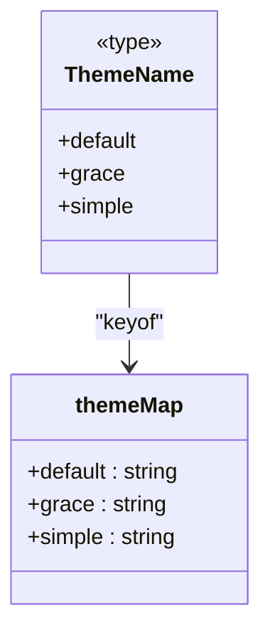
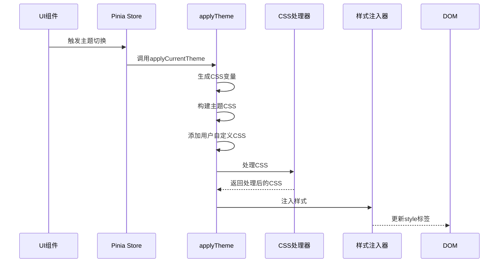
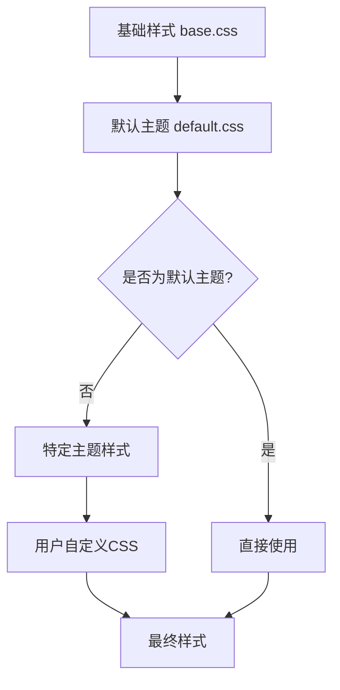
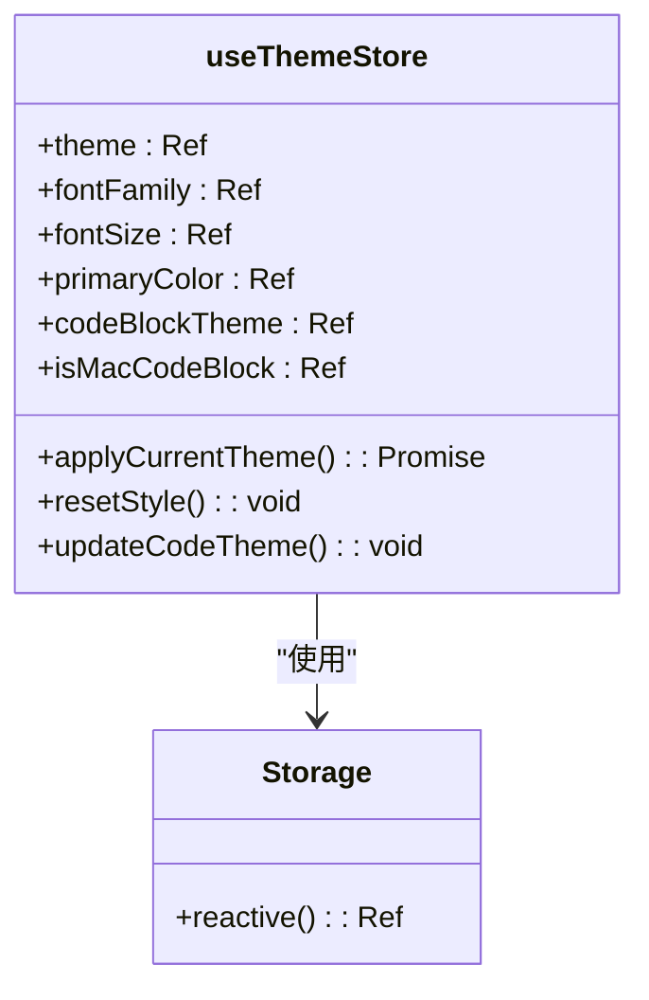
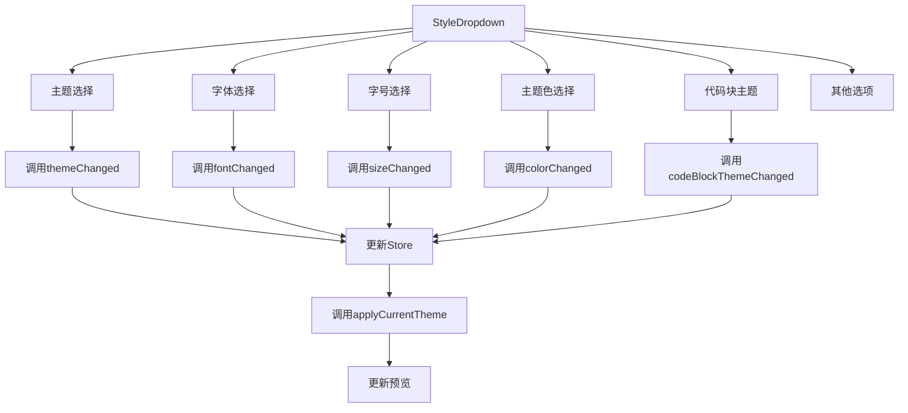

# 预设主题管理

<cite>
**本文档引用的文件**
- [theme.ts](file://packages/shared/src/configs/theme.ts)
- [theme-css/index.ts](file://packages/shared/src/configs/theme-css/index.ts)
- [themeApplicator.ts](file://packages/core/src/theme/themeApplicator.ts)
- [theme.ts](file://apps/web/src/stores/theme.ts)
- [StyleDropdown.vue](file://apps/web/src/components/editor/editor-header/StyleDropdown.vue)
- [cssVariables.ts](file://packages/core/src/theme/cssVariables.ts)
- [cssScopeWrapper.ts](file://packages/core/src/theme/cssScopeWrapper.ts)
- [themeInjector.ts](file://packages/core/src/theme/themeInjector.ts)
- [base.css](file://packages/shared/src/configs/theme-css/base.css)
- [default.css](file://packages/shared/src/configs/theme-css/default.css)
- [grace.css](file://packages/shared/src/configs/theme-css/grace.css)
- [simple.css](file://packages/shared/src/configs/theme-css/simple.css)
</cite>

## 目录
1. [简介](#简介)
2. [预设主题实现机制](#预设主题实现机制)
3. [主题样式存储结构](#主题样式存储结构)
4. [主题应用流程](#主题应用流程)
5. [样式叠加逻辑](#样式叠加逻辑)
6. [Pinia状态管理](#pinia状态管理)
7. [UI组件交互](#ui组件交互)
8. [新增主题开发指南](#新增主题开发指南)

## 简介
本系统实现了灵活的预设主题管理机制，通过模块化设计支持多种主题的动态切换。系统包含经典、优雅、简洁三种预设主题，每种主题都具有独特的视觉风格。主题系统采用分层架构，将基础样式、主题样式和用户自定义样式有机结合，通过CSS变量实现动态配置，为用户提供丰富的个性化选项。

## 预设主题实现机制

系统实现了三种预设主题：经典（default）、优雅（grace）和简洁（simple）。每种主题都有其独特的设计哲学和视觉特征：

- **经典主题**：采用传统的Markdown样式设计，强调内容的可读性和结构的清晰性
- **优雅主题**：在默认主题基础上添加了阴影、圆角等现代UI元素，提升视觉层次感
- **简洁主题**：追求极简主义设计，减少视觉噪音，突出内容本身

这些主题通过独立的CSS文件实现，每个主题文件只包含相对于基础样式的增量样式，避免重复定义。主题文件位于`packages/shared/src/configs/theme-css/`目录下，分别为`default.css`、`grace.css`和`simple.css`。

**主题实现机制的核心特点：**
- 使用CSS变量（如`--md-primary-color`）实现动态主题色配置
- 通过`?raw`导入方式将CSS文件作为字符串处理，便于动态注入
- 采用模块化设计，主题样式与基础样式分离
- 支持通过PostCSS在运行时处理CSS，确保浏览器兼容性

**Section sources**
- [default.css](file://packages/shared/src/configs/theme-css/default.css#L1-L324)
- [grace.css](file://packages/shared/src/configs/theme-css/grace.css#L1-L137)
- [simple.css](file://packages/shared/src/configs/theme-css/simple.css#L1-L130)

## 主题样式存储结构

主题样式通过`themeMap`对象进行集中管理，该对象存储了所有预设主题的CSS样式字符串。`themeMap`的结构设计体现了类型安全和不可变性的原则。



**Diagram sources**
- [theme-css/index.ts](file://packages/shared/src/configs/theme-css/index.ts#L19-L23)

### themeMap对象结构

`themeMap`是一个常量对象，使用`as const`声明确保类型推断的精确性。其结构如下：

```typescript
export const themeMap = {
  default: defaultCSS,
  grace: graceCSS,
  simple: simpleCSS,
} as const
```

每个属性值都是通过Vite的`?raw`插件导入的CSS文件内容字符串。这种设计使得CSS文件可以直接作为JavaScript模块使用，便于在运行时动态处理和注入。

### 类型定义

系统通过TypeScript的类型系统确保主题名称的类型安全：

```typescript
export type ThemeName = keyof typeof themeMap
```

这种类型定义方式具有以下优势：
- 编译时检查：确保主题名称的正确性
- 自动补全：IDE可以提供主题名称的智能提示
- 类型推断：编译器可以准确推断主题相关的类型

**Section sources**
- [theme-css/index.ts](file://packages/shared/src/configs/theme-css/index.ts#L19-L25)

## 主题应用流程

主题应用的核心逻辑由`themeApplicator.ts`文件中的`applyTheme`函数实现。该函数负责将主题配置转换为实际的CSS样式并注入到页面中。



**Diagram sources**
- [themeApplicator.ts](file://packages/core/src/theme/themeApplicator.ts#L24-L60)

### applyTheme函数执行步骤

`applyTheme`函数的执行流程分为八个主要步骤：

1. **生成CSS变量**：根据配置生成包含主题色、字体等信息的CSS变量
2. **构建基础主题**：以默认主题作为基础样式
3. **叠加特定主题**：如果选择的不是默认主题，则叠加相应主题的样式
4. **添加自定义CSS**：合并用户自定义的CSS样式
5. **作用域包装**：为样式添加`#output`作用域前缀，限制样式范围
6. **拼接完整CSS**：将变量、基础样式和主题样式合并
7. **CSS处理**：使用PostCSS处理CSS，简化calc()表达式等
8. **样式注入**：将最终的CSS注入到页面的`<style>`标签中

每个步骤都经过精心设计，确保样式的正确性和性能优化。

**Section sources**
- [themeApplicator.ts](file://packages/core/src/theme/themeApplicator.ts#L24-L60)

## 样式叠加逻辑

系统的样式叠加逻辑采用分层设计，确保样式的可预测性和可维护性。这种设计模式遵循了CSS的层叠原则，同时避免了样式冲突。



**Diagram sources**
- [themeApplicator.ts](file://packages/core/src/theme/themeApplicator.ts#L29-L37)

### 分层样式结构

系统采用三层样式结构：

1. **基础样式层**（base.css）：定义所有元素的基础样式和CSS变量
2. **主题样式层**：包含特定主题的样式规则
3. **用户自定义层**：允许用户添加自己的CSS样式

这种分层结构的优势：
- **可维护性**：样式按功能分离，便于维护和更新
- **可扩展性**：新增主题只需添加新的主题样式文件
- **性能优化**：基础样式只加载一次，减少重复计算

### 样式优先级规则

系统遵循CSS的层叠规则，后定义的样式优先级更高：

```typescript
let themeCSS = themeMap.default // 默认主题作为基础
if (config.themeName !== `default`) {
  const specificThemeCSS = themeMap[config.themeName as ThemeName]
  if (specificThemeCSS) {
    themeCSS = `${themeCSS}\n\n${specificThemeCSS}` // 特定主题样式叠加
  }
}
```

这种设计确保特定主题的样式可以覆盖默认主题的相应规则，实现主题的个性化效果。

**Section sources**
- [themeApplicator.ts](file://packages/core/src/theme/themeApplicator.ts#L29-L37)

## Pinia状态管理

主题配置在Pinia store中进行集中管理，`useThemeStore`负责存储和管理所有与主题相关的状态。



**Diagram sources**
- [theme.ts](file://apps/web/src/stores/theme.ts#L11-L156)

### Store状态结构

`useThemeStore`定义了以下状态属性：

- **主题相关**：`theme`、`fontFamily`、`fontSize`、`primaryColor`
- **代码块相关**：`codeBlockTheme`、`isMacCodeBlock`、`isShowLineNumber`
- **内容相关**：`legend`、`isCiteStatus`、`isCountStatus`
- **布局相关**：`isUseIndent`、`isUseJustify`、`previewWidth`

所有状态都使用`store.reactive`进行持久化存储，确保页面刷新后配置不会丢失。

### 核心方法

Store提供了几个关键方法：

- `applyCurrentTheme`：应用当前主题配置，调用核心的`applyTheme`函数
- `resetStyle`：重置所有样式配置到默认值
- `updateCodeTheme`：更新代码块主题

这些方法封装了复杂的业务逻辑，为UI组件提供了简洁的API接口。

**Section sources**
- [theme.ts](file://apps/web/src/stores/theme.ts#L11-L156)

## UI组件交互

`StyleDropdown.vue`组件是用户与主题系统交互的主要界面，它提供了直观的主题选择和样式配置功能。



**Diagram sources**
- [StyleDropdown.vue](file://apps/web/src/components/editor/editor-header/StyleDropdown.vue#L65-L96)

### 事件处理机制

当用户在UI上选择不同的主题时，会触发相应的事件处理函数：

```typescript
function themeChanged(newTheme: keyof typeof themeMap) {
  themeStore.theme = newTheme
  themeStore.applyCurrentTheme()
  editorRefresh()
}
```

这个处理流程包括三个关键步骤：
1. 更新Pinia Store中的主题状态
2. 调用`applyCurrentTheme`应用新主题
3. 刷新编辑器预览

这种设计确保了状态的一致性和UI的及时更新。

### 组件结构

`StyleDropdown`组件采用组合式API设计，主要包含：
- **状态引用**：通过`storeToRefs`引用Pinia Store的状态
- **事件处理器**：处理各种样式变更事件
- **模板结构**：使用Menubar组件构建下拉菜单界面

组件支持两种使用模式：作为子菜单（`asSub`）或独立菜单，提高了组件的复用性。

**Section sources**
- [StyleDropdown.vue](file://apps/web/src/components/editor/editor-header/StyleDropdown.vue#L65-L96)

## 新增主题开发指南

新增预设主题需要遵循特定的开发流程，确保新主题能够正确集成到现有系统中。

### 添加主题样式文件

首先，在`packages/shared/src/configs/theme-css/`目录下创建新的CSS文件：

```bash
# 创建新的主题文件
touch packages/shared/src/configs/theme-css/mytheme.css
```

新主题文件应遵循以下规范：
- 使用CSS变量（如`var(--md-primary-color)`）而不是硬编码颜色值
- 只定义相对于基础样式的增量样式
- 添加适当的注释说明主题的设计理念

### 在themeMap中注册

编辑`packages/shared/src/configs/theme-css/index.ts`文件，将新主题添加到`themeMap`中：

```typescript
import mythemeCSS from './mytheme.css?raw'

export const themeMap = {
  default: defaultCSS,
  grace: graceCSS,
  simple: simpleCSS,
  mytheme: mythemeCSS, // 新增主题
} as const
```

同时，TypeScript的`ThemeName`类型会自动更新，无需手动修改。

### 添加主题选项

编辑`packages/shared/src/configs/theme.ts`文件，添加新主题的显示选项：

```typescript
export const themeOptionsMap = {
  default: {
    label: `经典`,
    value: `default`,
    desc: ``,
  },
  grace: {
    label: `优雅`,
    value: `grace`,
    desc: `@brzhang`,
  },
  simple: {
    label: `简洁`,
    value: `simple`,
    desc: `@okooo5km`,
  },
  mytheme: { // 新增主题选项
    label: `我的主题`,
    value: `mytheme`,
    desc: `我的自定义主题`,
  },
}
```

完成这些步骤后，新主题就会出现在UI的主题选择列表中，用户可以正常切换和使用。

**Section sources**
- [theme-css/index.ts](file://packages/shared/src/configs/theme-css/index.ts#L19-L23)
- [theme.ts](file://packages/shared/src/configs/theme.ts#L7-L23)