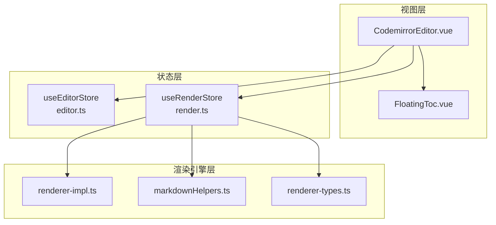
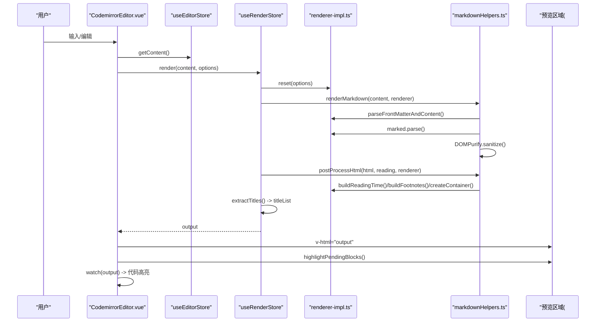
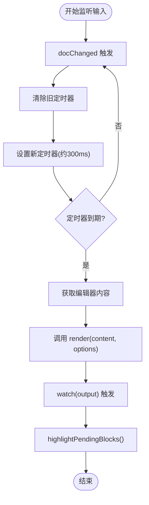
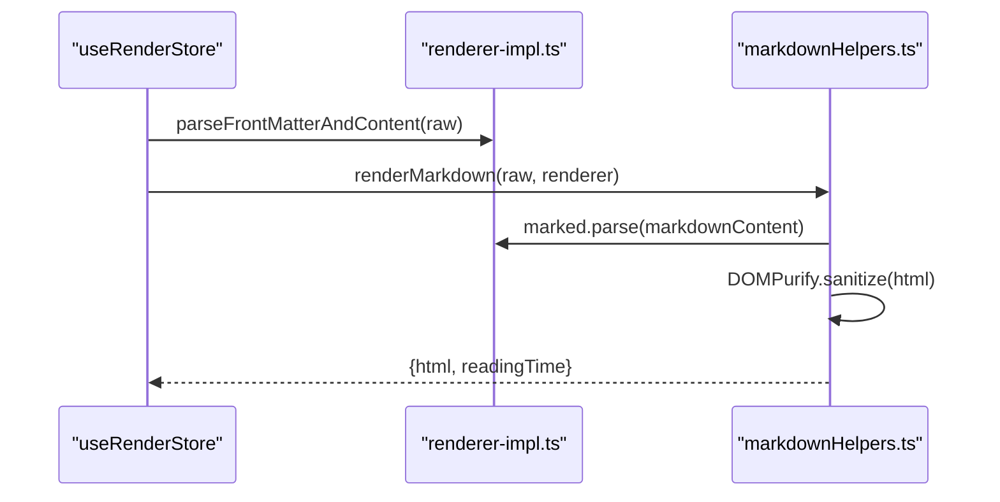
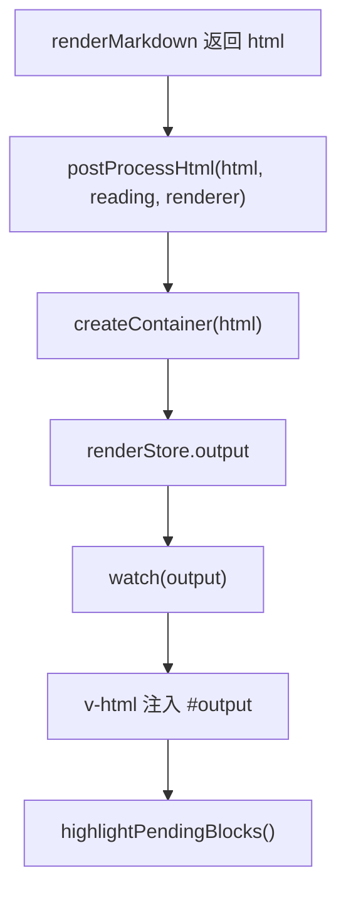
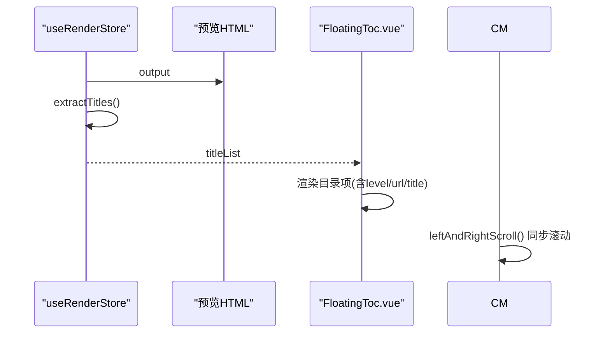
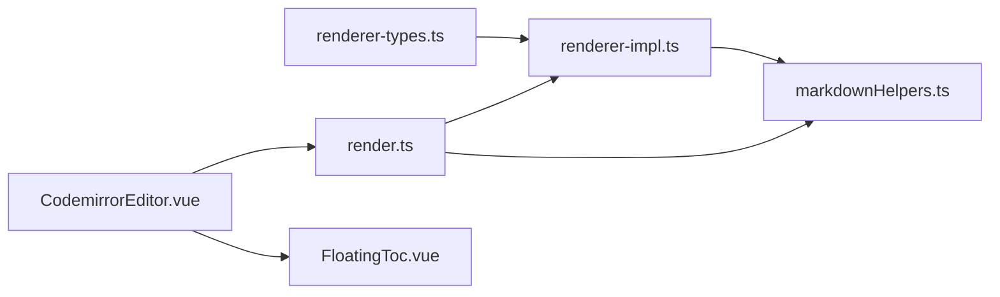

# 实时预览

<cite>
**本文引用的文件**
- [apps/web/src/stores/render.ts](file://apps/web/src/stores/render.ts)
- [apps/web/src/stores/editor.ts](file://apps/web/src/stores/editor.ts)
- [apps/web/src/views/CodemirrorEditor.vue](file://apps/web/src/views/CodemirrorEditor.vue)
- [apps/web/src/components/editor/FloatingToc.vue](file://apps/web/src/components/editor/FloatingToc.vue)
- [packages/core/src/renderer/renderer-impl.ts](file://packages/core/src/renderer/renderer-impl.ts)
- [packages/core/src/utils/markdownHelpers.ts](file://packages/core/src/utils/markdownHelpers.ts)
- [packages/shared/src/types/renderer-types.ts](file://packages/shared/src/types/renderer-types.ts)
- [apps/web/src/utils/index.ts](file://apps/web/src/utils/index.ts)
</cite>

## 目录
1. [引言](#引言)
2. [项目结构](#项目结构)
3. [核心组件](#核心组件)
4. [架构总览](#架构总览)
5. [详细组件分析](#详细组件分析)
6. [依赖关系分析](#依赖关系分析)
7. [性能考量](#性能考量)
8. [故障排查指南](#故障排查指南)
9. [结论](#结论)

## 引言
本文件围绕“实时预览”功能展开，系统性阐述从编辑器内容变更到预览区域更新的完整数据流，重点说明 render store 如何监听 editor store 的内容变化并通过防抖策略触发 Markdown 渲染流程；详细描述从 Markdown 解析、marked 渲染、DOMPurify 安全过滤到最终 HTML 注入的全过程；结合 FloatingToc.vue 组件说明目录结构如何随内容动态生成并同步滚动；最后给出性能优化建议与长文档场景下的潜在瓶颈与应对方案。

## 项目结构
- 编辑器视图层：CodemirrorEditor.vue 负责创建 CodeMirror 编辑器、监听输入事件、触发渲染刷新、同步滚动与注入预览区域。
- 渲染状态层：render store 负责初始化渲染器、执行 Markdown 渲染、统计阅读时长、提取标题并生成目录、输出最终 HTML。
- 渲染引擎层：@md/core 提供渲染器实现与工具函数，包括 marked 集成、扩展插件、安全过滤与后处理。
- 目录组件：FloatingToc.vue 从 render store 的标题列表动态渲染悬浮目录，并支持悬停展开与固定显示。

图表来源
- [apps/web/src/views/CodemirrorEditor.vue](file://apps/web/src/views/CodemirrorEditor.vue#L496-L531)
- [apps/web/src/stores/editor.ts](file://apps/web/src/stores/editor.ts#L1-L91)
- [apps/web/src/stores/render.ts](file://apps/web/src/stores/render.ts#L1-L110)
- [packages/core/src/renderer/renderer-impl.ts](file://packages/core/src/renderer/renderer-impl.ts#L1-L386)
- [packages/core/src/utils/markdownHelpers.ts](file://packages/core/src/utils/markdownHelpers.ts#L1-L79)
- [packages/shared/src/types/renderer-types.ts](file://packages/shared/src/types/renderer-types.ts#L1-L22)
- [apps/web/src/components/editor/FloatingToc.vue](file://apps/web/src/components/editor/FloatingToc.vue#L1-L41)

章节来源
- [apps/web/src/views/CodemirrorEditor.vue](file://apps/web/src/views/CodemirrorEditor.vue#L496-L531)
- [apps/web/src/stores/render.ts](file://apps/web/src/stores/render.ts#L1-L110)
- [packages/core/src/renderer/renderer-impl.ts](file://packages/core/src/renderer/renderer-impl.ts#L1-L386)

## 核心组件
- 编辑器 Store（useEditorStore）：维护 CodeMirror 实例，提供格式化、导入、清空、获取内容、选中文本、插入文本等能力。
- 渲染 Store（useRenderStore）：负责初始化渲染器、重置渲染选项、执行 Markdown 渲染、统计阅读时长、提取标题并生成目录、输出最终 HTML。
- 视图组件（CodemirrorEditor.vue）：创建编辑器、监听输入事件、触发 editorRefresh（防抖）、将渲染结果注入预览区域、同步滚动、高亮代码块。
- 目录组件（FloatingToc.vue）：基于 render store 的 titleList 动态渲染悬浮目录，支持悬停展开与固定显示。

章节来源
- [apps/web/src/stores/editor.ts](file://apps/web/src/stores/editor.ts#L1-L91)
- [apps/web/src/stores/render.ts](file://apps/web/src/stores/render.ts#L1-L110)
- [apps/web/src/views/CodemirrorEditor.vue](file://apps/web/src/views/CodemirrorEditor.vue#L496-L531)
- [apps/web/src/components/editor/FloatingToc.vue](file://apps/web/src/components/editor/FloatingToc.vue#L1-L41)

## 架构总览
实时预览的数据流由“输入事件 -> 防抖 -> 渲染器 -> 安全过滤 -> 后处理 -> DOM 注入 -> 目录生成 -> 滚动同步”构成。render store 作为渲染中枢，既消费 editor store 的内容，也向视图层暴露 output 与 titleList，从而驱动预览与目录联动。

图表来源
- [apps/web/src/views/CodemirrorEditor.vue](file://apps/web/src/views/CodemirrorEditor.vue#L496-L531)
- [apps/web/src/stores/render.ts](file://apps/web/src/stores/render.ts#L65-L109)
- [packages/core/src/utils/markdownHelpers.ts](file://packages/core/src/utils/markdownHelpers.ts#L1-L79)
- [packages/core/src/renderer/renderer-impl.ts](file://packages/core/src/renderer/renderer-impl.ts#L1-L386)

## 详细组件分析

### 编辑器输入监听与防抖刷新
- 编辑器通过 EditorView.updateListener 监听 docChanged，收集最新内容。
- 使用 changeTimer 对输入事件进行防抖（约 300ms），在防抖结束后调用 editorRefresh。
- editorRefresh 会从 editor store 获取当前内容，并以主题配置调用 render store 的 render 方法，随后触发 watch(output) 进行代码高亮。

图表来源
- [apps/web/src/views/CodemirrorEditor.vue](file://apps/web/src/views/CodemirrorEditor.vue#L496-L531)
- [apps/web/src/views/CodemirrorEditor.vue](file://apps/web/src/views/CodemirrorEditor.vue#L506-L522)
- [apps/web/src/views/CodemirrorEditor.vue](file://apps/web/src/views/CodemirrorEditor.vue#L75-L82)

章节来源
- [apps/web/src/views/CodemirrorEditor.vue](file://apps/web/src/views/CodemirrorEditor.vue#L496-L531)
- [apps/web/src/views/CodemirrorEditor.vue](file://apps/web/src/views/CodemirrorEditor.vue#L506-L522)
- [apps/web/src/views/CodemirrorEditor.vue](file://apps/web/src/views/CodemirrorEditor.vue#L75-L82)

### 渲染流程：renderMarkdown 调用链
- renderMarkdown 调用渲染器的 parseFrontMatterAndContent，分离 front-matter 与正文，并计算阅读时长。
- 使用 marked.parse 将正文转为 HTML。
- 通过 DOMPurify.sanitize 对 HTML 进行安全过滤，允许特定标签（如 mp-common-profile）。
- 返回 { html, readingTime }，供 postProcessHtml 后处理。

图表来源
- [apps/web/src/stores/render.ts](file://apps/web/src/stores/render.ts#L65-L109)
- [packages/core/src/utils/markdownHelpers.ts](file://packages/core/src/utils/markdownHelpers.ts#L1-L24)
- [packages/core/src/renderer/renderer-impl.ts](file://packages/core/src/renderer/renderer-impl.ts#L88-L110)

章节来源
- [apps/web/src/stores/render.ts](file://apps/web/src/stores/render.ts#L65-L109)
- [packages/core/src/utils/markdownHelpers.ts](file://packages/core/src/utils/markdownHelpers.ts#L1-L24)

### HTML 后处理与注入
- postProcessHtml 将阅读时长、脚注、附加样式与容器包裹整合，最终返回可注入的 HTML。
- render store 将输出写入 output，并触发 watch(output)。
- 视图层通过 v-html 将 output 注入预览区域；随后 highlightPendingBlocks 对代码块进行高亮。

图表来源
- [packages/core/src/utils/markdownHelpers.ts](file://packages/core/src/utils/markdownHelpers.ts#L26-L59)
- [apps/web/src/stores/render.ts](file://apps/web/src/stores/render.ts#L88-L95)
- [apps/web/src/views/CodemirrorEditor.vue](file://apps/web/src/views/CodemirrorEditor.vue#L75-L82)

章节来源
- [packages/core/src/utils/markdownHelpers.ts](file://packages/core/src/utils/markdownHelpers.ts#L26-L59)
- [apps/web/src/stores/render.ts](file://apps/web/src/stores/render.ts#L88-L95)
- [apps/web/src/views/CodemirrorEditor.vue](file://apps/web/src/views/CodemirrorEditor.vue#L75-L82)

### 目录结构动态生成与同步滚动
- render store 在渲染后调用 extractTitles，从输出 HTML 中提取带 data-heading 的标题节点，生成 titleList 并为每个标题设置唯一 id。
- FloatingToc.vue 从 render store 的 titleList 动态渲染目录项，支持悬停展开与固定显示。
- 视图层通过 leftAndRightScroll 将编辑区与预览区滚动条建立映射，按百分比同步滚动，提升阅读体验。

图表来源
- [apps/web/src/stores/render.ts](file://apps/web/src/stores/render.ts#L45-L62)
- [apps/web/src/components/editor/FloatingToc.vue](file://apps/web/src/components/editor/FloatingToc.vue#L1-L41)
- [apps/web/src/views/CodemirrorEditor.vue](file://apps/web/src/views/CodemirrorEditor.vue#L121-L191)

章节来源
- [apps/web/src/stores/render.ts](file://apps/web/src/stores/render.ts#L45-L62)
- [apps/web/src/components/editor/FloatingToc.vue](file://apps/web/src/components/editor/FloatingToc.vue#L1-L41)
- [apps/web/src/views/CodemirrorEditor.vue](file://apps/web/src/views/CodemirrorEditor.vue#L121-L191)

## 依赖关系分析
- 渲染器接口定义位于 shared/types，render store 通过 RendererAPI 调用 reset、parseFrontMatterAndContent、buildReadingTime、buildFootnotes、createContainer 等方法。
- renderer-impl.ts 实现了 marked 集成、扩展插件注册、heading/paragraph/table 等渲染器钩子，以及构建容器与附加样式。
- markdownHelpers.ts 提供 renderMarkdown 与 postProcessHtml，承担 marked 渲染与 DOMPurify 安全过滤职责。
- 视图层通过 watch(output) 与 highlightPendingBlocks 保证预览区域的即时高亮与交互。

图表来源
- [packages/shared/src/types/renderer-types.ts](file://packages/shared/src/types/renderer-types.ts#L1-L22)
- [packages/core/src/renderer/renderer-impl.ts](file://packages/core/src/renderer/renderer-impl.ts#L1-L386)
- [packages/core/src/utils/markdownHelpers.ts](file://packages/core/src/utils/markdownHelpers.ts#L1-L79)
- [apps/web/src/stores/render.ts](file://apps/web/src/stores/render.ts#L1-L110)
- [apps/web/src/views/CodemirrorEditor.vue](file://apps/web/src/views/CodemirrorEditor.vue#L496-L531)
- [apps/web/src/components/editor/FloatingToc.vue](file://apps/web/src/components/editor/FloatingToc.vue#L1-L41)

章节来源
- [packages/shared/src/types/renderer-types.ts](file://packages/shared/src/types/renderer-types.ts#L1-L22)
- [packages/core/src/renderer/renderer-impl.ts](file://packages/core/src/renderer/renderer-impl.ts#L1-L386)
- [packages/core/src/utils/markdownHelpers.ts](file://packages/core/src/utils/markdownHelpers.ts#L1-L79)
- [apps/web/src/stores/render.ts](file://apps/web/src/stores/render.ts#L1-L110)

## 性能考量
- 防抖策略：编辑器输入通过 changeTimer 防抖（约 300ms），显著降低渲染频率，避免频繁重排与重绘。
- 渲染器复用：render store 延迟初始化渲染器实例，后续仅 reset 选项，避免重复创建开销。
- DOMPurify 过滤：在渲染后统一进行安全过滤，减少多次过滤成本。
- 代码高亮：仅在 output 变更后执行 highlightPendingBlocks，避免对未变更区域重复处理。
- 滚动同步：leftAndRightScroll 通过百分比映射同步滚动，避免逐帧滚动带来的性能损耗。
- 长文档优化建议：
  - 采用虚拟滚动或分段渲染，限制一次性渲染的节点数量。
  - 对标题提取与目录生成进行节流，例如每 500ms 或 1s 执行一次。
  - 对 marked 渲染进行缓存（基于内容哈希），命中则直接复用 HTML 片段。
  - 控制高亮语言集，避免过多语言导致的高亮开销。
  - 在移动端或低性能设备上，默认关闭高亮或延迟高亮。

章节来源
- [apps/web/src/views/CodemirrorEditor.vue](file://apps/web/src/views/CodemirrorEditor.vue#L496-L531)
- [apps/web/src/stores/render.ts](file://apps/web/src/stores/render.ts#L65-L109)
- [packages/core/src/utils/markdownHelpers.ts](file://packages/core/src/utils/markdownHelpers.ts#L1-L79)

## 故障排查指南
- 渲染器未初始化：render 方法在未初始化渲染器时会抛错。确保在应用启动阶段调用 initRendererInstance。
- 预览区域无内容：确认 v-html 绑定的 output 是否更新，以及 watch(output) 是否触发 highlightPendingBlocks。
- 目录为空：检查 extractTitles 是否能正确匹配带 data-heading 的标题节点；确认渲染后 HTML 结构是否包含相应标记。
- 滚动不同步：检查 leftAndRightScroll 中的滚动容器查找逻辑与高度计算；确认容器存在且可滚动。
- 安全过滤问题：若出现标签缺失，检查 DOMPurify.sanitize 的配置与允许标签列表。

章节来源
- [apps/web/src/stores/render.ts](file://apps/web/src/stores/render.ts#L65-L109)
- [apps/web/src/views/CodemirrorEditor.vue](file://apps/web/src/views/CodemirrorEditor.vue#L75-L82)
- [apps/web/src/views/CodemirrorEditor.vue](file://apps/web/src/views/CodemirrorEditor.vue#L121-L191)
- [packages/core/src/utils/markdownHelpers.ts](file://packages/core/src/utils/markdownHelpers.ts#L1-L24)

## 结论
该实时预览体系通过“编辑器输入防抖 + 渲染器复用 + DOMPurify 安全过滤 + 目录动态生成 + 滚动同步”的组合，实现了流畅、安全、可交互的预览体验。render store 作为渲染中枢，清晰地串联了编辑器与视图层，配合 FloatingToc.vue 提升了长文档的导航效率。针对长文档场景，建议进一步引入虚拟滚动、缓存与节流等优化手段，以平衡实时性与性能。