# 快捷输入

<cite>
**本文档引用文件**   
- [InsertDropdown.vue](file://apps/web/src/components/editor/editor-header/InsertDropdown.vue)
- [FormatDropdown.vue](file://apps/web/src/components/editor/editor-header/FormatDropdown.vue)
- [InsertMpCardDialog.vue](file://apps/web/src/components/editor/InsertMpCardDialog.vue)
- [editor.ts](file://apps/web/src/stores/editor.ts)
- [format.ts](file://packages/shared/src/editor/format.ts)
- [ui.ts](file://apps/web/src/stores/ui.ts)
- [InsertFormDialog.vue](file://apps/web/src/components/editor/InsertFormDialog.vue)
- [shortcut-key.ts](file://packages/shared/src/configs/shortcut-key.ts)
- [storage.ts](file://apps/web/src/utils/storage.ts)
</cite>

## 目录
1. [简介](#简介)
2. [核心组件](#核心组件)
3. [插入功能实现](#插入功能实现)
4. [格式化功能实现](#格式化功能实现)
5. [公众号名片插入机制](#公众号名片插入机制)
6. [编辑器存储API](#编辑器存储api)
7. [自定义快捷指令扩展](#自定义快捷指令扩展)
8. [用户体验优化](#用户体验优化)
9. [结论](#结论)

## 简介
本项目是一个多平台Markdown编辑器，提供了丰富的快捷输入功能。通过InsertDropdown和FormatDropdown组件，用户可以快速插入和格式化Markdown元素。InsertMpCardDialog组件实现了微信公众号卡片的插入功能。这些功能通过editor store的API安全地在光标位置插入Markdown片段，并支持自定义快捷指令扩展。

## 核心组件

### InsertDropdown组件
InsertDropdown组件提供了一个下拉菜单，允许用户快速插入常见的Markdown元素，如图片、表格和公众号名片。该组件通过UI Store的状态管理来控制对话框的显示和隐藏。

**Section sources**
- [InsertDropdown.vue](file://apps/web/src/components/editor/editor-header/InsertDropdown.vue#L1-L59)
- [ui.ts](file://apps/web/src/stores/ui.ts#L48-L58)

### FormatDropdown组件
FormatDropdown组件提供了文本格式化功能，包括加粗、斜体、删除线、超链接、行内代码、标题和列表等。每个格式化操作都绑定了相应的快捷键，用户可以通过点击菜单项或使用快捷键来应用格式。

**Section sources**
- [FormatDropdown.vue](file://apps/web/src/components/editor/editor-header/FormatDropdown.vue#L1-L399)
- [format.ts](file://packages/shared/src/editor/format.ts#L1-L167)

### InsertMpCardDialog组件
InsertMpCardDialog组件实现了微信公众号卡片的插入功能。用户可以通过填写表单来配置卡片的属性，如ID、名称、Logo、描述、类型和认证状态。提交表单后，组件会生成相应的HTML片段并插入到编辑器中。

**Section sources**
- [InsertMpCardDialog.vue](file://apps/web/src/components/editor/InsertMpCardDialog.vue#L1-L187)
- [ui.ts](file://apps/web/src/stores/ui.ts#L51-L53)

## 插入功能实现

### 插入图片
用户可以通过InsertDropdown组件中的"插入图片"选项来打开UploadImgDialog对话框。该对话框支持多种图床配置，包括GitHub、阿里云、腾讯云、七牛云、MinIO、公众号图床、Cloudflare R2、又拍云、Telegram和Cloudinary。用户可以选择图床并上传图片，上传成功后图片的Markdown语法将自动插入到编辑器中。

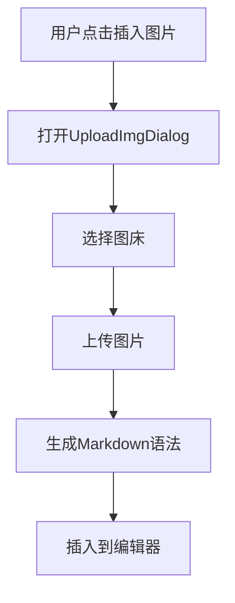

**Diagram sources**
- [InsertDropdown.vue](file://apps/web/src/components/editor/editor-header/InsertDropdown.vue#L24-L27)
- [UploadImgDialog.vue](file://apps/web/src/components/editor/UploadImgDialog.vue#L1-L800)

### 插入表格
用户可以通过InsertDropdown组件中的"插入表格"选项来打开InsertFormDialog对话框。该对话框允许用户设置表格的行数和列数，并填写表头和单元格内容。提交表单后，组件会调用createTable函数生成Markdown表格语法，并将其插入到编辑器中。

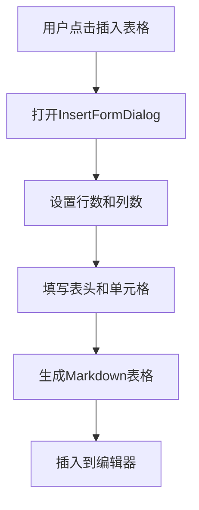

**Diagram sources**
- [InsertDropdown.vue](file://apps/web/src/components/editor/editor-header/InsertDropdown.vue#L28-L31)
- [InsertFormDialog.vue](file://apps/web/src/components/editor/InsertFormDialog.vue#L1-L90)

## 格式化功能实现

### 文本格式化
FormatDropdown组件提供了多种文本格式化选项，包括加粗、斜体、删除线、超链接和行内代码。每个选项都绑定了相应的快捷键，如Ctrl+B用于加粗，Ctrl+I用于斜体等。当用户点击菜单项或使用快捷键时，组件会调用相应的格式化函数来修改选中的文本。

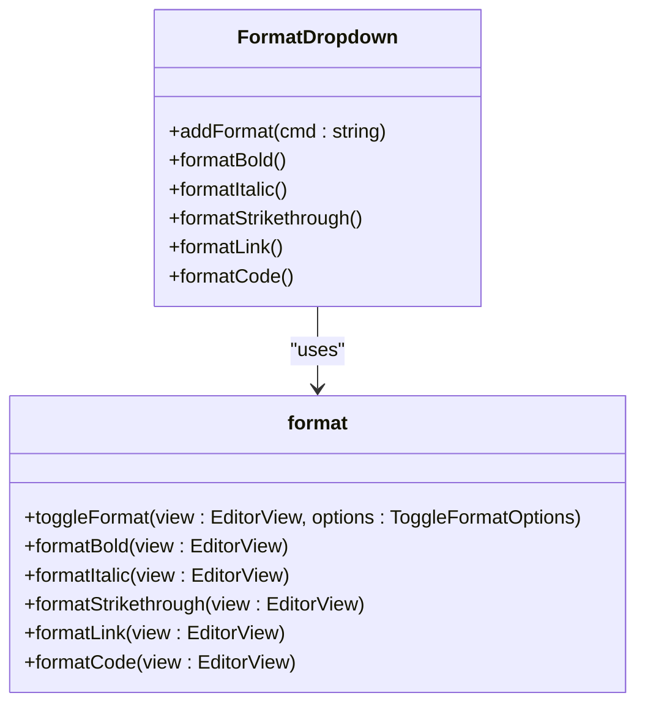

**Diagram sources**
- [FormatDropdown.vue](file://apps/web/src/components/editor/editor-header/FormatDropdown.vue#L75-L121)
- [format.ts](file://packages/shared/src/editor/format.ts#L14-L133)

### 标题和列表
FormatDropdown组件还提供了标题和列表的格式化功能。用户可以通过子菜单选择不同的标题级别（H1-H6）或列表类型（无序列表、有序列表）。每个选项都绑定了相应的快捷键，如Ctrl+1用于H1标题，Ctrl+U用于无序列表等。

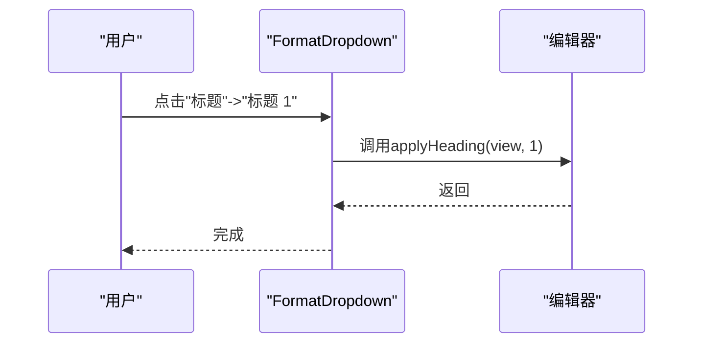

**Diagram sources**
- [FormatDropdown.vue](file://apps/web/src/components/editor/editor-header/FormatDropdown.vue#L176-L230)
- [format.ts](file://packages/shared/src/editor/format.ts#L51-L85)

## 公众号名片插入机制

### 表单数据绑定
InsertMpCardDialog组件使用VeeValidate进行表单验证，并通过Yup定义验证规则。表单字段包括公众号ID、名称、Logo、描述、类型和认证状态。这些字段通过v-model双向绑定到config对象，确保数据的一致性。

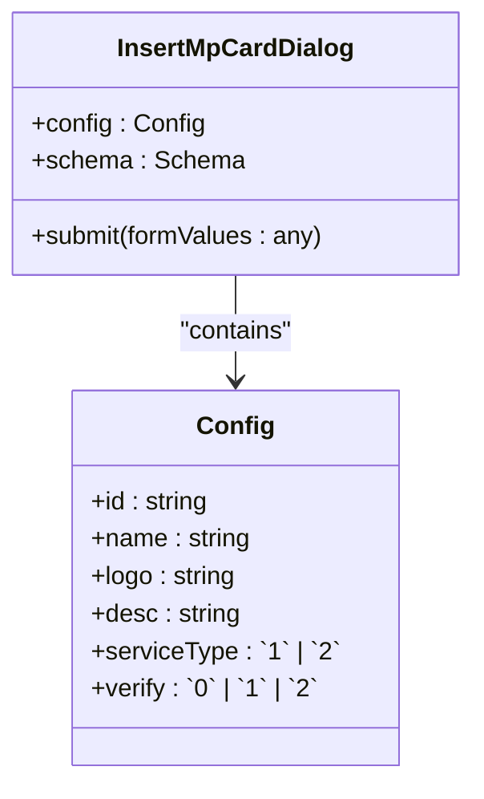

**Diagram sources**
- [InsertMpCardDialog.vue](file://apps/web/src/components/editor/InsertMpCardDialog.vue#L14-L40)

### 模板生成
当用户提交表单时，组件会调用buildMpHtml函数生成公众号名片的HTML片段。该函数根据config对象的值构建包含data-pluginname、data-id、data-nickname等属性的section元素。如果用户未提供Logo，则使用默认的Logo URL。

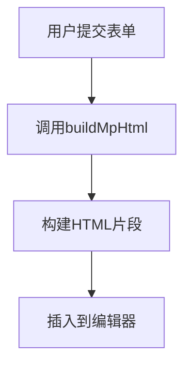

**Diagram sources**
- [InsertMpCardDialog.vue](file://apps/web/src/components/editor/InsertMpCardDialog.vue#L52-L67)

### 内容插入策略
生成HTML片段后，组件会获取编辑器实例和当前选区，然后调用dispatch方法在光标位置插入Markdown片段。插入完成后，会显示成功提示并关闭对话框。

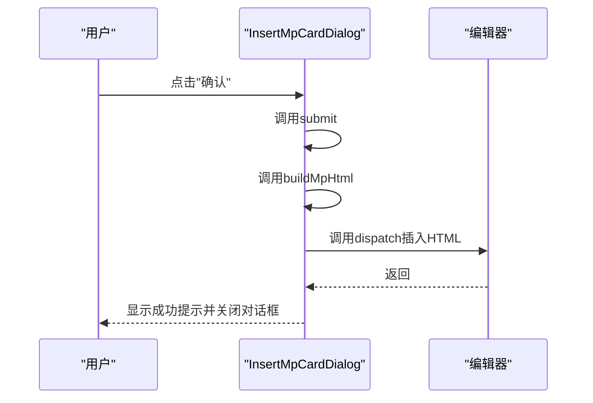

**Diagram sources**
- [InsertMpCardDialog.vue](file://apps/web/src/components/editor/InsertMpCardDialog.vue#L70-L79)

## 编辑器存储API

### insertAtCursor方法
editor store提供了insertAtCursor方法，允许在光标位置安全地插入文本。该方法首先检查编辑器实例是否存在，然后获取当前选区，最后调用dispatch方法插入文本并更新光标位置。

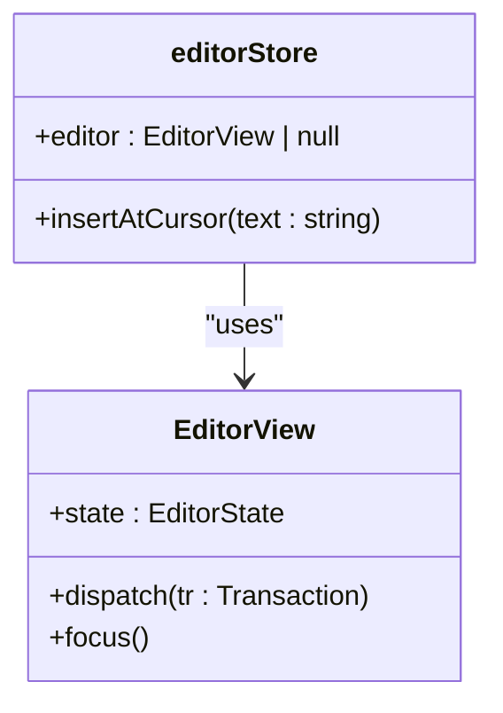

**Diagram sources**
- [editor.ts](file://apps/web/src/stores/editor.ts#L68-L78)

### replaceSelection方法
除了insertAtCursor，editor store还提供了replaceSelection方法，用于替换选中的文本。这对于实现格式化功能非常有用，例如加粗、斜体等操作。

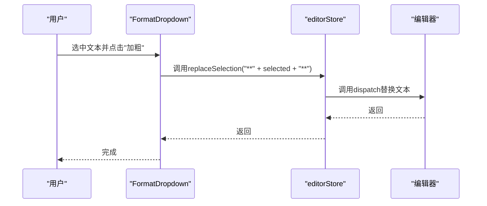

**Diagram sources**
- [editor.ts](file://apps/web/src/stores/editor.ts#L59-L65)

## 自定义快捷指令扩展

### 快捷指令管理
项目通过quickCommands store管理自定义快捷指令。用户可以添加、更新和删除快捷指令。每个快捷指令包含ID、标签和模板，其中模板可以使用{{sel}}占位符表示选中的文本。

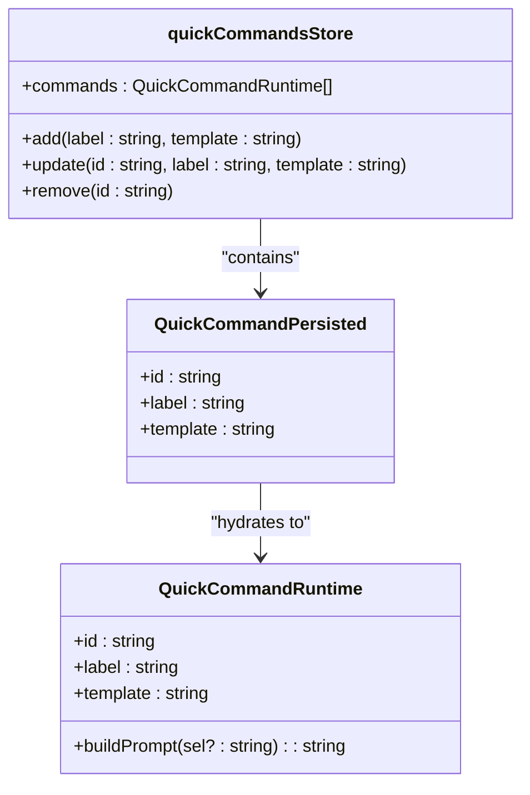

**Diagram sources**
- [quickCommands.ts](file://apps/web/src/stores/quickCommands.ts#L1-L86)

### 开发示例
要创建自定义快捷指令，开发者可以调用quickCommands store的add方法。例如，创建一个"润色"指令：

```typescript
const quickCommands = useQuickCommands();
quickCommands.add("润色", "请润色以下内容：\n\n{{sel}}");
```

这将添加一个标签为"润色"的快捷指令，其模板为"请润色以下内容：\n\n{{sel}}"。当用户使用此指令时，选中的文本将替换{{sel}}占位符。

**Section sources**
- [quickCommands.ts](file://apps/web/src/stores/quickCommands.ts#L65-L68)

## 用户体验优化

### 快捷键绑定
项目通过shortcut-key.ts文件定义了跨平台的快捷键。Ctrl键在Mac上显示为⌘，在Windows上显示为Ctrl。这确保了用户在不同操作系统上有一致的体验。

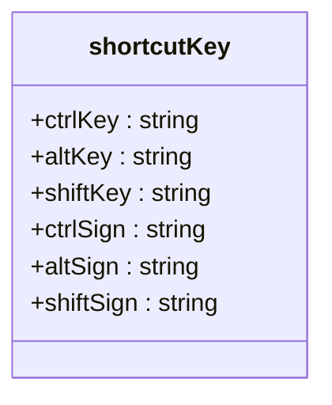

**Diagram sources**
- [shortcut-key.ts](file://packages/shared/src/configs/shortcut-key.ts#L1-L10)

### 插入后光标定位
在插入Markdown片段后，项目会自动将光标定位到合适的位置。例如，在插入加粗文本后，光标会定位到**之后，方便用户继续输入。这通过在dispatch调用中指定selection锚点来实现。

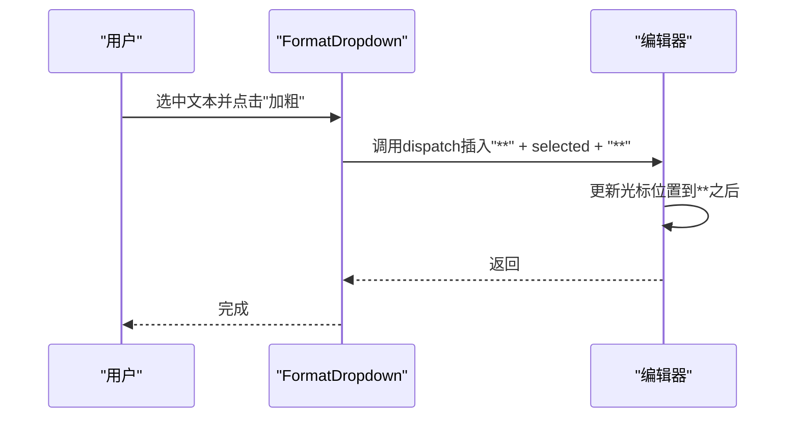

**Diagram sources**
- [format.ts](file://packages/shared/src/editor/format.ts#L37-L44)

## 结论
本项目通过InsertDropdown、FormatDropdown和InsertMpCardDialog组件实现了丰富的快捷输入功能。这些功能通过editor store的API安全地在光标位置插入Markdown片段，并支持自定义快捷指令扩展。通过优化快捷键绑定和插入后光标定位，项目提供了良好的用户体验。未来可以进一步扩展支持更多Markdown元素的快速插入，并增加更多自定义快捷指令的示例。