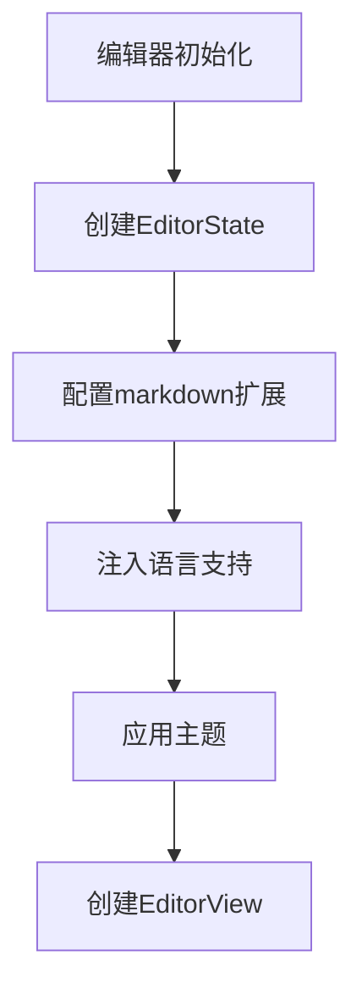
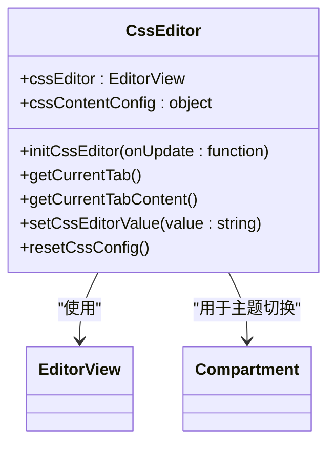
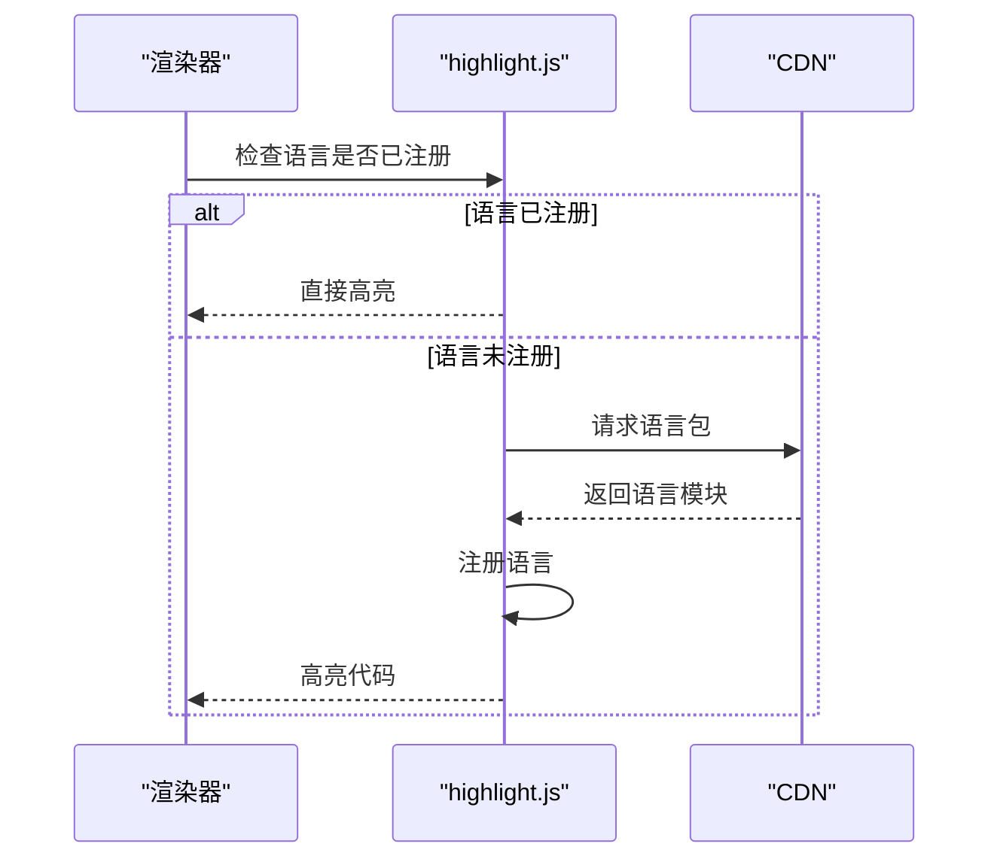
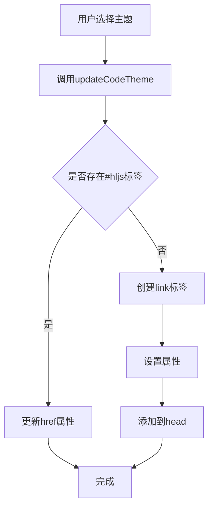
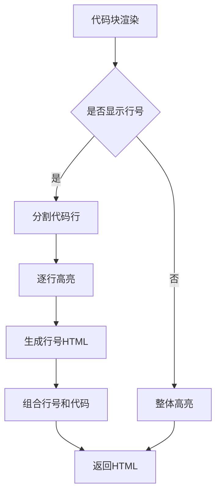

# 语法高亮

<cite>
**本文档引用文件**   
- [languages.ts](file://packages/core/src/utils/languages.ts)
- [renderer-impl.ts](file://packages/core/src/renderer/renderer-impl.ts)
- [CodemirrorEditor.vue](file://apps/web/src/views/CodemirrorEditor.vue)
- [CssEditor.vue](file://apps/web/src/components/editor/CssEditor.vue)
- [markdown.ts](file://packages/shared/src/editor/markdown.ts)
- [style.ts](file://packages/shared/src/configs/style.ts)
- [themeApplicator.ts](file://packages/core/src/theme/themeApplicator.ts)
</cite>

## 目录
1. [简介](#简介)
2. [核心组件](#核心组件)
3. [CodeMirror 6语法高亮实现](#codemirror-6语法高亮实现)
4. [highlight.js代码块渲染](#highlightjs代码块渲染)
5. [自定义语言支持配置](#自定义语言支持配置)
6. [微信排版兼容性处理](#微信排版兼容性处理)
7. [结论](#结论)

## 简介
本文档深入阐述了多语言Markdown编辑器中语法高亮功能的技术实现。重点说明了CodeMirror 6如何通过language配置实现对Markdown、CSS、JavaScript等多种语言的语法高亮支持，包括代码块token着色机制和主题适配逻辑。文档结合CssEditor.vue组件展示了内联样式编辑时的高亮处理方式，并解释了highlight.js在预览区代码块渲染中的集成方式，包括语言自动检测和样式注入流程。同时提供了配置自定义语言支持的代码示例，说明如何扩展新的语法高亮规则，并讨论了与微信排版兼容性相关的特殊处理，如代码块背景色统一、行号显示等视觉一致性优化。

## 核心组件

本项目中的语法高亮功能主要由两个核心组件构成：CodeMirror 6编辑器和highlight.js渲染库。CodeMirror 6负责编辑区域的实时语法高亮，提供代码编辑时的token着色和主题适配；highlight.js则负责预览区域的代码块渲染，实现最终输出的语法高亮效果。这两个组件通过统一的配置系统协同工作，确保编辑和预览体验的一致性。

**Section sources**
- [languages.ts](file://packages/core/src/utils/languages.ts#L1-L130)
- [renderer-impl.ts](file://packages/core/src/renderer/renderer-impl.ts#L1-L387)

## CodeMirror 6语法高亮实现

### 编辑器语言配置
CodeMirror 6通过`markdownSetup`函数配置多语言语法高亮支持。该函数利用`@codemirror/lang-markdown`扩展，并通过`codeLanguages`参数注入支持的语言列表。在`packages/shared/src/editor/markdown.ts`文件中，`markdownSetup`函数配置了基础的Markdown语言支持，并集成了括号匹配、历史记录、选择高亮等基础功能。



**Diagram sources**
- [markdown.ts](file://packages/shared/src/editor/markdown.ts#L99-L133)

### 内联样式编辑高亮
CssEditor.vue组件实现了内联样式编辑时的高亮处理。该组件使用CodeMirror 6的CSS语言支持，通过`cssSetup`函数配置CSS语法高亮。组件初始化时创建CSS编辑器实例，并通过`Compartment`机制实现主题的动态切换。当用户切换深色模式时，编辑器会重新配置主题，实现无缝的主题切换体验。



**Diagram sources**
- [CssEditor.vue](file://apps/web/src/components/editor/CssEditor.vue#L184-L213)
- [css.ts](file://packages/shared/src/editor/css.ts#L30-L42)

**Section sources**
- [CssEditor.vue](file://apps/web/src/components/editor/CssEditor.vue#L1-L544)
- [css.ts](file://packages/shared/src/editor/css.ts#L1-L42)

## highlight.js代码块渲染

### 语言自动检测与动态加载
highlight.js在预览区代码块渲染中实现了语言自动检测和动态加载机制。系统预注册了多种常用语言，如JavaScript、CSS、Python等，并通过CDN按需加载未预注册的语言包。`loadAndRegisterLanguage`函数负责动态加载并注册语言，使用Promise缓存机制避免重复加载。



**Diagram sources**
- [languages.ts](file://packages/core/src/utils/languages.ts#L97-L126)
- [renderer-impl.ts](file://packages/core/src/renderer/renderer-impl.ts#L227-L243)

### 样式注入流程
highlight.js的样式注入通过`updateCodeTheme`函数实现。该函数根据用户选择的主题，动态创建或更新`<link>`标签，将对应的CSS样式表注入到页面头部。样式表URL指向CDN上的highlight.js主题文件，确保快速加载和缓存利用。



**Diagram sources**
- [theme.ts](file://apps/web/src/stores/theme.ts#L80-L96)
- [style.ts](file://packages/shared/src/configs/style.ts#L121-L202)

**Section sources**
- [languages.ts](file://packages/core/src/utils/languages.ts#L78-L126)
- [renderer-impl.ts](file://packages/core/src/renderer/renderer-impl.ts#L210-L243)
- [theme.ts](file://apps/web/src/stores/theme.ts#L80-L96)

## 自定义语言支持配置

### 配置代码示例
系统提供了扩展新语法高亮规则的接口。通过`COMMON_LANGUAGES`常量预注册常用语言，并可通过`loadAndRegisterLanguage`函数动态加载新语言。以下为配置自定义语言支持的代码示例：

```typescript
// 预注册常用语言
export const COMMON_LANGUAGES: Record<string, LanguageFn> = {
  javascript,
  css,
  html,
  python,
  // ...其他语言
}

// 动态加载新语言
async function loadCustomLanguage(language: string, hljs: any) {
  if (!hljs.getLanguage(language)) {
    await loadAndRegisterLanguage(language, hljs)
  }
}
```

### 扩展新语法高亮规则
要扩展新的语法高亮规则，开发者需要：
1. 在`COMMON_LANGUAGES`中添加新语言的导入
2. 确保CDN上存在对应的语言包
3. 在用户界面中添加新语言的选项
4. 测试语言高亮效果

系统通过模块化设计，使得添加新语言支持变得简单高效，无需修改核心渲染逻辑。

**Section sources**
- [languages.ts](file://packages/core/src/utils/languages.ts#L39-L76)
- [style.ts](file://packages/shared/src/configs/style.ts#L198-L202)

## 微信排版兼容性处理

### 视觉一致性优化
为确保与微信排版的兼容性，系统实现了多项视觉一致性优化。代码块背景色统一通过CSS变量`--code-bg`控制，确保在不同主题下保持一致的视觉效果。行号显示功能通过`highlightAndFormatCode`函数实现，当`showLineNumber`为true时，生成包含行号的HTML结构。



**Diagram sources**
- [languages.ts](file://packages/core/src/utils/languages.ts#L159-L189)
- [renderer-impl.ts](file://packages/core/src/renderer/renderer-impl.ts#L231-L232)

### 特殊处理机制
系统还实现了Mac代码块样式，通过SVG生成Mac窗口标题栏，增强代码块的视觉吸引力。代码块的样式通过`themeApplicator.ts`中的`applyTheme`函数统一应用，确保所有样式都作用于预览区域，避免影响编辑器本身。

**Section sources**
- [languages.ts](file://packages/core/src/utils/languages.ts#L159-L189)
- [renderer-impl.ts](file://packages/core/src/renderer/renderer-impl.ts#L231-L243)
- [themeApplicator.ts](file://packages/core/src/theme/themeApplicator.ts#L24-L61)

## 结论
本项目通过CodeMirror 6和highlight.js的有机结合，实现了强大的多语言语法高亮功能。CodeMirror 6提供了编辑时的实时高亮和主题适配，而highlight.js则确保了预览区代码块的高质量渲染。系统通过模块化设计和动态加载机制，支持广泛的编程语言，并提供了灵活的自定义选项。与微信排版的兼容性处理确保了最终输出的视觉一致性，为用户提供了优质的编辑体验。