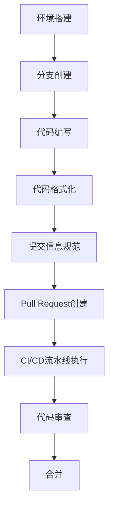
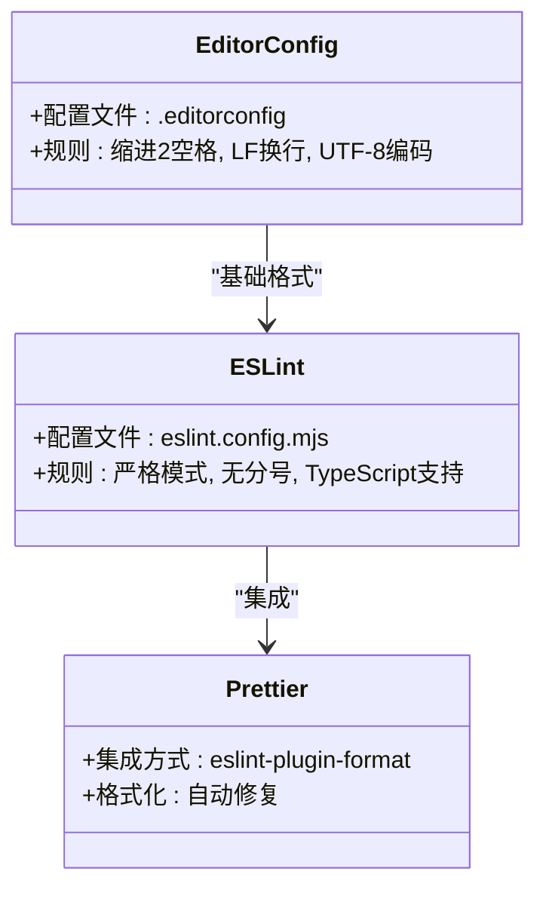
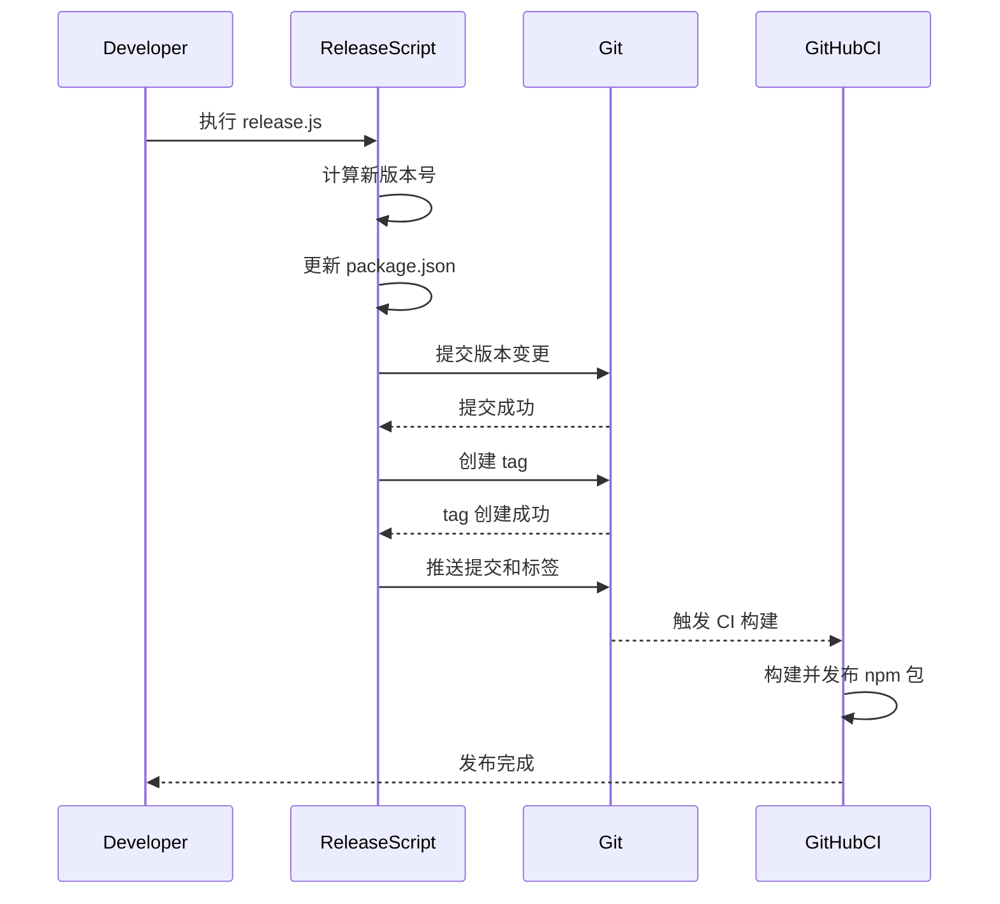

# 贡献指南

<cite>
**本文档引用的文件**  
- [CONTRIBUTING.md](file://CONTRIBUTING.md)
- [eslint.config.mjs](file://eslint.config.mjs)
- [package.json](file://package.json)
- [scripts/release.js](file://scripts/release.js)
- [.editorconfig](file://.editorconfig)
- [apps/web/package.json](file://apps/web/package.json)
- [packages/md-cli/package.json](file://packages/md-cli/package.json)
</cite>

## 目录
1. [介绍](#介绍)
2. [开发流程](#开发流程)
3. [代码规范与工具链](#代码规范与工具链)
4. [提交信息规范](#提交信息规范)
5. [Pull Request 流程](#pull-request-流程)
6. [版本发布机制](#版本发布机制)
7. [安全性要求](#安全性要求)
8. [非代码贡献方式](#非代码贡献方式)

## 介绍

本项目欢迎任何形式的贡献，包括报告缺陷、改进文档、提交新特性或修复 Bug。本指南详细说明了从环境搭建到代码合并的完整贡献生命周期，并介绍了项目使用的代码规范工具链、测试策略和版本发布机制。

**Section sources**
- [CONTRIBUTING.md](file://CONTRIBUTING.md#L1-L171)

## 开发流程

贡献者应遵循以下标准化的开发流程：

1. **环境搭建**：确保安装 Node.js ≥ 22 和 pnpm ≥ 10。
2. **项目克隆**：Fork 仓库并克隆到本地。
3. **依赖安装**：运行 `pnpm install` 安装所有依赖。
4. **分支创建**：从 `main` 分支拉取最新代码后，基于功能创建新分支（如 `feat/awesome-feature`）。
5. **代码编写**：在功能分支上进行开发。
6. **代码检查**：运行 `pnpm run lint` 进行 ESLint 和 Prettier 检查，`pnpm run type-check` 进行 TypeScript 类型检查。
7. **构建验证**：运行 `pnpm run web build` 验证产物。
8. **提交推送**：提交代码并推送到远程分支。
9. **创建 Pull Request**：在 GitHub 上发起 PR。

**Diagram sources**
- [CONTRIBUTING.md](file://CONTRIBUTING.md#L61-L94)

**Section sources**
- [CONTRIBUTING.md](file://CONTRIBUTING.md#L61-L94)

## 代码规范与工具链

项目使用以下代码规范工具链：

- **ESLint**：用于 JavaScript/TypeScript 代码质量检查，配置文件位于 `eslint.config.mjs`。
- **Prettier**：用于代码格式化，集成在 ESLint 中通过 `eslint-plugin-format` 执行。
- **EditorConfig**：统一编辑器配置，配置文件位于 `.editorconfig`。

这些工具通过 `pnpm run lint` 命令统一执行，且在 pre-commit 阶段通过 `lint-staged` 自动运行。

**Diagram sources**
- [eslint.config.mjs](file://eslint.config.mjs#L1-L18)
- [.editorconfig](file://.editorconfig#L1-L19)
- [package.json](file://package.json#L62-L67)

**Section sources**
- [CONTRIBUTING.md](file://CONTRIBUTING.md#L104-L108)
- [eslint.config.mjs](file://eslint.config.mjs#L1-L18)
- [.editorconfig](file://.editorconfig#L1-L19)

## 提交信息规范

### 分支命名

分支名称应遵循以下格式：
- `feat/<简要描述>`：新功能
- `fix/<简要描述>`：Bug 修复
- `docs/<简要描述>`：文档变更

### 提交信息格式

提交信息应遵循约定式提交（Conventional Commits）规范，类型包括：
- `feat`：新功能
- `fix`：Bug 修复
- `docs`：文档变更
- `style`：代码格式（不影响逻辑）
- `refactor`：重构（非修复亦非新增功能）
- `perf`：性能优化
- `test`：测试相关
- `build`：构建系统或依赖变动
- `chore`：其他辅助变动

Pull Request 标题应与首条 commit message 保持一致，建议包含影响范围和简要描述，例如：`feat(editor): 支持自定义快捷键`。

**Section sources**
- [CONTRIBUTING.md](file://CONTRIBUTING.md#L110-L138)

## Pull Request 流程

创建 Pull Request 时需遵循以下流程：
1. **描述清晰**：说明变更动机、相关 Issue、实现方案及影响范围。
2. **保持小而聚焦**：一个 PR 只做一件事，便于审查。
3. **确保测试**：新增/变更功能需自测。
4. **更新文档**：公共 API 或行为变更必须同步更新文档。
5. **CI 通过**：PR 必须通过所有 CI 检查（类型、lint、单测、构建）。
6. **等待审核**：维护者会在 1～3 个工作日内回复，根据建议进行修订。

CI/CD 流水线将自动执行类型检查、代码规范检查、构建等任务，确保代码质量。

**Section sources**
- [CONTRIBUTING.md](file://CONTRIBUTING.md#L140-L147)

## 版本发布机制

版本发布通过 `scripts/release.js` 脚本自动化执行，主要步骤如下：

1. **版本号递增**：根据传入参数（major/minor/patch）或指定版本号更新 `packages/md-cli/package.json` 中的版本。
2. **生成变更日志**：通过 Git 提交历史自动生成变更内容。
3. **代码提交与打标签**：自动提交版本更新并创建 Git tag。
4. **推送代码**：将提交和标签推送到远程仓库。
5. **触发 CI 构建**：GitHub CI 将自动构建并发布 npm 包。

使用方法：`node ./scripts/release.js [patch|minor|major|自定义版本号]`

**Diagram sources**
- [scripts/release.js](file://scripts/release.js#L1-L49)
- [package.json](file://package.json#L24)

**Section sources**
- [scripts/release.js](file://scripts/release.js#L1-L49)

## 安全性要求

项目对安全性有严格要求：
- **敏感信息**：禁止提交任何敏感信息（如 API 密钥、密码等）到代码仓库。
- **依赖审计**：所有依赖更新必须经过安全审计，确保无已知漏洞。
- **补丁管理**：使用 pnpm 的 `patchedDependencies` 机制管理依赖补丁，如 `@codemirror/view` 的补丁位于 `patches/@codemirror__view@6.38.8.patch`。

**Section sources**
- [package.json](file://package.json#L58-L60)
- [CONTRIBUTING.md](file://CONTRIBUTING.md#L159-L160)

## 非代码贡献方式

除了代码贡献，社区成员还可以通过以下方式参与项目：
- **文档改进**：完善 README、使用文档或贡献指南。
- **Bug 报告**：提供可复现的缺陷报告，包括环境信息、期望行为与实际行为。
- **功能建议**：在 GitHub Discussions 中提出新功能建议。
- **问题解答**：帮助其他用户解决使用中的问题。
- **用户体验反馈**：提供界面设计或交互体验的改进建议。

**Section sources**
- [CONTRIBUTING.md](file://CONTRIBUTING.md#L149-L155)