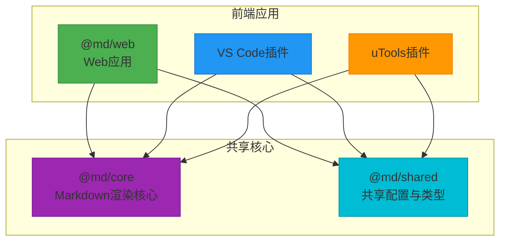
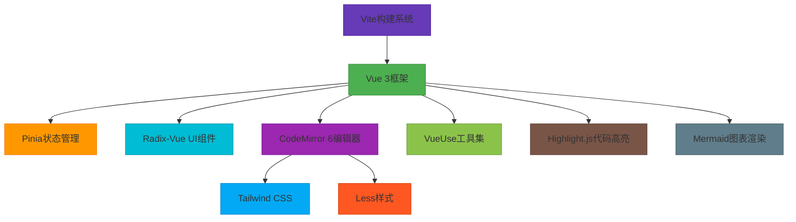
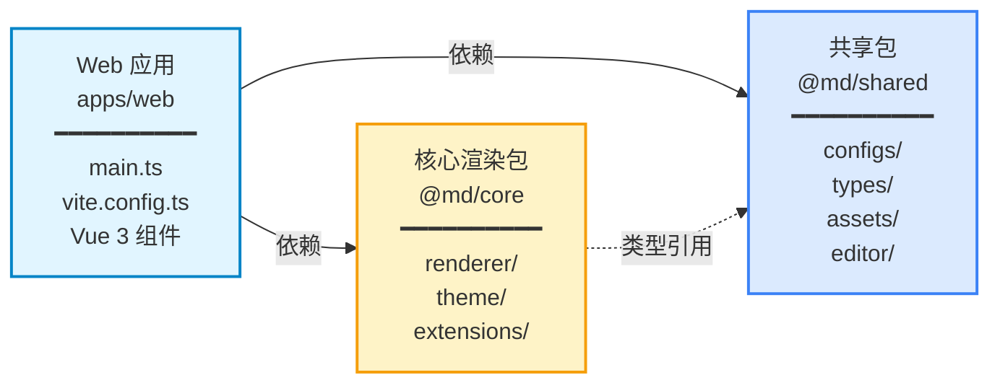
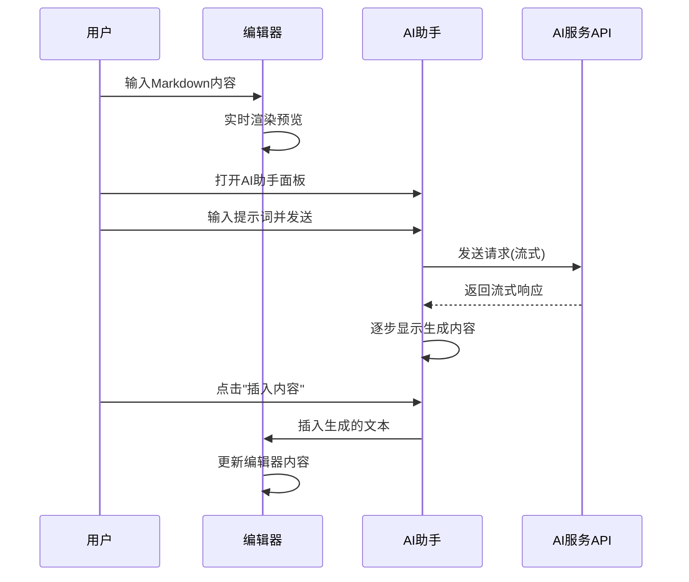

# 项目概述

<cite>
**本文档引用的文件**
- [README.md](file://README.md)
- [package.json](file://package.json)
- [pnpm-workspace.yaml](file://pnpm-workspace.yaml)
- [apps/web/package.json](file://apps/web/package.json)
- [apps/web/src/main.ts](file://apps/web/src/main.ts)
- [apps/web/vite.config.ts](file://apps/web/vite.config.ts)
- [packages/core/src/index.ts](file://packages/core/src/index.ts)
- [packages/core/src/renderer/index.ts](file://packages/core/src/renderer/index.ts)
- [packages/shared/src/index.ts](file://packages/shared/src/index.ts)
- [packages/shared/src/configs/theme.ts](file://packages/shared/src/configs/theme.ts)
- [packages/shared/src/types/renderer-types.ts](file://packages/shared/src/types/renderer-types.ts)
- [packages/shared/src/editor/markdown.ts](file://packages/shared/src/editor/markdown.ts)
- [apps/vscode/package.json](file://apps/vscode/package.json)
- [apps/utools/package.json](file://apps/utools/package.json)
- [apps/web/src/components/ai/chat-box/AIAssistantPanel.vue](file://apps/web/src/components/ai/chat-box/AIAssistantPanel.vue)
</cite>

## 目录
1. [项目简介](#项目简介)
2. [核心目标与功能特性](#核心目标与功能特性)
3. [架构设计原则](#架构设计原则)
4. [技术栈组成](#技术栈组成)
5. [主要子系统关系](#主要子系统关系)
6. [典型使用场景](#典型使用场景)
7. [学习路径与扩展机制](#学习路径与扩展机制)

## 项目简介

multipost-wechat-markdown-editor 是一个专为微信公众号内容创作者设计的现代化 Markdown 编辑与排版工具。该项目基于 doocs/md 进行改造，旨在解决微信图文内容排版复杂的问题，让用户只需掌握基本的 Markdown 语法，即可创作出样式简洁美观的文章。通过与 MultiPost 浏览器扩展集成，支持将编辑好的文章一键同步发布到知乎、微博、小红书、抖音等多个主流内容平台，显著提升内容创作效率。

**Section sources**
- [README.md](file://README.md#L7-L17)

## 核心目标与功能特性

该项目的核心目标是提供一个功能强大且易于使用的 Markdown 编辑环境，特别针对微信公众号的内容展示需求进行优化。其主要功能特性包括：支持 Markdown 所有基础语法和数学公式渲染；提供 Mermaid 图表和 GFM 警告块的支持；拥有丰富的代码块高亮主题以提升可读性；允许用户自定义主题色和 CSS 样式，实现灵活的展示效果定制；支持多图上传并可配置多种图床服务；提供便捷的文件导入导出功能以及本地内容管理能力，支持草稿自动保存；并通过 MultiPost 扩展实现跨平台一键发布。

**Section sources**
- [README.md](file://README.md#L25-L35)

## 架构设计原则

本项目采用现代化的前端架构设计理念，遵循清晰的分层和模块化原则。整体架构基于 Vue 3 的 MVVM 模式构建，利用响应式系统实现视图与数据的高效同步。项目采用 Monorepo 组织结构，通过 pnpm workspace 管理多个相关联的包，实现了代码的高复用性和维护便利性。状态管理采用 Pinia，提供了模块化的状态管理方案，使应用状态更加可预测和易于调试。同时，项目具备跨平台集成能力，支持 Web 应用、VS Code 插件、uTools 插件及 CLI 工具等多种使用形式。

**Diagram sources**
- [package.json](file://package.json#L20-L22)
- [pnpm-workspace.yaml](file://pnpm-workspace.yaml#L1-L4)
- [apps/web/package.json](file://apps/web/package.json#L35-L36)
- [apps/vscode/package.json](file://apps/vscode/package.json#L81-L82)

**Section sources**
- [package.json](file://package.json#L19-L22)
- [pnpm-workspace.yaml](file://pnpm-workspace.yaml#L1-L4)

## 技术栈组成

项目的技术栈选型体现了现代前端开发的最佳实践。构建系统采用 Vite，提供了极速的开发服务器启动和热更新体验。编辑器核心基于 CodeMirror 6，提供了高度可定制的代码编辑能力。样式方案采用 Tailwind CSS 与 Less 的混合模式，既享受了实用优先的 CSS 框架带来的开发效率，又能通过 Less 实现复杂的主题定制逻辑。UI 组件库选用 Radix-Vue，确保了无障碍访问能力和高质量的交互体验。此外，项目还集成了 Pinia 进行状态管理、VueUse 提供实用组合式函数、Highlight.js 实现代码高亮等关键技术。

**Diagram sources**
- [apps/web/package.json](file://apps/web/package.json#L73-L76)
- [apps/web/package.json](file://apps/web/package.json#L55-L56)
- [apps/web/package.json](file://apps/web/package.json#L60-L61)
- [apps/web/package.json](file://apps/web/package.json#L96-L97)
- [apps/web/package.json](file://apps/web/package.json#L89)
- [apps/web/vite.config.ts](file://apps/web/vite.config.ts#L5-L6)

**Section sources**
- [apps/web/package.json](file://apps/web/package.json#L35-L76)

## 主要子系统关系

项目采用清晰的模块化架构，各主要子系统之间有着明确的依赖关系。`apps/web` 作为 Web 应用的入口，直接依赖于 `@md/core` 包进行 Markdown 渲染处理，该核心包提供了从 Markdown 解析到 HTML 生成的完整渲染能力。同时，`apps/web` 通过 `@md/shared` 包共享配置信息和类型定义，确保了跨包的一致性。`@md/shared` 包不仅包含主题配置、快捷键设置等共享配置，还定义了统一的类型系统，为整个项目提供了类型安全保障。这种架构设计使得不同平台的应用可以共享核心逻辑，同时保持各自的独立性。

**Diagram sources**
- [apps/web/src/main.ts](file://apps/web/src/main.ts#L1-L3)
- [apps/web/package.json](file://apps/web/package.json#L35-L36)
- [packages/core/src/index.ts](file://packages/core/src/index.ts#L1-L4)
- [packages/shared/src/index.ts](file://packages/shared/src/index.ts#L1-L7)

**Section sources**
- [apps/web/package.json](file://apps/web/package.json#L35-L36)
- [packages/core/src/index.ts](file://packages/core/src/index.ts#L1-L4)
- [packages/shared/src/index.ts](file://packages/shared/src/index.ts#L1-L7)

## 典型使用场景

### 内容创作流程
用户在 Web 编辑器中使用 Markdown 语法进行内容创作，编辑器实时渲染为微信图文样式。通过集成的 AI 助手功能，用户可以与 AI 进行对话，获取写作建议或生成内容片段。创作完成后，可通过 MultiPost 扩展一键发布到多个平台。

### 主题定制
项目提供多种预设主题（如经典、优雅、简洁），用户可通过主题定制器调整颜色、字体等样式参数。系统通过 `@md/shared` 中的 `themeOptionsMap` 配置主题选项，并利用 `@md/core` 的主题应用功能实时预览效果。

### AI生成内容插入
在 AI 助手面板中，用户可以输入提示词，调用 AI 服务生成内容。生成的内容可以直接插入到编辑器中，支持对话历史保存和多轮交互。该功能通过 `AIAssistantPanel.vue` 组件实现，管理对话状态、处理流式响应并提供用户交互界面。

**Diagram sources**
- [apps/web/src/components/ai/chat-box/AIAssistantPanel.vue](file://apps/web/src/components/ai/chat-box/AIAssistantPanel.vue#L48-L513)
- [packages/shared/src/configs/theme.ts](file://packages/shared/src/configs/theme.ts#L7-L42)

**Section sources**
- [apps/web/src/components/ai/chat-box/AIAssistantPanel.vue](file://apps/web/src/components/ai/chat-box/AIAssistantPanel.vue#L48-L513)
- [packages/shared/src/configs/theme.ts](file://packages/shared/src/configs/theme.ts#L7-L42)

## 学习路径与扩展机制

对于初学者，建议首先熟悉项目的开发环境搭建，通过 `README.md` 中的说明运行开发服务器。然后了解基本的 Markdown 编辑功能和实时渲染机制。接着探索主题定制功能，学习如何修改样式配置。最后尝试使用 AI 助手功能，体验智能化写作辅助。

对于高级开发者，项目提供了多个核心扩展点。`@md/core` 包中的扩展系统允许开发者添加新的 Markdown 语法支持，如自定义的图表或交互组件。`@md/shared` 包定义了统一的配置和类型系统，便于进行功能扩展。Pinia 状态管理为复杂的状态逻辑提供了良好的组织方式。此外，通过 Vite 插件系统，可以轻松集成新的构建功能，如 `vite-plugin-utools-local-assets` 所示的本地资源处理。

**Section sources**
- [README.md](file://README.md#L36-L52)
- [apps/web/vite.config.ts](file://apps/web/vite.config.ts#L15)
- [packages/core/src/extensions](file://packages/core/src/extensions)
- [packages/shared/src/configs](file://packages/shared/src/configs)