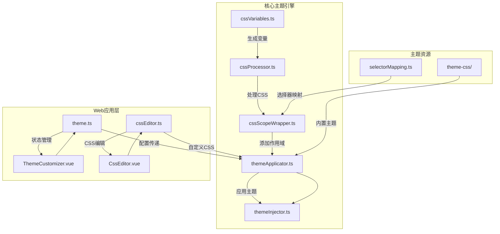
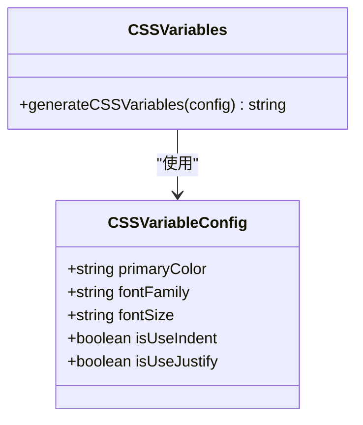
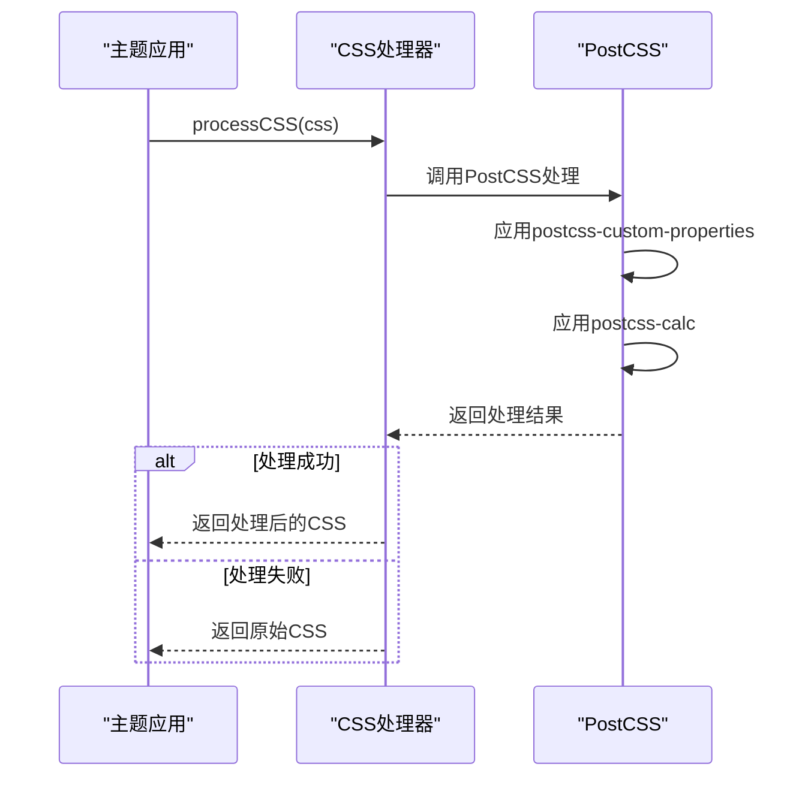
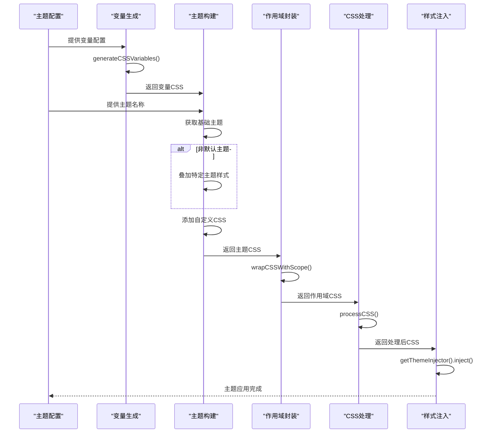
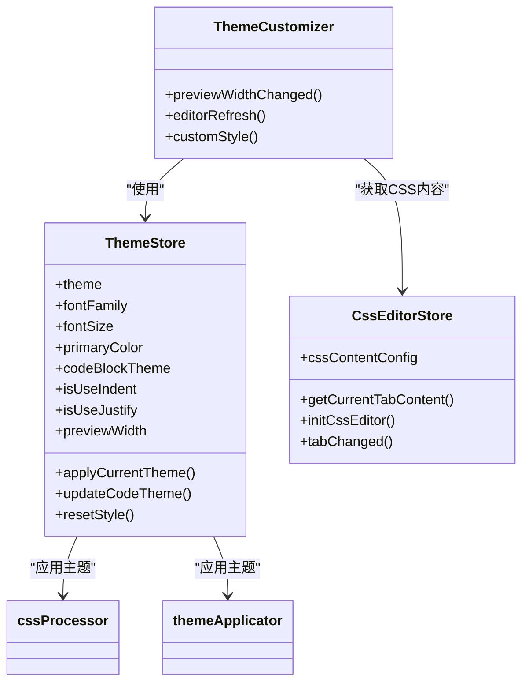
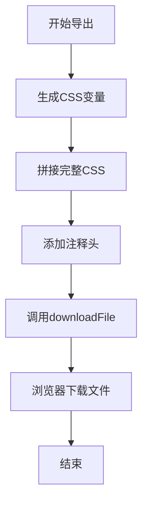
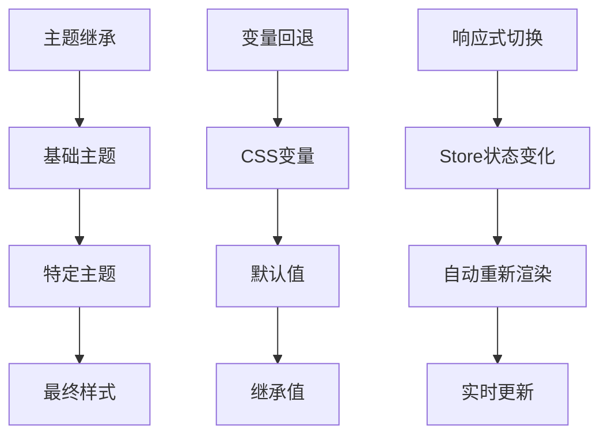

# 主题引擎深度解析

<cite>
**本文档引用的文件**
- [cssVariables.ts](file://packages/core/src/theme/cssVariables.ts)
- [cssProcessor.ts](file://packages/core/src/theme/cssProcessor.ts)
- [cssScopeWrapper.ts](file://packages/core/src/theme/cssScopeWrapper.ts)
- [themeApplicator.ts](file://packages/core/src/theme/themeApplicator.ts)
- [theme.ts](file://apps/web/src/stores/theme.ts)
- [ThemeCustomizer.vue](file://apps/web/src/components/editor/ThemeCustomizer.vue)
- [cssEditor.ts](file://apps/web/src/stores/cssEditor.ts)
- [themeExporter.ts](file://packages/core/src/theme/themeExporter.ts)
- [selectorMapping.ts](file://packages/core/src/theme/selectorMapping.ts)
- [themeInjector.ts](file://packages/core/src/theme/themeInjector.ts)
- [theme-css/index.ts](file://packages/shared/src/configs/theme-css/index.ts)
- [CssEditor.vue](file://apps/web/src/components/editor/CssEditor.vue)
</cite>

## 目录
1. [项目结构](#项目结构)
2. [核心组件](#核心组件)
3. [主题变量体系](#主题变量体系)
4. [CSS处理流程](#css处理流程)
5. [作用域封装机制](#作用域封装机制)
6. [主题应用流程](#主题应用流程)
7. [主题定制组件](#主题定制组件)
8. [主题导出与分享](#主题导出与分享)
9. [高级主题特性](#高级主题特性)

## 项目结构

主题引擎的核心功能分布在多个模块中，主要位于 `packages/core/src/theme` 目录下，同时与 `apps/web/src/stores` 和 `apps/web/src/components/editor` 中的组件紧密协作。



**Diagram sources**
- [project_structure](file://#)

**Section sources**
- [project_structure](file://#)

## 核心组件

主题引擎由多个协同工作的核心组件构成，每个组件负责特定的功能，共同实现主题的动态管理和应用。

**Section sources**
- [cssVariables.ts](file://packages/core/src/theme/cssVariables.ts)
- [cssProcessor.ts](file://packages/core/src/theme/cssProcessor.ts)
- [cssScopeWrapper.ts](file://packages/core/src/theme/cssScopeWrapper.ts)
- [themeApplicator.ts](file://packages/core/src/theme/themeApplicator.ts)
- [themeInjector.ts](file://packages/core/src/theme/themeInjector.ts)

## 主题变量体系

主题变量体系通过 `cssVariables.ts` 文件实现，该文件定义了动态CSS变量的生成逻辑。

`CSSVariableConfig` 接口定义了主题配置所需的关键属性，包括主色、字体和字号等。`generateCSSVariables` 函数根据这些配置生成相应的CSS变量字符串，这些变量以 `--md-` 为前缀，确保命名空间的统一性。

该机制允许在运行时动态调整主题的外观，而无需重新加载整个CSS文件。生成的变量包括 `--md-primary-color`、`--md-font-family` 和 `--md-font-size`，这些变量可以在整个主题样式中被引用。



**Diagram sources**
- [cssVariables.ts](file://packages/core/src/theme/cssVariables.ts#L6-L34)

**Section sources**
- [cssVariables.ts](file://packages/core/src/theme/cssVariables.ts#L1-L35)

## CSS处理流程

CSS处理流程由 `cssProcessor.ts` 文件实现，该文件利用PostCSS在运行时对CSS进行处理和优化。

该流程主要包含两个处理步骤：首先使用 `postcss-custom-properties` 插件将CSS变量替换为实际值，然后使用 `postcss-calc` 插件处理和简化 `calc()` 表达式。这种处理方式确保了CSS在不同浏览器中的兼容性，同时优化了性能。

处理过程是异步的，通过 `processCSS` 函数接收原始CSS字符串并返回处理后的CSS字符串。如果处理过程中发生错误，函数会返回原始CSS字符串作为降级方案。



**Diagram sources**
- [cssProcessor.ts](file://packages/core/src/theme/cssProcessor.ts#L6-L40)

**Section sources**
- [cssProcessor.ts](file://packages/core/src/theme/cssProcessor.ts#L1-L41)

## 作用域封装机制

作用域封装机制通过 `cssScopeWrapper.ts` 文件实现，该文件为CSS选择器添加作用域前缀，防止样式污染。

`wrapCSSWithScope` 函数接收原始CSS字符串和作用域选择器（默认为 `#output`），然后对每个CSS规则进行处理。该函数会跳过 `@` 规则和 `:root` 选择器，对其他选择器添加作用域前缀。

该机制还包含一个选择器映射表（`SELECTOR_MAPPING`），用于将旧的选择器转换为新的规范类名，实现向后兼容。对于多个选择器（用逗号分隔），函数会分别处理每个选择器并重新组合。

```mermaid
flowchart TD
Start([开始]) --> ParseCSS["解析CSS规则"]
ParseCSS --> CheckSelector["检查选择器类型"]
CheckSelector --> |是@规则或:root| Skip["跳过，保持原样"]
CheckSelector --> |是普通选择器| SplitSelectors["分割多个选择器"]
SplitSelectors --> ProcessEach["处理每个选择器"]
ProcessEach --> CheckPrefix["检查是否已有作用域前缀"]
CheckPrefix --> |已有前缀| Keep["保持原样"]
CheckPrefix --> |无前缀| CheckBase["获取基础选择器"]
CheckBase --> CheckMapping["检查选择器映射"]
CheckMapping --> |存在映射| Replace["替换为新类名"]
CheckMapping --> |无映射| AddPrefix["添加作用域前缀"]
Keep --> Combine["重新组合选择器"]
Replace --> Combine
AddPrefix --> Combine
Combine --> ApplyProperties["应用样式属性"]
ApplyProperties --> End([结束])
Skip --> End
```

**Diagram sources**
- [cssScopeWrapper.ts](file://packages/core/src/theme/cssScopeWrapper.ts#L14-L59)
- [selectorMapping.ts](file://packages/core/src/theme/selectorMapping.ts#L11-L50)

**Section sources**
- [cssScopeWrapper.ts](file://packages/core/src/theme/cssScopeWrapper.ts#L1-L60)
- [selectorMapping.ts](file://packages/core/src/theme/selectorMapping.ts#L1-L51)

## 主题应用流程

主题应用流程由 `themeApplicator.ts` 文件实现，该文件负责将主题配置动态注入页面。

`applyTheme` 函数是主题应用的核心，它接收 `ThemeConfig` 配置对象，包含主题名称、自定义CSS和变量配置。该函数按照特定顺序构建最终的CSS：

1. 首先生成CSS变量
2. 构建基础主题CSS
3. 叠加特定主题的样式（如果非默认主题）
4. 添加用户自定义CSS
5. 为主题CSS添加作用域
6. 拼接完整的CSS
7. 使用PostCSS处理CSS
8. 通过注入器将CSS注入页面

这种分层构建的方式确保了样式的可维护性和灵活性，同时通过作用域封装避免了样式冲突。



**Diagram sources**
- [themeApplicator.ts](file://packages/core/src/theme/themeApplicator.ts#L24-L60)
- [themeInjector.ts](file://packages/core/src/theme/themeInjector.ts#L9-L55)

**Section sources**
- [themeApplicator.ts](file://packages/core/src/theme/themeApplicator.ts#L1-L61)
- [themeInjector.ts](file://packages/core/src/theme/themeInjector.ts#L1-L56)

## 主题定制组件

主题定制功能通过 `ThemeCustomizer.vue` 组件和 `theme.ts` Store实现，为用户提供直观的主题配置界面。

`useThemeStore` Store管理所有与主题相关的状态，包括主题名称、字体、字号、主色等。它还提供了 `applyCurrentTheme` 方法，用于应用当前主题配置。

`ThemeCustomizer.vue` 组件提供了一个用户界面，允许用户调整预览宽度、编辑区位置、深色模式等设置。该组件与多个Store交互，包括 `themeStore`、`uiStore` 和 `editorStore`，实现了配置的实时更新和预览。



**Diagram sources**
- [theme.ts](file://apps/web/src/stores/theme.ts#L11-L155)
- [ThemeCustomizer.vue](file://apps/web/src/components/editor/ThemeCustomizer.vue#L1-L147)
- [cssEditor.ts](file://apps/web/src/stores/cssEditor.ts#L26-L217)

**Section sources**
- [theme.ts](file://apps/web/src/stores/theme.ts#L1-L156)
- [ThemeCustomizer.vue](file://apps/web/src/components/editor/ThemeCustomizer.vue#L1-L147)
- [cssEditor.ts](file://apps/web/src/stores/cssEditor.ts#L1-L218)

## 主题导出与分享

主题导出功能通过 `themeExporter.ts` 文件实现，允许用户将当前主题配置导出为CSS文件。

`exportMergedTheme` 函数接收自定义CSS、基础主题CSS、配置项和文件名作为参数，然后生成一个包含完整主题样式的CSS文件。该文件包含注释头，说明导出时间等信息。

导出的CSS文件包含了所有必要的样式，可以直接在其他项目中使用。该功能通过 `downloadFile` 工具函数实现文件下载，确保了跨平台的兼容性。



**Diagram sources**
- [themeExporter.ts](file://packages/core/src/theme/themeExporter.ts#L17-L44)
- [CssEditor.vue](file://apps/web/src/components/editor/CssEditor.vue#L216-L242)

**Section sources**
- [themeExporter.ts](file://packages/core/src/theme/themeExporter.ts#L1-L45)
- [CssEditor.vue](file://apps/web/src/components/editor/CssEditor.vue#L1-L544)

## 高级主题特性

主题引擎支持多种高级特性，包括主题继承、变量回退和响应式主题切换。

主题继承通过 `themeMap` 实现，该映射表包含了所有内置主题的CSS内容。当应用非默认主题时，系统会将默认主题作为基础，然后叠加特定主题的样式，实现了样式的继承和扩展。

变量回退机制通过CSS自定义属性（CSS Variables）实现。当某个变量未定义时，浏览器会使用其默认值或继承值，这为主题提供了良好的向后兼容性。

响应式主题切换通过Vue的响应式系统实现。当Store中的主题配置发生变化时，相关的组件会自动重新渲染，确保界面的实时更新。



**Diagram sources**
- [themeApplicator.ts](file://packages/core/src/theme/themeApplicator.ts#L29-L37)
- [theme-css/index.ts](file://packages/shared/src/configs/theme-css/index.ts#L19-L23)
- [theme.ts](file://apps/web/src/stores/theme.ts#L102-L125)

**Section sources**
- [themeApplicator.ts](file://packages/core/src/theme/themeApplicator.ts#L1-L61)
- [theme-css/index.ts](file://packages/shared/src/configs/theme-css/index.ts#L1-L26)
- [theme.ts](file://apps/web/src/stores/theme.ts#L1-L156)