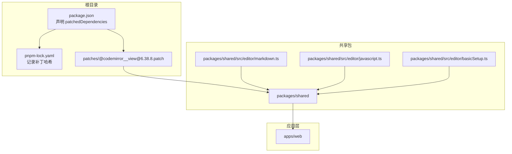
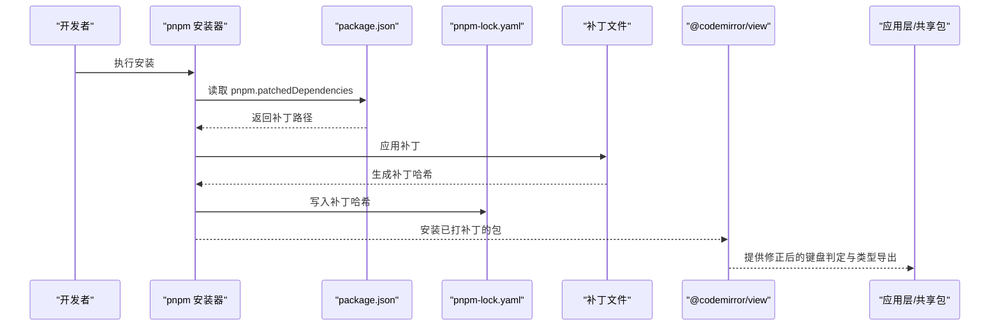
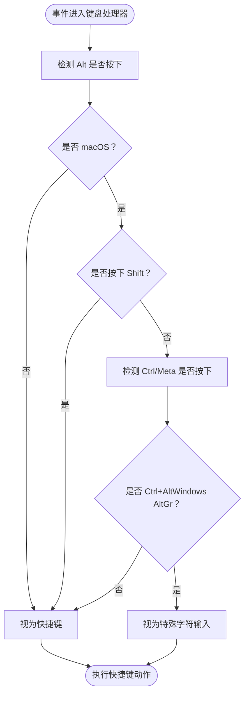
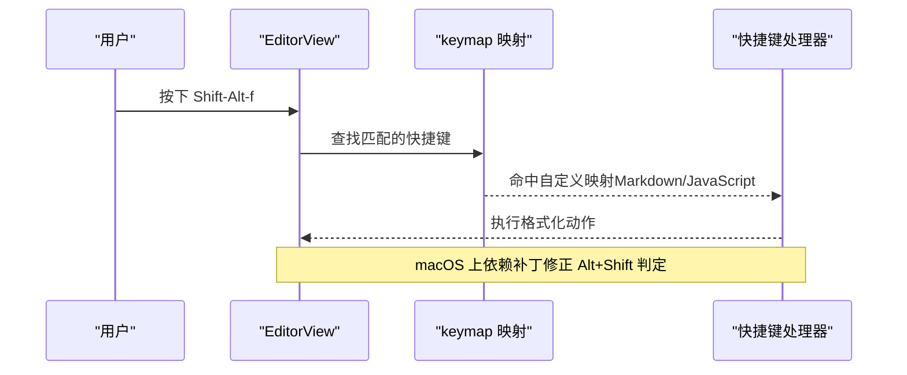
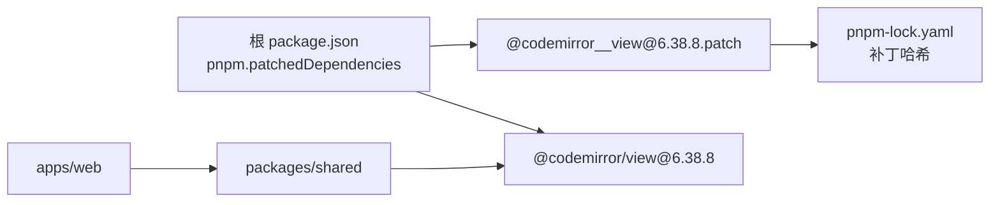

# 依赖补丁管理策略

<cite>
**本文引用的文件**
- [patches/@codemirror__view@6.38.8.patch](file://patches/@codemirror__view@6.38.8.patch)
- [package.json](file://package.json)
- [packages/shared/src/editor/markdown.ts](file://packages/shared/src/editor/markdown.ts)
- [packages/shared/src/editor/javascript.ts](file://packages/shared/src/editor/javascript.ts)
- [packages/shared/src/editor/basicSetup.ts](file://packages/shared/src/editor/basicSetup.ts)
- [pnpm-lock.yaml](file://pnpm-lock.yaml)
</cite>

## 目录
1. [引言](#引言)
2. [项目结构](#项目结构)
3. [核心组件](#核心组件)
4. [架构总览](#架构总览)
5. [详细组件分析](#详细组件分析)
6. [依赖关系分析](#依赖关系分析)
7. [性能考量](#性能考量)
8. [故障排查指南](#故障排查指南)
9. [结论](#结论)
10. [附录](#附录)

## 引言
本技术文档围绕依赖补丁机制展开，以 @codemirror__view@6.38.8.patch 为例，系统阐述为何需要对 CodeMirror 进行补丁修改、补丁内容如何解决类型引用与 macOS 下 Alt+Shift 快捷键判定问题，并解释该补丁如何通过 pnpm 的 patch 协议自动应用，确保团队协作一致性。同时，文档总结补丁维护的最佳实践（生成、测试、更新），并讨论依赖补丁的风险与替代方案（如 fork 仓库或等待官方修复），结合本项目的实际决策依据给出建议。

## 项目结构
本项目采用 monorepo 结构，核心编辑器能力由 packages/shared 提供，应用层在 apps/web 中消费。依赖补丁位于 patches 目录，通过根目录 package.json 的 pnpm 字段声明并启用。

图表来源
- [package.json](file://package.json#L49-L61)
- [pnpm-lock.yaml](file://pnpm-lock.yaml#L400-L431)
- [patches/@codemirror__view@6.38.8.patch](file://patches/@codemirror__view@6.38.8.patch#L1-L28)
- [packages/shared/src/editor/markdown.ts](file://packages/shared/src/editor/markdown.ts#L1-L133)
- [packages/shared/src/editor/javascript.ts](file://packages/shared/src/editor/javascript.ts#L1-L40)
- [packages/shared/src/editor/basicSetup.ts](file://packages/shared/src/editor/basicSetup.ts#L43-L84)

章节来源
- [package.json](file://package.json#L49-L61)
- [pnpm-lock.yaml](file://pnpm-lock.yaml#L400-L431)

## 核心组件
- 补丁文件：patches/@codemirror__view@6.38.8.patch，包含两处关键修改：
  - 将 MeasureRequest 接口导出，解决类型引用问题；
  - 调整 macOS 下 Alt 键组合的快捷键判定逻辑，允许 Alt+Shift 被正确识别为快捷键而非特殊字符输入。
- 根配置：package.json 的 pnpm 字段声明 patchedDependencies，使 pnpm 在安装时自动应用补丁。
- 使用方：
  - packages/shared/src/editor/markdown.ts 与 packages/shared/src/editor/javascript.ts 定义了多处快捷键（如 Shift-Alt-f），这些快捷键在 macOS 上依赖补丁修正后的判定逻辑才能正常工作。
  - packages/shared/src/editor/basicSetup.ts 合并了默认快捷键与自定义快捷键，形成最终的键盘映射优先级。

章节来源
- [patches/@codemirror__view@6.38.8.patch](file://patches/@codemirror__view@6.38.8.patch#L1-L28)
- [package.json](file://package.json#L49-L61)
- [packages/shared/src/editor/markdown.ts](file://packages/shared/src/editor/markdown.ts#L47-L87)
- [packages/shared/src/editor/javascript.ts](file://packages/shared/src/editor/javascript.ts#L30-L39)
- [packages/shared/src/editor/basicSetup.ts](file://packages/shared/src/editor/basicSetup.ts#L43-L84)

## 架构总览
补丁应用流程（基于 pnpm patch 协议）：
- 当执行安装时，pnpm 读取 package.json 的 pnpm.patchedDependencies 字段，定位到 patches/@codemirror__view@6.38.8.patch。
- pnpm 应用补丁后，生成补丁哈希并写入 pnpm-lock.yaml，保证团队成员安装一致。
- 应用层（如 apps/web）通过依赖 packages/shared，间接使用已打补丁的 @codemirror/view，从而获得修正后的键盘判定与类型导出。

图表来源
- [package.json](file://package.json#L49-L61)
- [pnpm-lock.yaml](file://pnpm-lock.yaml#L400-L431)
- [patches/@codemirror__view@6.38.8.patch](file://patches/@codemirror__view@6.38.8.patch#L1-L28)

## 详细组件分析

### 补丁内容解析与动机
- 第一处修改：导出 MeasureRequest 接口
  - 动机：上游类型声明未导出 MeasureRequest，导致下游模块在类型层面无法直接引用该接口，影响类型安全与开发体验。
  - 影响范围：任何依赖 @codemirror/view 类型定义的模块都会受益。
- 第二处修改：macOS 下 Alt+Shift 快捷键判定
  - 动机：原逻辑将 macOS 上的 Alt+Shift 组合视为特殊字符输入，导致 Shift-Alt-f 等快捷键失效；修正后仅在无 Shift 时才视为特殊字符输入，保留 Alt+Shift 作为快捷键。
  - 影响范围：所有使用 Shift-Alt-* 或 Alt+Shift+* 的快捷键在 macOS 上将恢复正常。

图表来源
- [patches/@codemirror__view@6.38.8.patch](file://patches/@codemirror__view@6.38.8.patch#L15-L28)

章节来源
- [patches/@codemirror__view@6.38.8.patch](file://patches/@codemirror__view@6.38.8.patch#L1-L28)

### 快捷键映射与补丁协同
- Markdown 快捷键映射示例：Shift-Alt-f 触发格式化，该快捷键在 macOS 上依赖补丁修正后的 Alt+Shift 判定逻辑。
- JavaScript 快捷键映射示例：同样使用 Shift-Alt-f，行为与 Markdown 保持一致。
- 基础快捷键合并：basicSetup 将默认快捷键与自定义快捷键合并，形成优先级链路，确保用户自定义快捷键能覆盖默认行为。

图表来源
- [packages/shared/src/editor/markdown.ts](file://packages/shared/src/editor/markdown.ts#L47-L87)
- [packages/shared/src/editor/javascript.ts](file://packages/shared/src/editor/javascript.ts#L30-L39)
- [packages/shared/src/editor/basicSetup.ts](file://packages/shared/src/editor/basicSetup.ts#L43-L84)
- [patches/@codemirror__view@6.38.8.patch](file://patches/@codemirror__view@6.38.8.patch#L15-L28)

章节来源
- [packages/shared/src/editor/markdown.ts](file://packages/shared/src/editor/markdown.ts#L47-L87)
- [packages/shared/src/editor/javascript.ts](file://packages/shared/src/editor/javascript.ts#L30-L39)
- [packages/shared/src/editor/basicSetup.ts](file://packages/shared/src/editor/basicSetup.ts#L43-L84)

### 补丁应用与一致性保障
- 自动应用：通过 package.json 的 pnpm.patchedDependencies 字段，pnpm 在安装时自动应用补丁。
- 一致性：补丁哈希写入 pnpm-lock.yaml，确保团队成员安装结果一致，避免“本地可用、CI 失败”的问题。
- 可追溯：补丁文件与哈希共同构成变更记录，便于回溯与审计。

章节来源
- [package.json](file://package.json#L49-L61)
- [pnpm-lock.yaml](file://pnpm-lock.yaml#L400-L431)

## 依赖关系分析
- 直接依赖：项目直接依赖 @codemirror/view@6.38.8。
- 间接依赖：packages/shared 依赖 @codemirror/view，应用层（apps/web）依赖 packages/shared。
- 补丁绑定：通过 pnpm.patchedDependencies 将 @codemirror/view@6.38.8 与 patches/@codemirror__view@6.38.8.patch 绑定，确保安装时自动应用。

图表来源
- [package.json](file://package.json#L49-L61)
- [pnpm-lock.yaml](file://pnpm-lock.yaml#L400-L431)
- [patches/@codemirror__view@6.38.8.patch](file://patches/@codemirror__view@6.38.8.patch#L1-L28)

章节来源
- [package.json](file://package.json#L31-L34)
- [pnpm-lock.yaml](file://pnpm-lock.yaml#L400-L431)

## 性能考量
- 补丁本身不引入运行时开销，仅在安装阶段应用，对构建与运行性能无直接影响。
- 由于补丁仅修正键盘判定与类型导出，不会改变渲染或交互的性能特征。
- 若未来升级 @codemirror/view 版本，需同步评估补丁兼容性，避免引入额外的维护成本。

## 故障排查指南
- 安装后补丁未生效
  - 检查 package.json 的 pnpm.patchedDependencies 是否存在且路径正确。
  - 清理缓存并重新安装，确保 pnpm-lock.yaml 中的补丁哈希更新。
- macOS 上 Alt+Shift 快捷键仍无效
  - 确认补丁已应用（查看 pnpm-lock.yaml 中的补丁哈希）。
  - 检查快捷键映射是否正确（Markdown/JavaScript 文件中的 keymap 定义）。
- 类型引用报错
  - 确认 MeasureRequest 已被导出（补丁已应用）。
  - 如仍报错，检查 TypeScript 版本与 @codemirror/view 的类型声明版本是否匹配。

章节来源
- [package.json](file://package.json#L49-L61)
- [pnpm-lock.yaml](file://pnpm-lock.yaml#L400-L431)
- [packages/shared/src/editor/markdown.ts](file://packages/shared/src/editor/markdown.ts#L47-L87)
- [packages/shared/src/editor/javascript.ts](file://packages/shared/src/editor/javascript.ts#L30-L39)

## 结论
本项目通过 pnpm 的 patch 协议对 @codemirror/view@6.38.8 进行了必要修正：既解决了类型导出问题，又改善了 macOS 平台下 Alt+Shift 快捷键的识别，从而保障了 Markdown 与 JavaScript 编辑器的快捷键体验。补丁与锁文件的配合确保了团队协作的一致性。建议在升级依赖时同步评估补丁兼容性，必要时更新补丁或迁移至官方修复版本。

## 附录

### 补丁维护最佳实践
- 生成
  - 使用最小差异的 diff，仅包含必要修改，避免无关格式变更。
  - 为每个补丁提供清晰的注释，说明动机、影响范围与验证方法。
- 测试
  - 在 macOS 与非 macOS 平台上分别验证 Alt+Shift 快捷键行为。
  - 验证类型导出是否可用，确保下游模块编译通过。
- 更新
  - 记录补丁哈希与版本对应关系，便于回滚与追踪。
  - 升级上游版本后，先在隔离环境中验证补丁兼容性，再决定是否迁移或重写补丁。

### 风险与替代方案
- 风险
  - 依赖补丁会增加维护成本，升级上游版本时可能需要重新适配。
  - 不同平台的键盘行为差异可能导致跨平台兼容性问题。
- 替代方案
  - Fork 仓库：适合长期维护与定制，但需承担持续同步上游的负担。
  - 等待官方修复：风险较低，但可能延长问题暴露时间。
- 本项目决策依据
  - 问题影响面有限（键盘判定与类型导出），且补丁体积小、可快速验证。
  - 通过 pnpm patch 协议与锁文件实现团队一致性，降低协作成本。
  - 一旦官方发布修复版本，优先迁移至官方版本，逐步移除补丁。