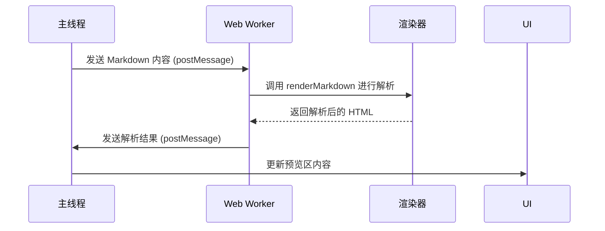
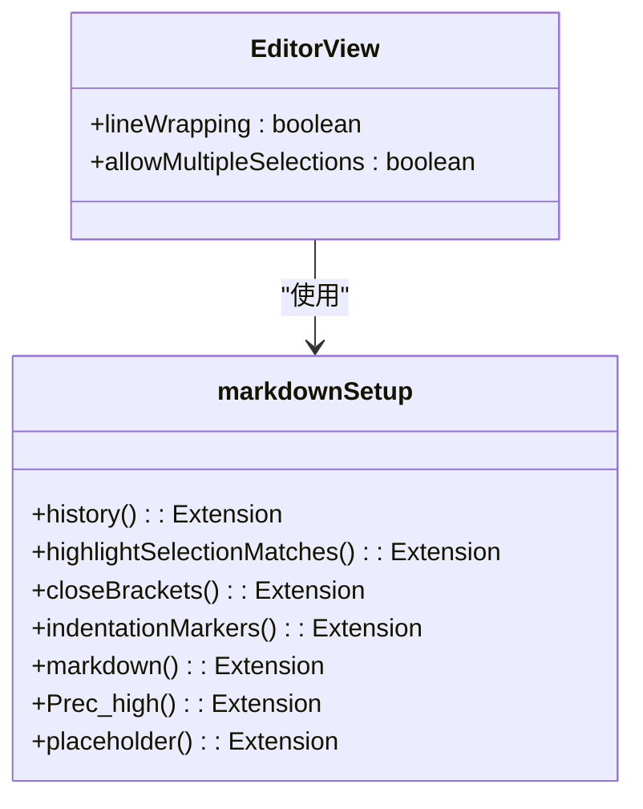
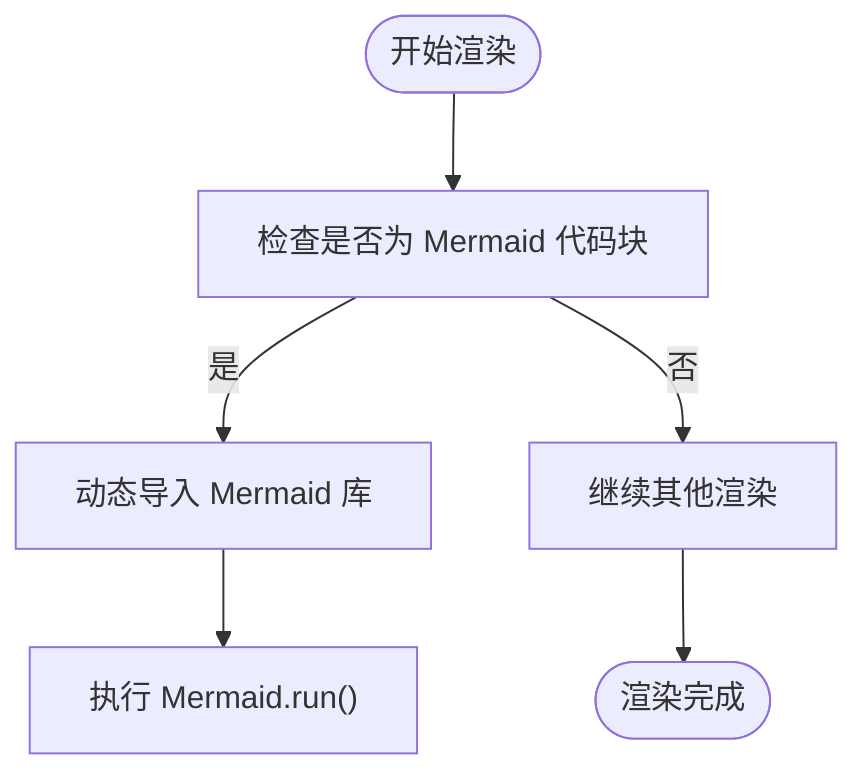
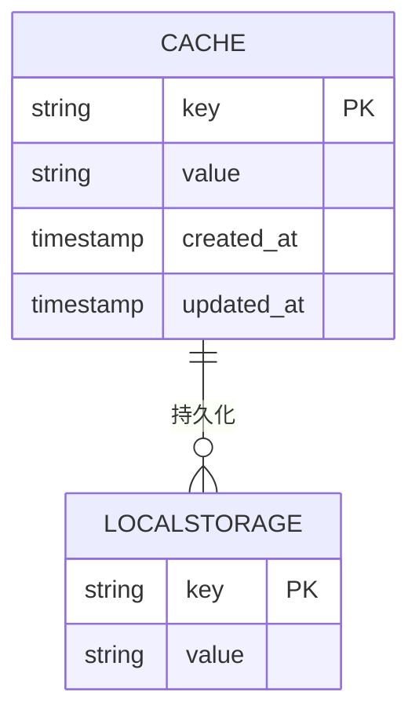
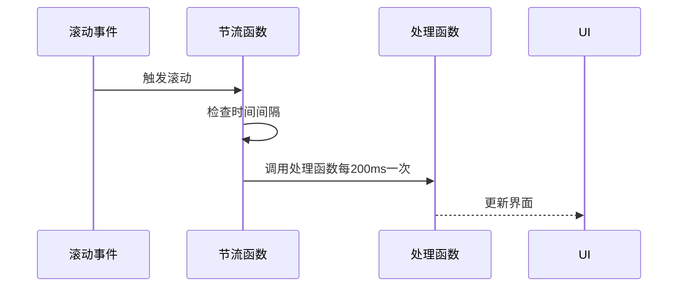

# 性能优化技术

<cite>
**本文档引用的文件**  
- [index.ts](file://apps/web/worker/index.ts)
- [CodemirrorEditor.vue](file://apps/web/src/views/CodemirrorEditor.vue)
- [render.ts](file://apps/web/src/stores/render.ts)
- [renderer-impl.ts](file://packages/core/src/renderer/renderer-impl.ts)
- [markdownHelpers.ts](file://packages/core/src/utils/markdownHelpers.ts)
- [markdown.ts](file://packages/shared/src/editor/markdown.ts)
- [themes.ts](file://packages/shared/src/editor/themes.ts)
- [BackTop.vue](file://apps/web/src/components/ui/back-top/BackTop.vue)
- [storage.ts](file://apps/web/src/utils/storage.ts)
</cite>

## 目录
1. [引言](#引言)
2. [Web Worker 中的渲染计算](#web-worker-中的渲染计算)
3. [CodeMirror 6 性能配置](#codemirror-6-性能配置)
4. [重型库的懒加载策略](#重型库的懒加载策略)
5. [缓存策略](#缓存策略)
6. [非关键任务调度](#非关键任务调度)
7. [结论](#结论)

## 引言
本指南旨在为大型 Markdown 文档编辑器提供全面的性能优化方案。通过分析代码库，我们将探讨如何避免主线程阻塞、实现耗时计算的异步处理、优化编辑器性能以及实施有效的缓存策略。本文档将重点关注 Web Worker 的使用、CodeMirror 6 的配置、重型库的懒加载、内存缓存机制以及非关键任务的调度策略。

## Web Worker 中的渲染计算
项目中的 `worker/index.ts` 文件展示了如何使用 Cloudflare Workers 作为代理服务器，但这并非用于执行渲染计算的 Web Worker。真正的渲染计算在主线程中进行，通过 `renderStore` 和 `initRenderer` 实现。为了优化性能，建议将耗时的渲染计算（如 marked 解析、reading-time 统计）移至 Web Worker 中执行。

**Diagram sources**
- [index.ts](file://apps/web/worker/index.ts)
- [render.ts](file://apps/web/src/stores/render.ts)
- [renderer-impl.ts](file://packages/core/src/renderer/renderer-impl.ts)

**Section sources**
- [index.ts](file://apps/web/worker/index.ts)
- [render.ts](file://apps/web/src/stores/render.ts)

## CodeMirror 6 性能配置
CodeMirror 6 的性能配置主要在 `packages/shared/src/editor` 目录下实现。`markdown.ts` 文件定义了编辑器的基础扩展集合，包括语言支持、历史记录、括号匹配等功能。`themes.ts` 文件则负责主题的配置。

### viewportMargin 调整
CodeMirror 6 通过 `viewportMargin` 配置来优化长文档的渲染性能。虽然代码中未显式设置 `viewportMargin`，但可以通过 `EditorView` 的配置来实现。

**Diagram sources**
- [markdown.ts](file://packages/shared/src/editor/markdown.ts)
- [themes.ts](file://packages/shared/src/editor/themes.ts)

**Section sources**
- [markdown.ts](file://packages/shared/src/editor/markdown.ts)
- [themes.ts](file://packages/shared/src/editor/themes.ts)

## 重型库的懒加载策略
项目中对 KaTeX 和 Mermaid 等重型库采用了按需引入的策略。在 `renderer-impl.ts` 文件中，可以看到 Mermaid 的动态导入逻辑。

**Diagram sources**
- [renderer-impl.ts](file://packages/core/src/renderer/renderer-impl.ts)

**Section sources**
- [renderer-impl.ts](file://packages/core/src/renderer/renderer-impl.ts)

## 缓存策略
项目中使用了多种缓存策略来提升性能。`renderStore` 中的 `output`、`readingTime` 和 `titleList` 都是响应式数据，可以实现内存缓存。此外，`storage.ts` 文件提供了基于 localStorage 的持久化存储。

**Diagram sources**
- [render.ts](file://apps/web/src/stores/render.ts)
- [storage.ts](file://apps/web/src/utils/storage.ts)

**Section sources**
- [render.ts](file://apps/web/src/stores/render.ts)
- [storage.ts](file://apps/web/src/utils/storage.ts)

## 非关键任务调度
项目中未直接使用 `requestIdleCallback` 或 `scheduler`，但通过 `setTimeout` 和 `throttle` 实现了类似的功能。例如，在 `BackTop.vue` 中使用了 `throttle` 来节流滚动事件的处理。

**Diagram sources**
- [BackTop.vue](file://apps/web/src/components/ui/back-top/BackTop.vue)

**Section sources**
- [BackTop.vue](file://apps/web/src/components/ui/back-top/BackTop.vue)

## 结论
通过对代码库的分析，我们可以看到项目在性能优化方面已经采取了一些措施，如使用 Web Worker 作为代理、按需加载重型库、使用节流函数等。然而，仍有改进空间，特别是在将耗时的渲染计算移至 Web Worker、更精细地配置 CodeMirror 6 以及使用 `requestIdleCallback` 或 `scheduler` 进行非关键任务调度方面。建议进一步优化这些方面，以提升大型 Markdown 文档的编辑体验。