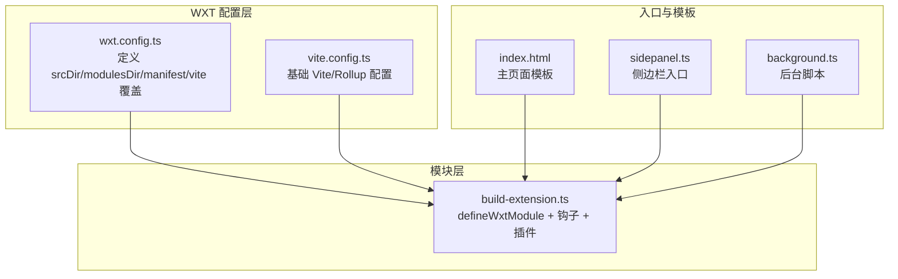
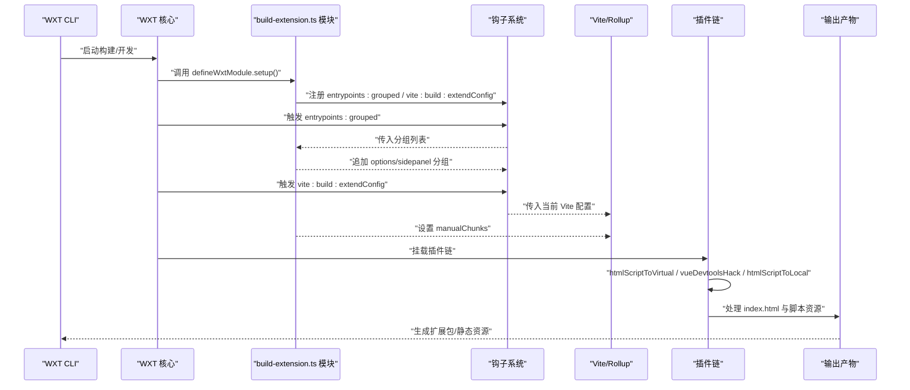
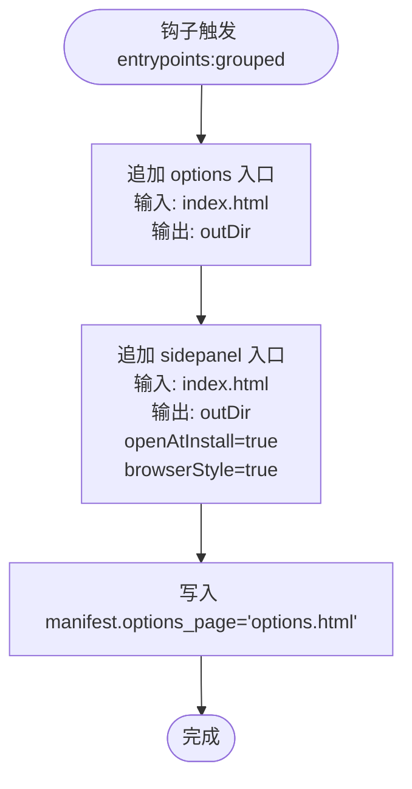
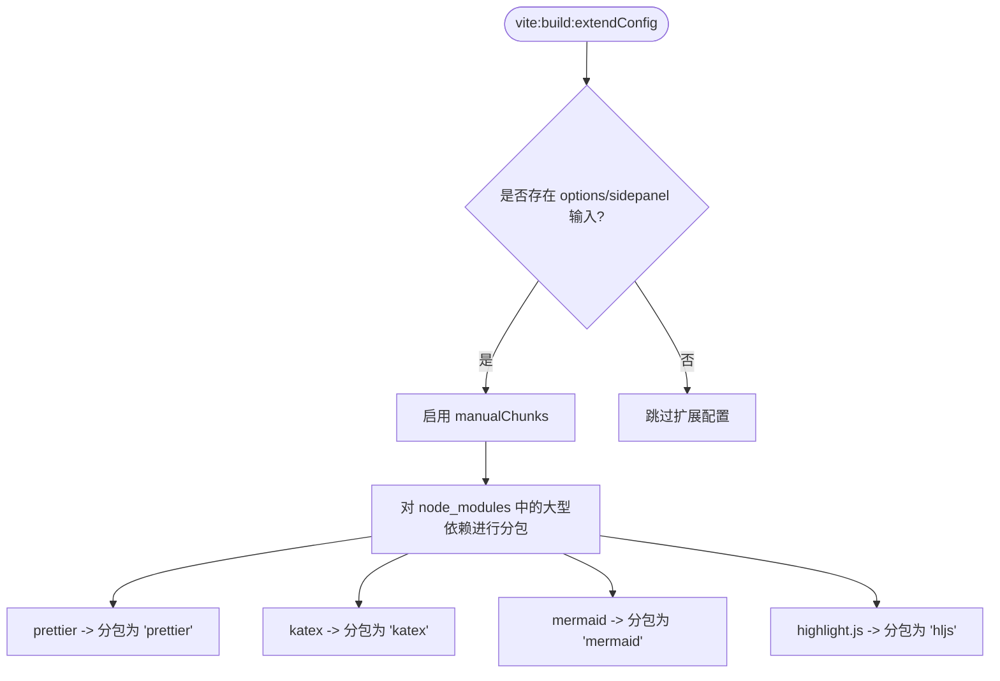
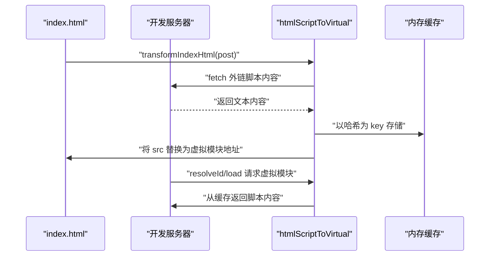
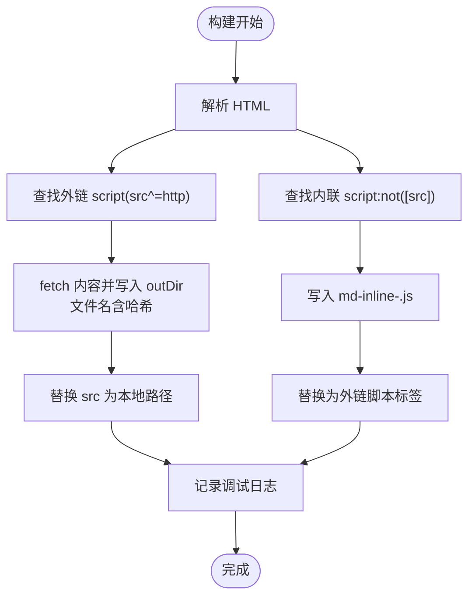
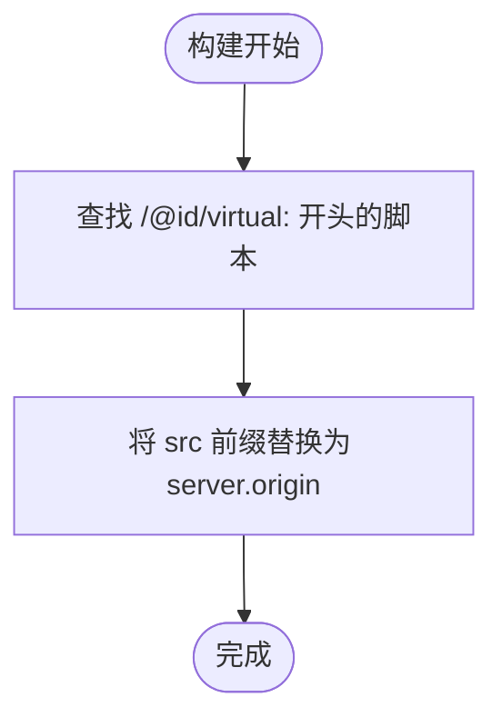
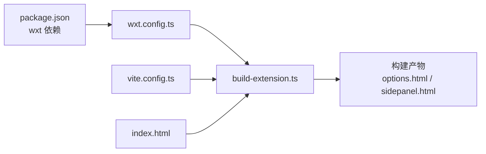

# 插件化构建流程

<cite>
**本文引用的文件**
- [apps/web/src/modules/build-extension.ts](file://apps/web/src/modules/build-extension.ts)
- [apps/web/wxt.config.ts](file://apps/web/wxt.config.ts)
- [apps/web/vite.config.ts](file://apps/web/vite.config.ts)
- [apps/web/index.html](file://apps/web/index.html)
- [apps/web/src/sidepanel.ts](file://apps/web/src/sidepanel.ts)
- [apps/web/src/entrypoints/background.ts](file://apps/web/src/entrypoints/background.ts)
- [apps/web/package.json](file://apps/web/package.json)
</cite>

## 目录
1. [简介](#简介)
2. [项目结构](#项目结构)
3. [核心组件](#核心组件)
4. [架构总览](#架构总览)
5. [详细组件分析](#详细组件分析)
6. [依赖关系分析](#依赖关系分析)
7. [性能考量](#性能考量)
8. [故障排查指南](#故障排查指南)
9. [结论](#结论)
10. [附录](#附录)

## 简介
本文件系统性记录并解析 apps/web/src/modules/build-extension.ts 模块所实现的插件化构建机制。该模块通过 WXT 的 defineWxtModule 与框架深度集成，在构建生命周期中注入多项自定义逻辑，重点解决以下问题：
- 浏览器扩展 CSP 对内联脚本的限制：通过 htmlScriptToVirtual 在开发环境将内联/外链脚本虚拟化；通过 htmlScriptToLocal 在生产环境将脚本写入本地文件并替换为本地路径。
- Vue Devtools 在扩展环境中的加载问题：通过 vueDevtoolsHack 修正虚拟模块的访问路径。
- 动态扩展 Vite 配置：在 vite:build:extendConfig 钩子中为 options 与 sidepanel 入口启用手动分包（manualChunks），针对 prettier、katex、mermaid、highlight.js 等大型依赖进行代码分割。
- 自动化注入 options 与 sidepanel 入口点：在 entrypoints:grouped 钩子中向分组列表追加这两个入口，并在 manifest 中设置 options_page 与 side_panel。

这些能力共同确保了扩展在开发与生产两种模式下的稳定运行与可维护性。

## 项目结构
该模块位于应用的模块目录下，作为 WXT 的自定义模块参与构建流程。关键文件与职责如下：
- build-extension.ts：定义模块、注册钩子、注入插件、扩展 Vite 配置、自动化注入入口点。
- wxt.config.ts：WXT 主配置，定义 srcDir、modulesDir、manifest、vite 覆盖等。
- vite.config.ts：基础 Vite 配置，包含 Rollup 手动分包策略与通用插件。
- index.html：扩展页面入口模板，包含 MathJax、Mermaid、主应用与侧边栏入口脚本。
- sidepanel.ts：侧边栏入口脚本，用于与宿主页面通信。
- background.ts：后台脚本，负责安装后打开选项页与上下文菜单。
- package.json：声明 WXT 依赖与脚本命令。

图表来源
- [apps/web/wxt.config.ts](file://apps/web/wxt.config.ts#L23-L101)
- [apps/web/vite.config.ts](file://apps/web/vite.config.ts#L24-L91)
- [apps/web/src/modules/build-extension.ts](file://apps/web/src/modules/build-extension.ts#L13-L66)
- [apps/web/index.html](file://apps/web/index.html#L72-L113)
- [apps/web/src/sidepanel.ts](file://apps/web/src/sidepanel.ts#L1-L39)
- [apps/web/src/entrypoints/background.ts](file://apps/web/src/entrypoints/background.ts#L1-L34)

章节来源
- [apps/web/wxt.config.ts](file://apps/web/wxt.config.ts#L23-L101)
- [apps/web/vite.config.ts](file://apps/web/vite.config.ts#L24-L91)
- [apps/web/src/modules/build-extension.ts](file://apps/web/src/modules/build-extension.ts#L13-L66)
- [apps/web/index.html](file://apps/web/index.html#L72-L113)
- [apps/web/src/sidepanel.ts](file://apps/web/src/sidepanel.ts#L1-L39)
- [apps/web/src/entrypoints/background.ts](file://apps/web/src/entrypoints/background.ts#L1-L34)

## 核心组件
- defineWxtModule：定义模块入口，返回模块对象，包含 setup 函数。
- setup(wxt)：在模块初始化时执行，注册别名、注入入口点、扩展 Vite 配置、挂载插件。
- 钩子：
  - entrypoints:grouped：向分组列表追加 options 与 sidepanel 入口。
  - vite:build:extendConfig：在构建阶段扩展 Rollup 配置，启用 manualChunks。
- 插件：
  - htmlScriptToVirtual：开发环境将内联/外链脚本替换为虚拟模块，规避 CSP。
  - htmlScriptToLocal：生产环境将外链/内联脚本下载并写入本地文件，替换为本地路径。
  - vueDevtoolsHack：修正 Vue Devtools 虚拟模块的访问 URL，使其能在扩展环境中加载。

章节来源
- [apps/web/src/modules/build-extension.ts](file://apps/web/src/modules/build-extension.ts#L13-L66)

## 架构总览
下图展示了从 WXT 启动到构建完成的关键交互流程，包括模块初始化、钩子触发、插件执行与最终产物生成。

图表来源
- [apps/web/src/modules/build-extension.ts](file://apps/web/src/modules/build-extension.ts#L13-L66)
- [apps/web/wxt.config.ts](file://apps/web/wxt.config.ts#L23-L101)

## 详细组件分析

### 组件A：defineWxtModule 与模块初始化
- 作用：定义模块并提供 setup(wxt) 生命周期钩子，允许在模块加载时修改配置、注册入口点、扩展 Vite/Rollup 行为。
- 关键行为：
  - 设置别名：将 /src/main.ts 与 /src/sidepanel.ts 映射到实际路径，便于入口引用。
  - 写入 manifest：设置 options_page 为 options.html。
  - 注册钩子：entrypoints:grouped 与 vite:build:extendConfig。
  - 添加 Vite 插件：htmlScriptToVirtual、vueDevtoolsHack、条件加载 htmlScriptToLocal。

章节来源
- [apps/web/src/modules/build-extension.ts](file://apps/web/src/modules/build-extension.ts#L13-L66)
- [apps/web/wxt.config.ts](file://apps/web/wxt.config.ts#L23-L101)

### 组件B：入口点自动化注入（options 与 sidepanel）
- 触发时机：entrypoints:grouped 钩子。
- 实现要点：
  - 追加两个入口分组：type 为 options 与 sidepanel，输入路径指向根目录的 index.html，输出目录为构建输出目录。
  - sidepanel 入口设置了 openAtInstall 与 browserStyle，确保安装后自动打开并使用浏览器样式。
- 结果体现：
  - manifest 中 options_page 指向 options.html。
  - side_panel 默认路径由浏览器决定（Chrome 使用 sidepanel.html，Firefox 使用 sidebar_action）。

图表来源
- [apps/web/src/modules/build-extension.ts](file://apps/web/src/modules/build-extension.ts#L18-L35)
- [apps/web/wxt.config.ts](file://apps/web/wxt.config.ts#L23-L101)

章节来源
- [apps/web/src/modules/build-extension.ts](file://apps/web/src/modules/build-extension.ts#L18-L35)
- [apps/web/wxt.config.ts](file://apps/web/wxt.config.ts#L23-L101)

### 组件C：动态扩展 Vite 配置（Rollup manualChunks）
- 触发时机：vite:build:extendConfig 钩子。
- 实现要点：
  - 当检测到 options 或 sidepanel 入口存在时，启用 manualChunks。
  - 对 node_modules 中的大型依赖进行分类分包：
    - prettier -> 分包为 prettier
    - katex -> 分包为 katex
    - mermaid -> 分包为 mermaid
    - highlight.js -> 分包为 hljs
- 与基础 Vite 配置的关系：
  - 基础 vite.config.ts 已有 rollupOptions.manualChunks，但此处仅对特定入口生效，避免影响其他入口的分包策略。

图表来源
- [apps/web/src/modules/build-extension.ts](file://apps/web/src/modules/build-extension.ts#L36-L55)
- [apps/web/vite.config.ts](file://apps/web/vite.config.ts#L62-L89)

章节来源
- [apps/web/src/modules/build-extension.ts](file://apps/web/src/modules/build-extension.ts#L36-L55)
- [apps/web/vite.config.ts](file://apps/web/vite.config.ts#L62-L89)

### 组件D：htmlScriptToVirtual（开发环境虚拟化）
- 适用场景：开发模式（serve）。
- 解决问题：浏览器扩展 CSP 不允许内联脚本，将内联/外链脚本转换为虚拟模块并通过开发服务器提供。
- 核心流程：
  - transformIndexHtml（post 阶段）：解析 HTML，查找以 http 开头的 script 标签，通过 fetch 获取内容并缓存到内存字典。
  - 将 src 替换为虚拟模块地址（如 /@id/virtual:md-inline-script?key），必要时将带 id 的脚本 type 设为 module。
  - resolveId/load：拦截虚拟模块请求，从内存字典返回对应脚本内容。
  - 忽略预渲染过程中的 chunks，避免干扰。

图表来源
- [apps/web/src/modules/build-extension.ts](file://apps/web/src/modules/build-extension.ts#L70-L148)

章节来源
- [apps/web/src/modules/build-extension.ts](file://apps/web/src/modules/build-extension.ts#L70-L148)

### 组件E：htmlScriptToLocal（生产环境本地化）
- 适用场景：构建模式（build）。
- 解决问题：生产环境下 CSP 仍限制内联脚本，将外链/内联脚本下载并写入 outDir，再将 HTML 中的 script 标签替换为本地相对路径。
- 核心流程：
  - transformIndexHtml（post 阶段）：解析 HTML，遍历以 http 开头的 script 标签，fetch 内容并写入 outDir，重命名文件（含内容哈希），替换 src 为本地路径。
  - 同时处理无 src 的内联脚本：读取 textContent，写入 md-inline-<hash>.js，替换为外链脚本标签。
  - 记录调试日志，便于定位问题。

图表来源
- [apps/web/src/modules/build-extension.ts](file://apps/web/src/modules/build-extension.ts#L150-L219)

章节来源
- [apps/web/src/modules/build-extension.ts](file://apps/web/src/modules/build-extension.ts#L150-L219)

### 组件F：vueDevtoolsHack（修复 Devtools 加载）
- 适用场景：构建模式（build）。
- 解决问题：Vue Devtools 在扩展环境中加载虚拟模块时，需要将虚拟模块的 src 改为开发服务器可访问的完整 URL。
- 核心流程：
  - transformIndexHtml（post 阶段）：查找以 /@id/virtual: 开头的脚本，将其 src 前缀替换为开发服务器 origin，使 Devtools 可以正确加载。

图表来源
- [apps/web/src/modules/build-extension.ts](file://apps/web/src/modules/build-extension.ts#L221-L247)

章节来源
- [apps/web/src/modules/build-extension.ts](file://apps/web/src/modules/build-extension.ts#L221-L247)

### 组件G：入口模板与脚本加载（index.html）
- 关键脚本：
  - MathJax：通过外链引入，用于数学公式渲染。
  - Mermaid：通过外链引入，用于流程图渲染。
  - 主应用入口：/src/main.ts（模块化加载）。
  - 侧边栏入口：/src/sidepanel.ts（模块化加载）。
- 作用：为 options 与 sidepanel 入口提供统一的 HTML 模板，确保两个入口共享相同的外部依赖与主题资源。

章节来源
- [apps/web/index.html](file://apps/web/index.html#L72-L113)

### 组件H：sidepanel.ts 与后台脚本联动
- sidepanel.ts：监听复制事件并向宿主页面发送消息，实现与内容脚本的通信。
- background.ts：安装后打开 options 页面，并在支持 sidePanel 的浏览器中注册上下文菜单，点击后打开侧边栏。

章节来源
- [apps/web/src/sidepanel.ts](file://apps/web/src/sidepanel.ts#L1-L39)
- [apps/web/src/entrypoints/background.ts](file://apps/web/src/entrypoints/background.ts#L1-L34)

## 依赖关系分析
- 模块依赖：
  - build-extension.ts 依赖 wxt/modules（defineWxtModule、addViteConfig）、wxt/hooks（钩子）、wxt/server（开发服务器）、linkedom（HTML 解析）、ohash（内容哈希）、node:fs/promises（文件写入）。
- 配置依赖：
  - wxt.config.ts 定义 modulesDir 为 src/modules，使模块被自动发现与加载。
  - vite.config.ts 提供基础 Vite/Rollup 配置，包括 rollupOptions.manualChunks 与通用插件。
- 入口依赖：
  - index.html 作为 options 与 sidepanel 的共享模板，承载外链脚本与模块化入口。

图表来源
- [apps/web/package.json](file://apps/web/package.json#L78-L106)
- [apps/web/wxt.config.ts](file://apps/web/wxt.config.ts#L23-L101)
- [apps/web/vite.config.ts](file://apps/web/vite.config.ts#L24-L91)
- [apps/web/src/modules/build-extension.ts](file://apps/web/src/modules/build-extension.ts#L13-L66)
- [apps/web/index.html](file://apps/web/index.html#L72-L113)

章节来源
- [apps/web/package.json](file://apps/web/package.json#L78-L106)
- [apps/web/wxt.config.ts](file://apps/web/wxt.config.ts#L23-L101)
- [apps/web/vite.config.ts](file://apps/web/vite.config.ts#L24-L91)
- [apps/web/src/modules/build-extension.ts](file://apps/web/src/modules/build-extension.ts#L13-L66)
- [apps/web/index.html](file://apps/web/index.html#L72-L113)

## 性能考量
- 代码分割策略：
  - 对 prettier、katex、mermaid、highlight.js 等大型依赖进行独立分包，有助于浏览器缓存复用与并行加载。
  - 基础 vite.config.ts 中也对 codemirror、highlight.js、katex 等进行了 vendor 分包，与模块扩展形成互补。
- 生产环境脚本本地化：
  - 将外链脚本写入本地文件并替换为本地路径，减少网络往返与 CSP 限制，提升加载稳定性。
- 开发环境虚拟化：
  - 通过虚拟模块与内存缓存，避免频繁网络请求，同时保持热更新体验。
- 日志与可观测性：
  - 插件在处理前后输出调试日志，便于定位脚本替换失败或路径错误等问题。

章节来源
- [apps/web/src/modules/build-extension.ts](file://apps/web/src/modules/build-extension.ts#L36-L55)
- [apps/web/vite.config.ts](file://apps/web/vite.config.ts#L62-L89)

## 故障排查指南
- 外链脚本无法加载：
  - 检查 htmlScriptToLocal 是否成功写入本地文件并替换 src；确认 outDir 下存在对应文件且路径正确。
  - 若为开发环境，检查 htmlScriptToVirtual 是否将外链脚本 fetch 并缓存到内存字典。
- Vue Devtools 无法加载：
  - 检查 vueDevtoolsHack 是否将虚拟模块的 src 替换为 server.origin；确认开发服务器已启动。
- 内联脚本报 CSP 错误：
  - 确认 htmlScriptToLocal 已将内联脚本写入 md-inline-<hash>.js 并替换为外链脚本标签。
- 入口点未生成：
  - 检查 entrypoints:grouped 钩子是否被触发，确认 options 与 sidepanel 分组已加入。
  - 检查 manifest.options_page 是否被设置为 options.html。
- 手动分包未生效：
  - 确认 vite:build:extendConfig 钩子已检测到 options/sidepanel 输入；检查 manualChunks 条件分支。

章节来源
- [apps/web/src/modules/build-extension.ts](file://apps/web/src/modules/build-extension.ts#L150-L219)
- [apps/web/src/modules/build-extension.ts](file://apps/web/src/modules/build-extension.ts#L221-L247)
- [apps/web/src/modules/build-extension.ts](file://apps/web/src/modules/build-extension.ts#L36-L55)

## 结论
build-extension.ts 模块通过 defineWxtModule 与 WXT 深度集成，围绕“开发虚拟化、生产本地化”的核心目标，提供了完善的脚本处理方案，并在构建阶段实现了对大型依赖的手动分包优化。配合入口点自动化注入与 manifest 的配置，该模块有效解决了浏览器扩展 CSP 限制带来的兼容性问题，提升了开发体验与构建效率。建议在后续迭代中持续关注：
- 对更多外链依赖的本地化策略；
- 在多浏览器（Chrome/Firefox/Edge）上的兼容性验证；
- 与现有基础 Vite 配置的协同与冲突消解。

## 附录
- 相关命令：
  - 开发：wxt 或 npm 脚本 ext:dev
  - 构建：wxt zip 或 npm 脚本 ext:zip
  - 浏览器指定：firefox:dev / firefox:zip
- 重要文件路径：
  - 模块：apps/web/src/modules/build-extension.ts
  - 配置：apps/web/wxt.config.ts、apps/web/vite.config.ts
  - 模板：apps/web/index.html
  - 入口：apps/web/src/sidepanel.ts、apps/web/src/entrypoints/background.ts