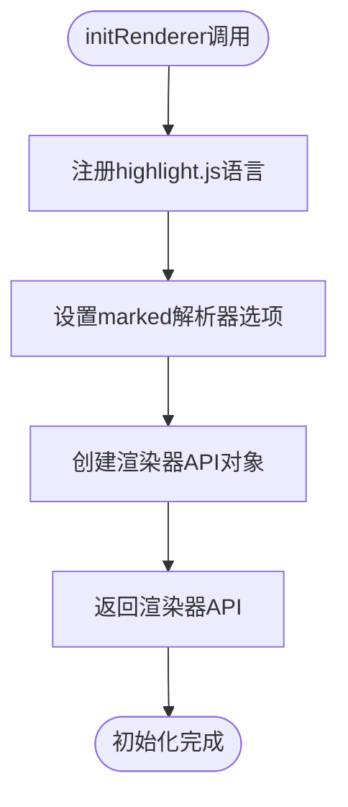
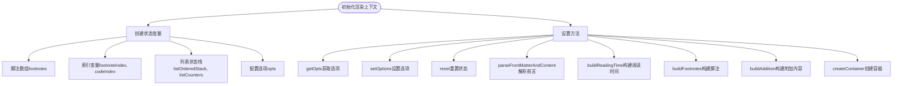
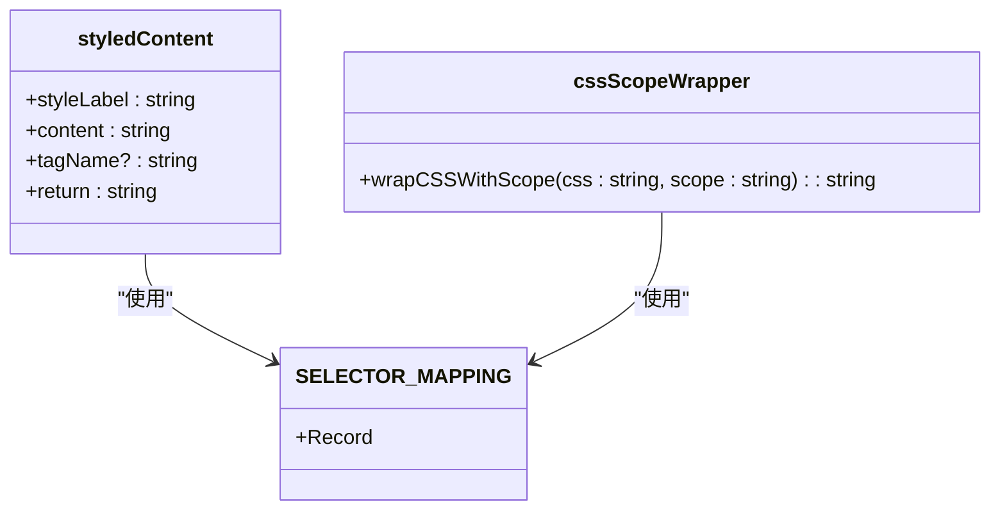
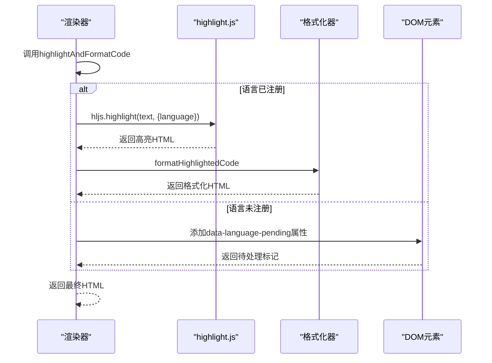
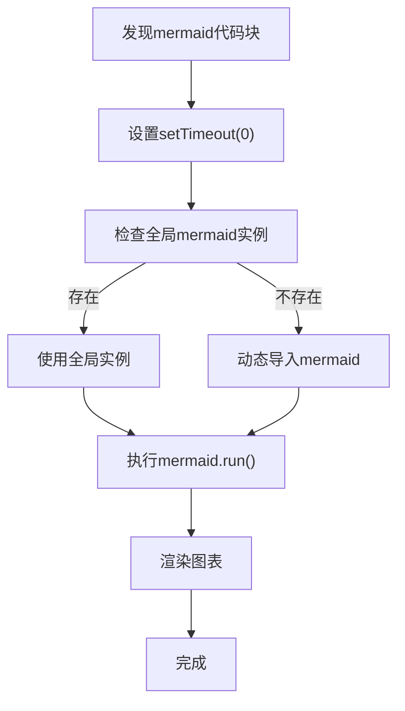
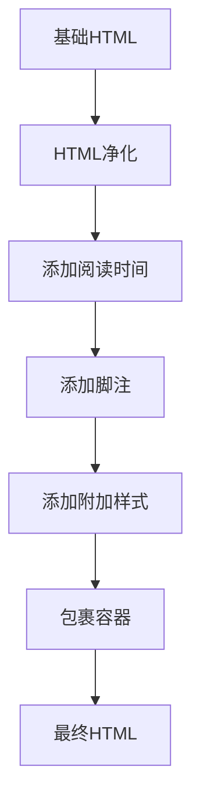
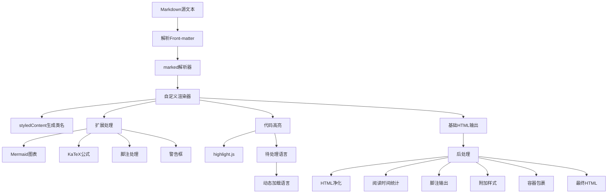

# 渲染管道架构与实现

<cite>
**本文档引用的文件**
- [renderer-impl.ts](file://packages/core/src/renderer/renderer-impl.ts)
- [languages.ts](file://packages/core/src/utils/languages.ts)
- [selectorMapping.ts](file://packages/core/src/theme/selectorMapping.ts)
- [cssScopeWrapper.ts](file://packages/core/src/theme/cssScopeWrapper.ts)
- [initializeMermaid.ts](file://packages/core/src/utils/initializeMermaid.ts)
- [markdownHelpers.ts](file://packages/core/src/utils/markdownHelpers.ts)
- [common.ts](file://packages/shared/src/types/common.ts)
- [renderer-types.ts](file://packages/shared/src/types/renderer-types.ts)
- [katex.ts](file://packages/core/src/extensions/katex.ts)
- [footnotes.ts](file://packages/core/src/extensions/footnotes.ts)
</cite>

## 目录
1. [渲染管道概述](#渲染管道概述)
2. [核心初始化流程](#核心初始化流程)
3. [渲染上下文初始化](#渲染上下文初始化)
4. [RendererObject 方法实现](#rendererobject-方法实现)
5. [新主题系统与CSS类名映射](#新主题系统与css类名映射)
6. [代码高亮处理流程](#代码高亮处理流程)
7. [复杂内容异步渲染机制](#复杂内容异步渲染机制)
8. [后处理环节实现原理](#后处理环节实现原理)
9. [渲染管道架构图](#渲染管道架构图)

## 渲染管道概述

渲染管道是将Markdown内容转换为符合微信公众号风格HTML的核心处理流程。该管道基于marked库构建，通过自定义渲染器和扩展机制，实现了从Markdown语法解析到最终HTML输出的完整转换过程。管道支持多种扩展功能，包括脚注、代码高亮、数学公式、流程图等，并通过新主题系统实现了样式与逻辑的分离。

**Section sources**
- [renderer-impl.ts](file://packages/core/src/renderer/renderer-impl.ts#L1-L387)

## 核心初始化流程

渲染管道的核心初始化流程始于`initRenderer`函数的调用。该函数接收配置选项作为参数，创建并返回一个包含完整渲染功能的API对象。初始化过程中，系统会注册highlight.js支持的常用编程语言，并设置marked解析器的基本选项。整个流程确保了渲染器在首次使用时就具备完整的功能支持。

**Diagram sources**
- [renderer-impl.ts](file://packages/core/src/renderer/renderer-impl.ts#L11-L387)

**Section sources**
- [renderer-impl.ts](file://packages/core/src/renderer/renderer-impl.ts#L11-L387)

## 渲染上下文初始化

`initRenderer`函数在初始化渲染上下文时，会创建多个状态管理变量，包括脚注数组、脚注索引、代码块索引和列表状态栈。这些变量用于在渲染过程中维护跨Token的状态信息。函数还实现了选项配置机制，允许在运行时动态调整渲染行为。通过`setOptions`方法，可以更新渲染器的配置，并重新应用相关的Markdown扩展。

**Diagram sources**
- [renderer-impl.ts](file://packages/core/src/renderer/renderer-impl.ts#L112-L185)

**Section sources**
- [renderer-impl.ts](file://packages/core/src/renderer/renderer-impl.ts#L112-L185)
- [common.ts](file://packages/shared/src/types/common.ts#L8-L14)

## RendererObject 方法实现

RendererObject定义了将Markdown Token转换为HTML结构的核心方法。每个方法对应一种Markdown语法元素，如标题、代码块、图片、链接等。这些方法通过`styledContent`函数生成符合微信风格的HTML结构，确保输出内容在视觉上与微信公众号文章保持一致。方法实现中包含了对特殊场景的处理，如图片的图注、链接的引用标记等。

### 标题处理
标题方法接收Token中的文本和层级信息，使用`styledContent`函数生成对应层级的标题HTML。

### 代码块处理
代码块方法处理代码高亮和行号显示，支持mermaid图表的特殊处理。

### 图片处理
图片方法生成包含图注的figure结构，支持通过legend选项控制图注内容。

### 链接处理
链接方法处理引用标记，当启用citeStatus时，会为外部链接添加脚注引用。

**Section sources**
- [renderer-impl.ts](file://packages/core/src/renderer/renderer-impl.ts#L187-L359)

## 新主题系统与CSS类名映射

新主题系统通过`styledContent`函数实现CSS类名的映射。该函数接收样式标签、内容和可选的HTML标签名，生成带有规范类名的HTML元素。系统使用kebab-case命名约定，并通过`SELECTOR_MAPPING`映射表实现向后兼容，将旧的选择器转换为新的规范类名。CSS作用域包装器确保样式只在预览区域生效，避免影响页面其他部分。

**Diagram sources**
- [renderer-impl.ts](file://packages/core/src/renderer/renderer-impl.ts#L129-L134)
- [selectorMapping.ts](file://packages/core/src/theme/selectorMapping.ts#L11-L50)
- [cssScopeWrapper.ts](file://packages/core/src/theme/cssScopeWrapper.ts#L14-L59)

**Section sources**
- [renderer-impl.ts](file://packages/core/src/renderer/renderer-impl.ts#L129-L134)
- [selectorMapping.ts](file://packages/core/src/theme/selectorMapping.ts#L11-L50)
- [cssScopeWrapper.ts](file://packages/core/src/theme/cssScopeWrapper.ts#L14-L59)

## 代码高亮处理流程

代码高亮流程从`highlightAndFormatCode`函数调用开始，经过语言注册、代码高亮、格式化等步骤。系统首先检查语言是否已注册，若未注册则标记为待处理状态。对于已注册的语言，直接使用highlight.js进行高亮处理。行号显示通过特殊布局实现，确保代码块在不同设备上都能正确显示。

**Diagram sources**
- [languages.ts](file://packages/core/src/utils/languages.ts#L159-L189)
- [renderer-impl.ts](file://packages/core/src/renderer/renderer-impl.ts#L210-L243)

**Section sources**
- [languages.ts](file://packages/core/src/utils/languages.ts#L159-L189)
- [renderer-impl.ts](file://packages/core/src/renderer/renderer-impl.ts#L210-L243)

## 复杂内容异步渲染机制

复杂内容如Mermaid图表和KaTeX公式采用异步渲染机制。系统在遇到mermaid代码块时，会设置一个零延迟的setTimeout，确保在当前调用栈清空后执行渲染。渲染时优先使用全局CDN的mermaid实例，若不存在则动态导入。KaTeX公式通过MathJax库在客户端实时渲染，支持标准和非标准语法。

**Diagram sources**
- [renderer-impl.ts](file://packages/core/src/renderer/renderer-impl.ts#L211-L225)
- [initializeMermaid.ts](file://packages/core/src/utils/initializeMermaid.ts#L1-L12)
- [katex.ts](file://packages/core/src/extensions/katex.ts#L16-L44)

**Section sources**
- [renderer-impl.ts](file://packages/core/src/renderer/renderer-impl.ts#L211-L225)
- [initializeMermaid.ts](file://packages/core/src/utils/initializeMermaid.ts#L1-L12)
- [katex.ts](file://packages/core/src/extensions/katex.ts#L16-L44)

## 后处理环节实现原理

后处理环节包括HTML净化、资源重写和交互增强。HTML净化使用DOMPurify库防止XSS攻击，同时允许特定的自定义标签。资源重写在构建时将CDN资源替换为本地资源，确保在离线环境下也能正常工作。交互增强通过添加额外的样式和脚本实现，如代码块的macOS风格标识和行号显示控制。

**Diagram sources**
- [markdownHelpers.ts](file://packages/core/src/utils/markdownHelpers.ts#L12-L59)
- [utoolsLocalAssetsPlugin.ts](file://apps/web/plugins/vite-plugin-utools-local-assets.ts#L7-L53)

**Section sources**
- [markdownHelpers.ts](file://packages/core/src/utils/markdownHelpers.ts#L12-L59)
- [utoolsLocalAssetsPlugin.ts](file://apps/web/plugins/vite-plugin-utools-local-assets.ts#L7-L53)

## 渲染管道架构图

**Diagram sources**
- [renderer-impl.ts](file://packages/core/src/renderer/renderer-impl.ts#L112-L387)
- [languages.ts](file://packages/core/src/utils/languages.ts#L97-L126)
- [markdownHelpers.ts](file://packages/core/src/utils/markdownHelpers.ts#L12-L59)

**Section sources**
- [renderer-impl.ts](file://packages/core/src/renderer/renderer-impl.ts#L112-L387)
- [languages.ts](file://packages/core/src/utils/languages.ts#L97-L126)
- [markdownHelpers.ts](file://packages/core/src/utils/markdownHelpers.ts#L12-L59)