# 自定义Markdown扩展开发

<cite>
**本文档引用的文件**  
- [alert.ts](file://packages/core/src/extensions/alert.ts)
- [katex.ts](file://packages/core/src/extensions/katex.ts)
- [plantuml.ts](file://packages/core/src/extensions/plantuml.ts)
- [renderer-impl.ts](file://packages/core/src/renderer/renderer-impl.ts)
- [footnotes.ts](file://packages/core/src/extensions/footnotes.ts)
- [toc.ts](file://packages/core/src/extensions/toc.ts)
- [slider.ts](file://packages/core/src/extensions/slider.ts)
- [markup.ts](file://packages/core/src/extensions/markup.ts)
- [ruby.ts](file://packages/core/src/extensions/ruby.ts)
- [index.ts](file://packages/core/src/extensions/index.ts)
- [renderer-types.ts](file://packages/shared/src/types/renderer-types.ts)
- [common.ts](file://packages/shared/src/types/common.ts)
</cite>

## 目录
1. [引言](#引言)
2. [扩展系统架构](#扩展系统架构)
3. [核心扩展模块分析](#核心扩展模块分析)
4. [扩展开发实践](#扩展开发实践)
5. [扩展集成与执行流程](#扩展集成与执行流程)
6. [扩展兼容性与执行顺序](#扩展兼容性与执行顺序)
7. [复杂内容结构构建](#复杂内容结构构建)
8. [结论](#结论)

## 引言

本技术文档深入探讨了在`multipost-wechat-markdown-editor`项目中开发自定义Markdown扩展的完整流程。文档以`alert.ts`、`katex.ts`和`plantuml.ts`等实际扩展模块为例，详细阐述了如何定义新的语法解析规则，并将其注册到`marked`解析器中。我们将解析每个扩展模块的导出结构（如`markedAlert`、`MDKatex`）及其在`renderer-impl.ts`中的集成方式，为开发者提供一个全面的扩展开发指南。

## 扩展系统架构

该项目的Markdown扩展系统基于`marked`库构建，通过其扩展API实现自定义语法的解析和渲染。所有扩展模块位于`packages/core/src/extensions/`目录下，通过`index.ts`文件统一导出，形成了一个模块化的扩展体系。

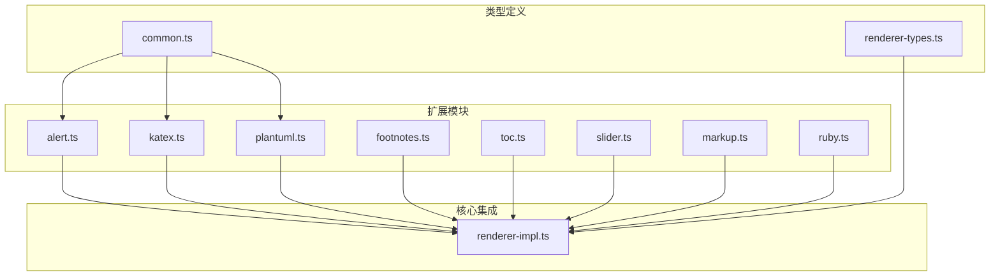

**图源**  
- [alert.ts](file://packages/core/src/extensions/alert.ts)
- [katex.ts](file://packages/core/src/extensions/katex.ts)
- [plantuml.ts](file://packages/core/src/extensions/plantuml.ts)
- [renderer-impl.ts](file://packages/core/src/renderer/renderer-impl.ts)
- [common.ts](file://packages/shared/src/types/common.ts)
- [renderer-types.ts](file://packages/shared/src/types/renderer-types.ts)

**本节来源**  
- [index.ts](file://packages/core/src/extensions/index.ts)

## 核心扩展模块分析

### 警报扩展 (alert.ts)

`markedAlert`扩展实现了GitHub Flavored Markdown (GFM) 风格的警报块功能，支持`[!note]`、`[!tip]`、`[!warning]`等多种变体。

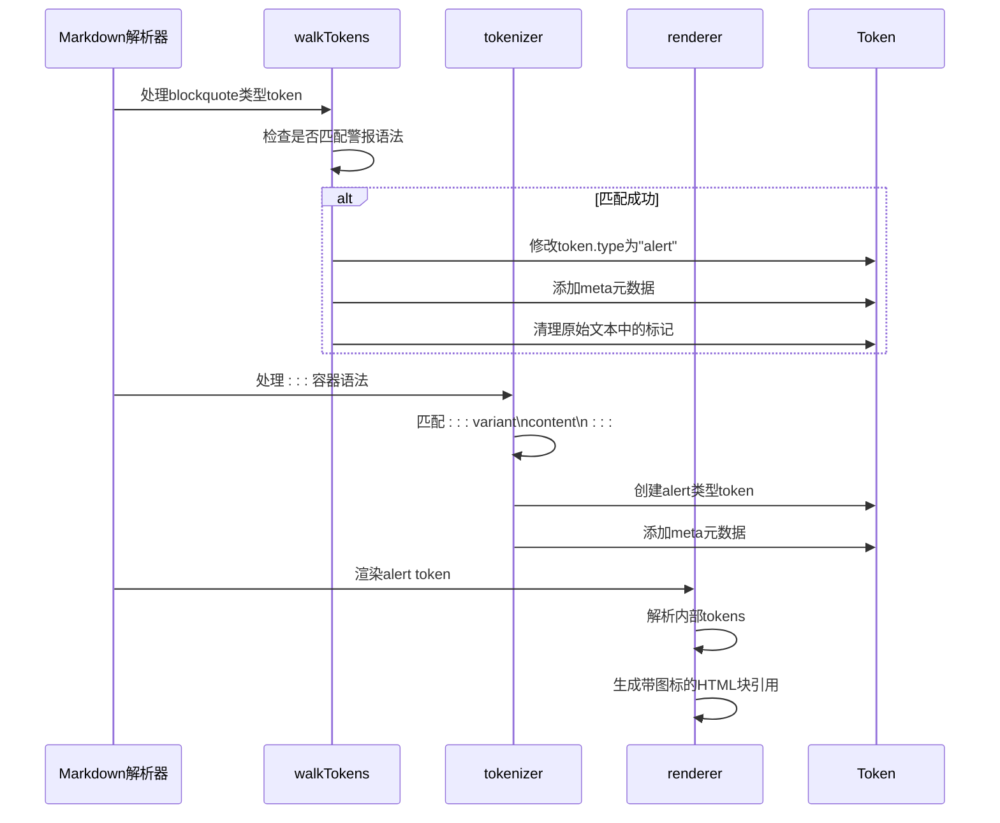

**图源**  
- [alert.ts](file://packages/core/src/extensions/alert.ts#L10-L121)

**本节来源**  
- [alert.ts](file://packages/core/src/extensions/alert.ts)
- [common.ts](file://packages/shared/src/types/common.ts#L22-L56)

### 数学公式扩展 (katex.ts)

`MDKatex`扩展支持使用`$...$`和`$$...$$`语法渲染数学公式，同时兼容LaTeX风格的`\(...\)`和`\[...\]`语法。

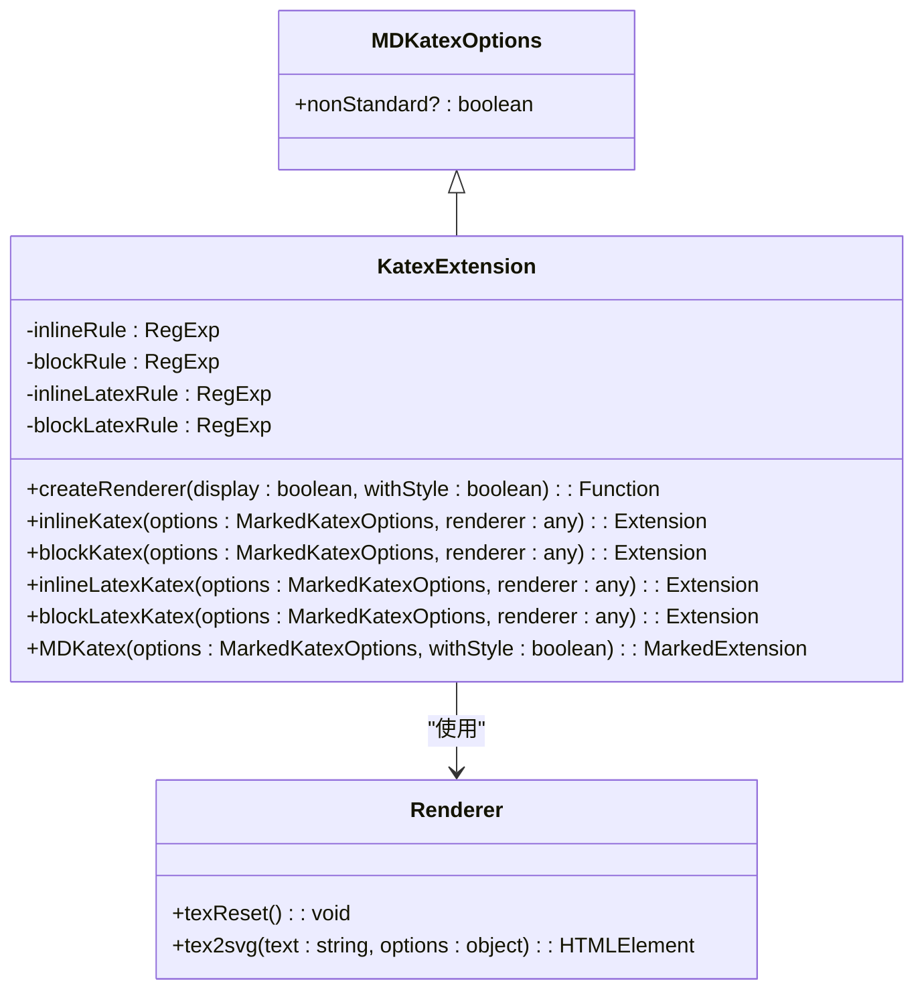

**图源**  
- [katex.ts](file://packages/core/src/extensions/katex.ts#L3-L162)

**本节来源**  
- [katex.ts](file://packages/core/src/extensions/katex.ts)

### 流程图扩展 (plantuml.ts)

`markedPlantUML`扩展允许用户通过代码块语法嵌入PlantUML图表，支持SVG和PNG两种渲染格式。

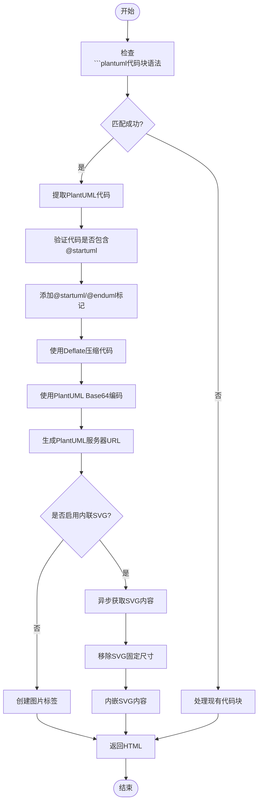

**图源**  
- [plantuml.ts](file://packages/core/src/extensions/plantuml.ts#L239-L289)

**本节来源**  
- [plantuml.ts](file://packages/core/src/extensions/plantuml.ts)

## 扩展开发实践

### 定义新的语法解析规则

在`marked`扩展中，定义新的语法解析规则主要通过`extensions`数组中的`tokenizer`函数实现。每个`tokenizer`需要定义`name`、`level`（`block`或`inline`）、`start`和`tokenizer`方法。

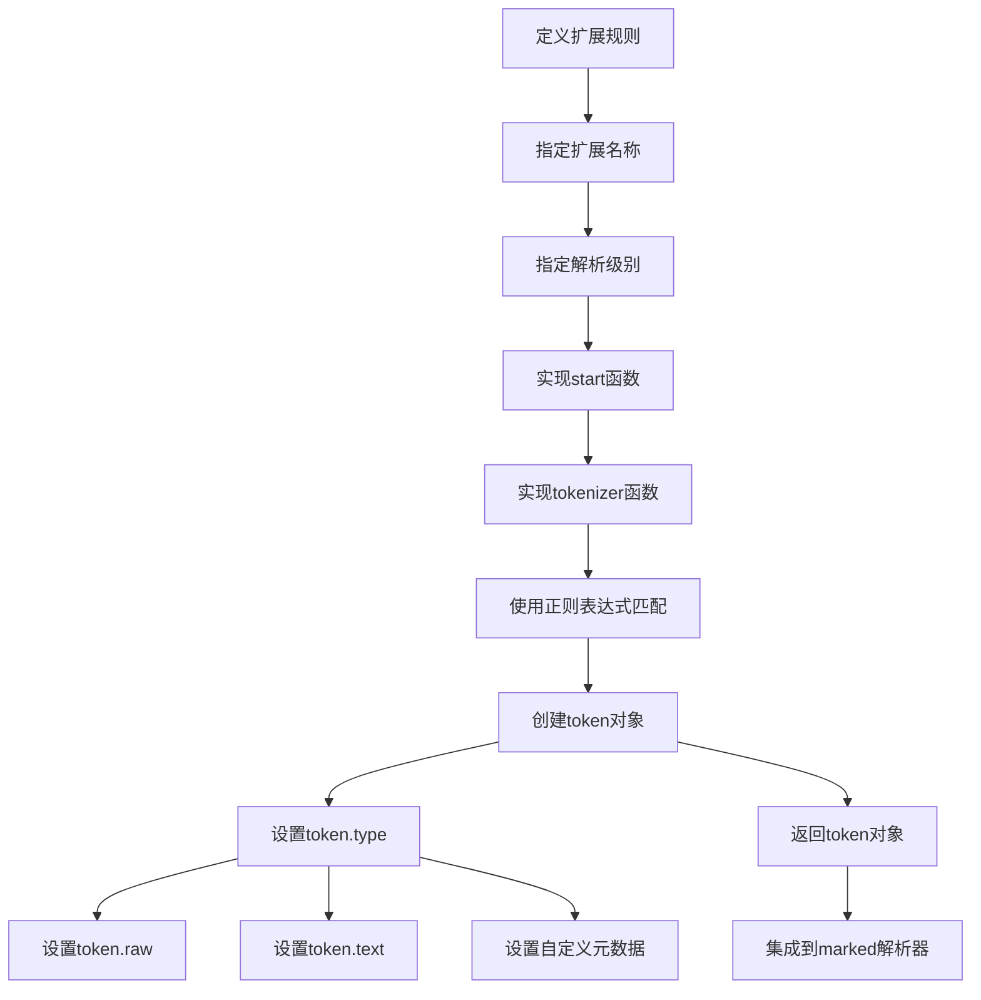

**本节来源**  
- [markup.ts](file://packages/core/src/extensions/markup.ts)
- [ruby.ts](file://packages/core/src/extensions/ruby.ts)

### 实现全新的数学公式扩展

以下是一个实现全新数学公式扩展的步骤示例：

1. **定义扩展选项接口**：
```typescript
export interface MathFormulaOptions {
  className?: string;
  displayMode?: boolean;
}
```

2. **创建正则表达式匹配规则**：
```typescript
const inlineMathRule = /^\$(.*?)\$/;
const blockMathRule = /^\$\$(.*?)\$\$/;
```

3. **实现tokenizer函数**：
```typescript
{
  name: 'mathFormula',
  level: 'inline',
  start(src: string) {
    return src.match(/\$/)?.index;
  },
  tokenizer(src: string) {
    const match = inlineMathRule.exec(src);
    if (match) {
      return {
        type: 'mathFormula',
        raw: match[0],
        text: match[1],
        displayMode: false
      };
    }
  },
  renderer(token: any) {
    // 渲染逻辑
  }
}
```

4. **实现渲染器**：
```typescript
renderer(token: any) {
  const { text, displayMode } = token;
  const formula = katex.renderToString(text, { displayMode });
  const className = displayMode ? 'math-block' : 'math-inline';
  return `<span class="${className}">${formula}</span>`;
}
```

**本节来源**  
- [katex.ts](file://packages/core/src/extensions/katex.ts)
- [common.ts](file://packages/shared/src/types/common.ts)

## 扩展集成与执行流程

### 扩展注册与注入

所有扩展通过`marked.use()`方法在`initRenderer`流程中注入。`renderer-impl.ts`文件负责初始化渲染器并注册所有扩展。

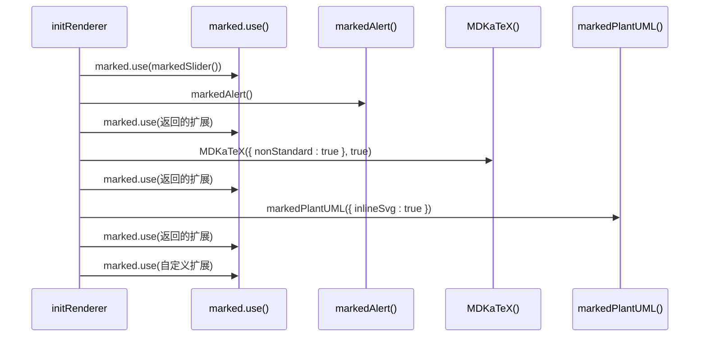

**图源**  
- [renderer-impl.ts](file://packages/core/src/renderer/renderer-impl.ts#L20-L372)

**本节来源**  
- [renderer-impl.ts](file://packages/core/src/renderer/renderer-impl.ts)

### 渲染器处理流程

当Markdown文本被解析时，`marked`解析器会按照预定义的顺序处理各种token类型，每个注册的扩展都有机会处理匹配的token。

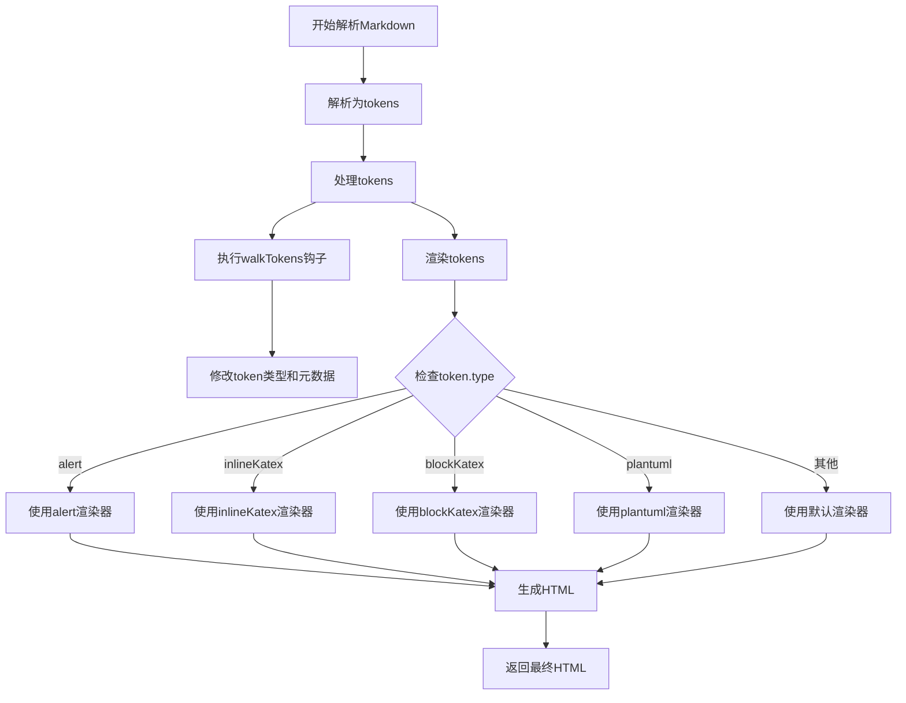

**本节来源**  
- [renderer-impl.ts](file://packages/core/src/renderer/renderer-impl.ts)
- [alert.ts](file://packages/core/src/extensions/alert.ts)
- [katex.ts](file://packages/core/src/extensions/katex.ts)
- [plantuml.ts](file://packages/core/src/extensions/plantuml.ts)

## 扩展兼容性与执行顺序

### 扩展之间的依赖关系

扩展的执行顺序至关重要，某些扩展需要在其他扩展之前执行才能正确工作。例如，`markedSlider`需要在`markedAlert`之前执行，以确保滑动图片语法不会被误识别为警报块。

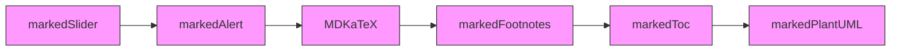

**本节来源**  
- [renderer-impl.ts](file://packages/core/src/renderer/renderer-impl.ts#L20-L372)

### 执行顺序依赖

在`renderer-impl.ts`中，扩展的注册顺序决定了它们的执行优先级。`walkTokens`钩子按照注册顺序执行，而`extensions`中的`tokenizer`则根据`start`函数返回的索引值决定优先级。

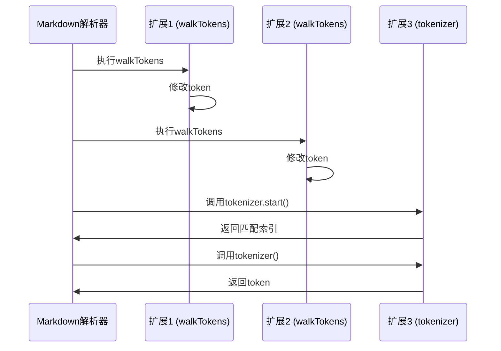

**本节来源**  
- [renderer-impl.ts](file://packages/core/src/renderer/renderer-impl.ts)
- [alert.ts](file://packages/core/src/extensions/alert.ts#L49-L86)
- [plantuml.ts](file://packages/core/src/extensions/plantuml.ts#L282-L287)

## 复杂内容结构构建

### Front-matter机制

`front-matter`扩展允许在Markdown文档开头使用YAML格式的元数据，这些元数据可以用于文章配置、SEO信息等。

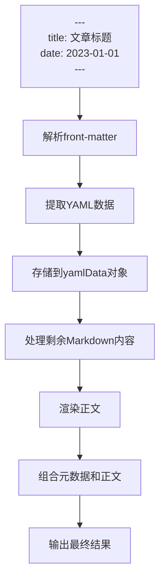

**本节来源**  
- [renderer-impl.ts](file://packages/core/src/renderer/renderer-impl.ts#L88-L109)

### 脚注机制

`markedFootnotes`扩展实现了脚注功能，允许在文档中添加引用标记并在文末生成脚注列表。

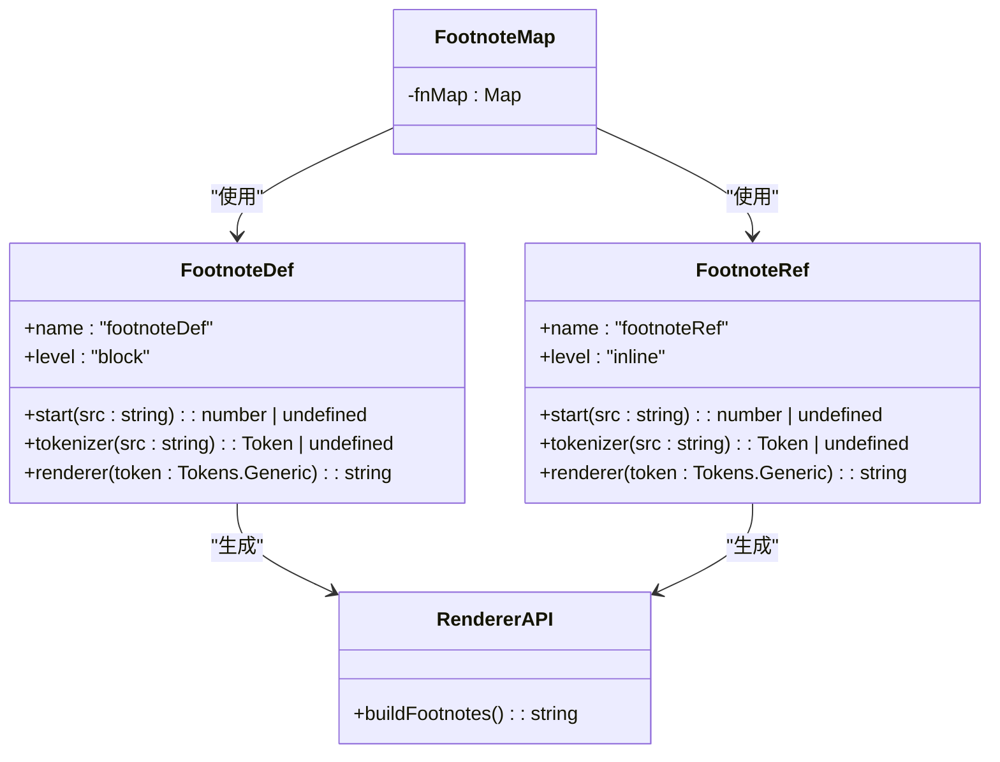

**图源**  
- [footnotes.ts](file://packages/core/src/extensions/footnotes.ts#L17-L89)

**本节来源**  
- [footnotes.ts](file://packages/core/src/extensions/footnotes.ts)
- [renderer-impl.ts](file://packages/core/src/renderer/renderer-impl.ts#L136-L185)

### 滑块机制

`markedSlider`扩展实现了水平滑动图片容器，特别适用于微信公众号等移动端场景。

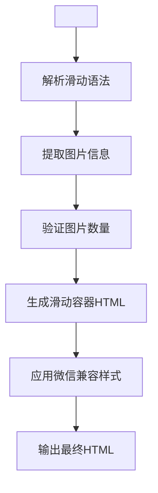

**本节来源**  
- [slider.ts](file://packages/core/src/extensions/slider.ts)

## 结论

通过分析`multipost-wechat-markdown-editor`项目的扩展系统，我们深入了解了如何开发自定义Markdown扩展。关键要点包括：

1. **扩展结构**：每个扩展模块导出一个函数，该函数返回符合`MarkedExtension`接口的对象。
2. **语法解析**：使用正则表达式定义语法匹配规则，并通过`tokenizer`函数生成token。
3. **渲染处理**：通过`renderer`函数将token转换为HTML输出。
4. **集成方式**：在`initRenderer`流程中使用`marked.use()`方法注入扩展。
5. **执行顺序**：扩展的注册顺序影响其执行优先级，需要注意依赖关系。

开发者可以基于这些模式创建新的扩展，如支持Mermaid图表、流程图、甘特图等，从而极大地丰富Markdown的表达能力。