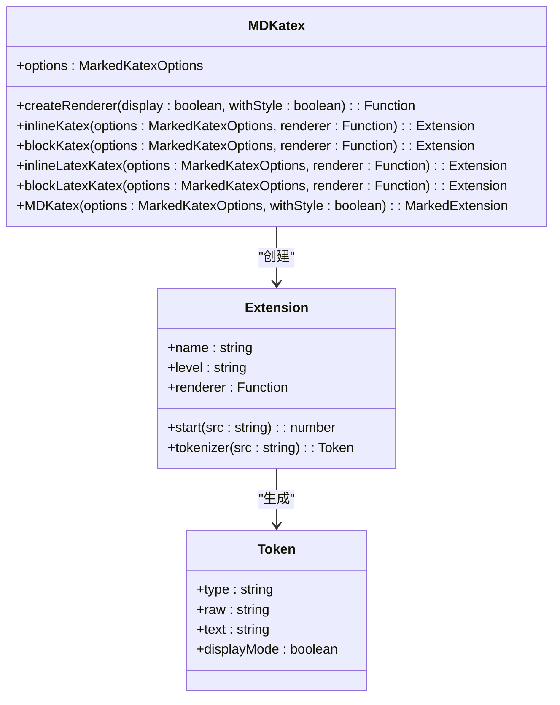
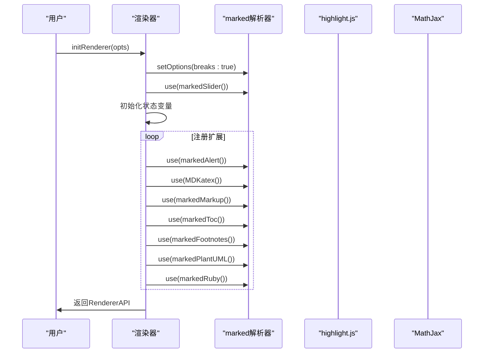
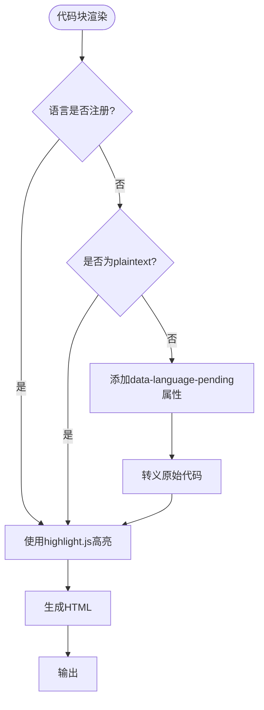
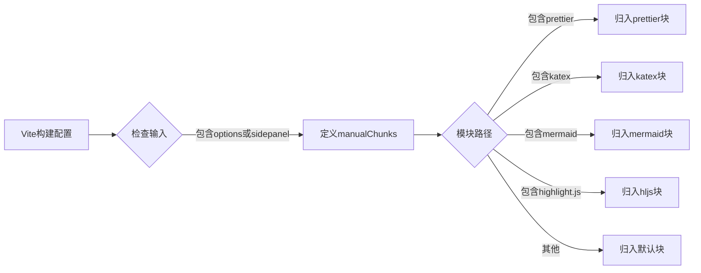
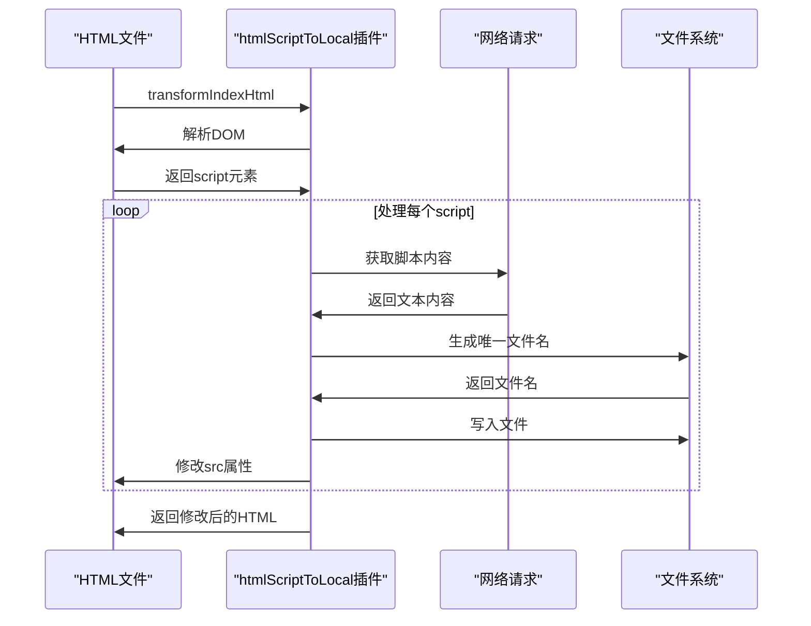
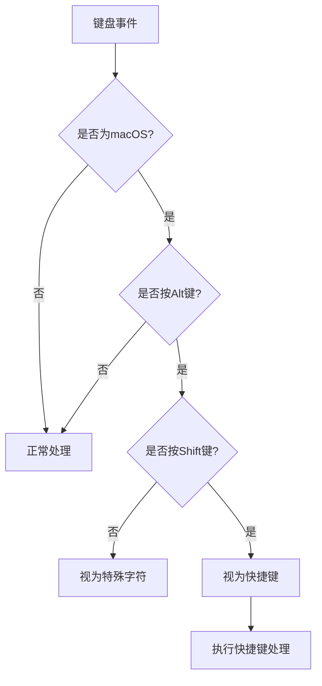
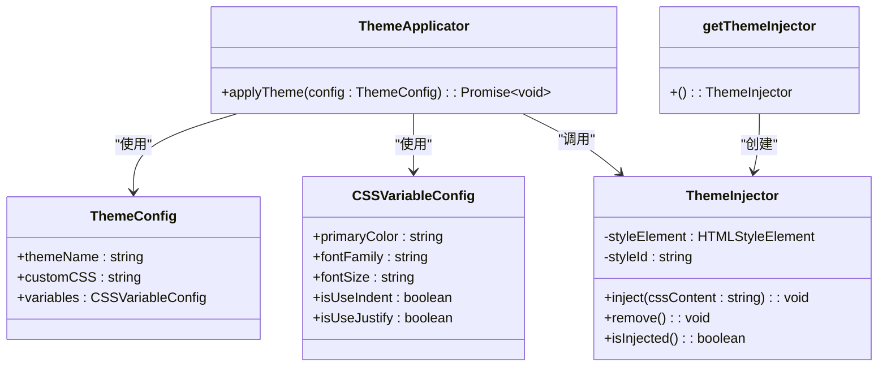

# 高级主题

<cite>
**本文档中引用的文件**  
- [alert.ts](file://packages/core/src/extensions/alert.ts)
- [katex.ts](file://packages/core/src/extensions/katex.ts)
- [renderer-impl.ts](file://packages/core/src/renderer/renderer-impl.ts)
- [build-extension.ts](file://apps/web/src/modules/build-extension.ts)
- [cssScopeWrapper.ts](file://packages/core/src/theme/cssScopeWrapper.ts)
- [cssVariables.ts](file://packages/core/src/theme/cssVariables.ts)
- [themeApplicator.ts](file://packages/core/src/theme/themeApplicator.ts)
- [themeInjector.ts](file://packages/core/src/theme/themeInjector.ts)
- [selectorMapping.ts](file://packages/core/src/theme/selectorMapping.ts)
- [@codemirror__view@6.38.8.patch](file://patches/@codemirror__view@6.38.8.patch)
</cite>

## 目录
1. [引言](#引言)
2. [自定义Markdown扩展开发](#自定义markdown扩展开发)
3. [渲染管道内部实现](#渲染管道内部实现)
4. [插件化构建流程](#插件化构建流程)
5. [依赖补丁机制](#依赖补丁机制)
6. [性能优化策略](#性能优化策略)
7. [主题引擎深层原理](#主题引擎深层原理)
8. [结论](#结论)

## 引言
本文档深入探讨了multipost-wechat-markdown-editor项目中的高级技术主题，重点分析了自定义Markdown扩展的开发流程、渲染管道的内部实现、插件化构建机制、依赖补丁的使用以及主题引擎的深层原理。文档面向高级开发者，旨在提供对核心功能模块的深度理解，帮助开发者更好地进行二次开发和性能优化。

## 自定义Markdown扩展开发

本文档分析了基于`core/extensions`目录下的`alert.ts`、`katex.ts`等示例，说明如何实现新的语法解析规则并注册到marked解析器。这些扩展模块通过marked的扩展API，实现了对特定Markdown语法的识别和渲染。

**Section sources**
- [alert.ts](file://packages/core/src/extensions/alert.ts)
- [katex.ts](file://packages/core/src/extensions/katex.ts)

### 警告块扩展实现

`alert.ts`文件实现了对GitHub Flavored Markdown (GFM) 警告块语法的支持。该扩展通过定义`markedAlert`函数，创建了一个marked扩展对象，包含`walkTokens`和`extensions`两个主要部分。

`walkTokens`函数在解析过程中遍历所有token，当遇到`blockquote`类型的token时，会检查其内容是否匹配预定义的警告类型（如note、tip、info等）。如果匹配，则将token类型修改为`alert`，并添加元数据（meta）信息，包括警告类型、图标、标题等。

`extensions`部分定义了两种渲染方式：一种是基于`[!type]`语法的行内警告块，另一种是基于`:::type`语法的容器式警告块。两种方式都使用相同的`renderAlert`函数进行渲染，生成带有特定CSS类名的`<blockquote>`元素。

```mermaid
flowchart TD
Start([开始解析]) --> CheckBlockquote{是否为 blockquote?}
CheckBlockquote --> |否| Continue[继续处理其他token]
CheckBlockquote --> |是| MatchPattern{匹配 [!type] 或 :::type 模式?}
MatchPattern --> |否| Continue
MatchPattern --> |是| ModifyToken[修改token类型为alert]
ModifyToken --> AddMeta[添加元数据]
AddMeta --> Render[使用renderAlert函数渲染]
Render --> Output[输出HTML]
Continue --> Output
```

**Diagram sources**
- [alert.ts](file://packages/core/src/extensions/alert.ts#L50-L86)

### 数学公式扩展实现

`katex.ts`文件实现了对LaTeX数学公式的解析和渲染。该扩展支持四种语法：行内公式`$...$`、块级公式`$$...$$`、行内LaTeX语法`\(...\)`和块级LaTeX语法`\[...\]`。

扩展通过定义`MDKatex`函数，创建了一个包含四个tokenizer的marked扩展。每个tokenizer负责识别一种语法模式，并生成相应的token。`inlineKatex`和`blockKatex`处理美元符号语法，而`inlineLatexKatex`和`blockLatexKatex`处理反斜杠括号语法。

渲染器使用MathJax库将LaTeX代码转换为SVG格式的数学公式，并包裹在带有`katex-inline`或`katex-block`类名的元素中，以便进行样式控制。



**Diagram sources**
- [katex.ts](file://packages/core/src/extensions/katex.ts#L46-L153)

## 渲染管道内部实现

`renderer-impl.ts`文件实现了Markdown渲染管道的核心逻辑，包括HTML净化、资源重写和交互增强等环节。该文件导出了`initRenderer`函数，用于初始化渲染器实例。

**Section sources**
- [renderer-impl.ts](file://packages/core/src/renderer/renderer-impl.ts)

### 渲染器初始化流程

`initRenderer`函数接收配置选项`opts`，并返回一个包含多个方法的`RendererAPI`对象。初始化过程中，会设置marked解析器的全局选项，并注册各种扩展。

渲染器使用`styledContent`辅助函数生成带有CSS类名的内容，实现了新主题系统。该函数根据样式标签生成相应的HTML标签和类名，确保渲染结果与主题样式兼容。



**Diagram sources**
- [renderer-impl.ts](file://packages/core/src/renderer/renderer-impl.ts#L112-L387)

### HTML净化与安全处理

渲染管道实现了多层HTML净化机制，确保输出内容的安全性。`escapeHtml`函数用于转义HTML特殊字符，防止XSS攻击。在渲染代码块时，会对代码内容进行高亮处理，并添加适当的类名。

对于未注册的语言，渲染器会添加`data-language-pending`属性和原始代码文本，以便后续动态加载相应的语法高亮规则。这种机制既保证了基本的代码显示，又支持了按需加载，优化了性能。



**Diagram sources**
- [renderer-impl.ts](file://packages/core/src/renderer/renderer-impl.ts#L210-L243)

## 插件化构建流程

`build-extension.ts`文件实现了基于WXT框架的插件化构建流程，允许在编译时动态注入自定义逻辑。该文件定义了一个WXT模块，通过钩子函数扩展了Vite和WXT的构建配置。

**Section sources**
- [build-extension.ts](file://apps/web/src/modules/build-extension.ts)

### 构建流程扩展机制

该模块通过`wxt.hook`方法注册了多个构建阶段的钩子函数。`entrypoints:grouped`钩子用于添加新的入口点（如options和sidepanel），`vite:build:extendConfig`钩子用于扩展Vite的构建配置。

在Vite配置扩展中，模块定义了`manualChunks`策略，将大型依赖库（如prettier、katex、mermaid、highlight.js）拆分为独立的代码块。这种策略可以实现按需加载，减少初始加载时间，优化性能。



**Diagram sources**
- [build-extension.ts](file://apps/web/src/modules/build-extension.ts#L36-L55)

### HTML脚本处理插件

模块实现了三个Vite插件：`htmlScriptToVirtual`、`htmlScriptToLocal`和`vueDevtoolsHack`。这些插件用于处理HTML中的脚本标签，解决浏览器扩展CSP（内容安全策略）限制的问题。

`htmlScriptToVirtual`插件在开发模式下将外部脚本转换为虚拟模块，通过开发服务器提供服务。`htmlScriptToLocal`插件在构建模式下将外部脚本下载并保存为本地文件，修改HTML中的引用路径。`vueDevtoolsHack`插件则解决了Vue Devtools在扩展中的加载问题。



**Diagram sources**
- [build-extension.ts](file://apps/web/src/modules/build-extension.ts#L150-L217)

## 依赖补丁机制

项目使用依赖补丁机制来解决第三方库的特定问题或实现自定义功能。`patches`目录下的`@codemirror__view@6.38.8.patch`文件就是一个典型的例子。

**Section sources**
- [@codemirror__view@6.38.8.patch](file://patches/@codemirror__view@6.38.8.patch)

### CodeMirror补丁分析

该补丁针对`@codemirror/view`库的6.38.8版本，解决了macOS系统下Alt键组合的快捷键问题。原始代码中，macOS系统的Alt键组合被视为特殊字符输入而非快捷键，这影响了某些快捷键的正常使用。

补丁修改了`runHandlers`函数中的条件判断，将`!(browser.mac && event.altKey && !(event.ctrlKey || event.metaKey))`改为`!(browser.mac && event.altKey && !event.shiftKey && !(event.ctrlKey || event.metaKey))`。这一修改允许Alt+Shift组合被视为快捷键，同时保留了其他Alt组合的特殊字符输入功能。



**Diagram sources**
- [@codemirror__view@6.38.8.patch](file://patches/@codemirror__view@6.38.8.patch#L18-L24)

### 补丁应用与维护

依赖补丁通常通过包管理器的补丁功能（如pnpm的patch protocol）自动应用。维护补丁时需要注意：
1. 记录补丁的原因和目的
2. 尽量保持补丁的简洁性
3. 定期检查上游库是否已修复相关问题
4. 在项目升级时验证补丁的兼容性

当上游库修复了相关问题后，应及时移除补丁，避免维护负担。同时，应将补丁的原因和解决方案记录在文档中，便于团队成员理解和维护。

## 性能优化策略

项目采用了多种性能优化策略，包括大型文档的懒加载、Web Worker中进行渲染计算、虚拟滚动实现等。

### Web Worker渲染

通过将Markdown渲染计算移至Web Worker中执行，可以避免阻塞主线程，保持UI的响应性。渲染器的`parseFrontMatterAndContent`函数可以在Web Worker中调用，将解析结果通过消息传递回主线程。

### 虚拟滚动实现

对于长文档的预览，可以采用虚拟滚动技术，只渲染可视区域内的内容。这可以显著减少DOM节点数量，提高渲染性能和滚动流畅度。

### 按需加载

通过`manualChunks`策略，将大型依赖库拆分为独立的代码块，实现按需加载。例如，只有在用户使用数学公式功能时，才加载katex库。

## 主题引擎深层原理

主题引擎实现了CSS作用域封装、变量继承等高级功能，确保主题样式只在预览区域生效，同时支持动态配置。

**Section sources**
- [cssScopeWrapper.ts](file://packages/core/src/theme/cssScopeWrapper.ts)
- [cssVariables.ts](file://packages/core/src/theme/cssVariables.ts)
- [themeApplicator.ts](file://packages/core/src/theme/themeApplicator.ts)
- [themeInjector.ts](file://packages/core/src/theme/themeInjector.ts)
- [selectorMapping.ts](file://packages/core/src/theme/selectorMapping.ts)

### CSS作用域封装

`cssScopeWrapper.ts`文件实现了CSS作用域封装功能。`wrapCSSWithScope`函数通过正则表达式处理CSS规则，为每个选择器添加`#output`前缀，确保样式只在预览区域生效。

该函数还使用`SELECTOR_MAPPING`映射表，将旧的选择器转换为新的规范类名，实现了向后兼容。例如，`blockquote_note`被转换为`.markdown-alert-note`。

```mermaid
flowchart TD
A[原始CSS] --> B{处理每个规则}
B --> C{是否为@规则或:root?}
C --> |是| D[保持不变]
C --> |否| E{分割选择器}
E --> F{处理每个选择器}
F --> G{是否已有作用域前缀?}
G --> |是| H[保持不变]
G --> |否| I{是否为空?}
I --> |是| J[跳过]
I --> |否| K{查找映射}
K --> |存在| L[替换为新类名]
K --> |不存在| M[保持原样]
L --> N[添加作用域前缀]
M --> N
N --> O[重新组合]
O --> P[生成新CSS]
```

**Diagram sources**
- [cssScopeWrapper.ts](file://packages/core/src/theme/cssScopeWrapper.ts#L14-L59)

### 变量继承与动态配置

`cssVariables.ts`文件实现了CSS变量的动态生成。`generateCSSVariables`函数根据配置对象生成`:root`级别的CSS变量，如`--md-primary-color`、`--md-font-family`等。

`themeApplicator.ts`文件中的`applyTheme`函数负责应用主题，它将CSS变量、基础样式和主题样式合并，并通过`themeInjector.ts`中的单例`ThemeInjector`注入到页面中。这种设计确保了主题样式的动态更新和内存效率。



**Diagram sources**
- [themeApplicator.ts](file://packages/core/src/theme/themeApplicator.ts#L24-L60)
- [themeInjector.ts](file://packages/core/src/theme/themeInjector.ts#L9-L55)

## 结论
本文档深入分析了multipost-wechat-markdown-editor项目中的高级技术主题，包括自定义Markdown扩展开发、渲染管道内部实现、插件化构建流程、依赖补丁机制、性能优化策略和主题引擎深层原理。这些技术共同构成了一个功能强大、性能优越、易于扩展的Markdown编辑器核心。开发者可以基于这些原理进行二次开发，实现更多自定义功能，或对现有功能进行优化。